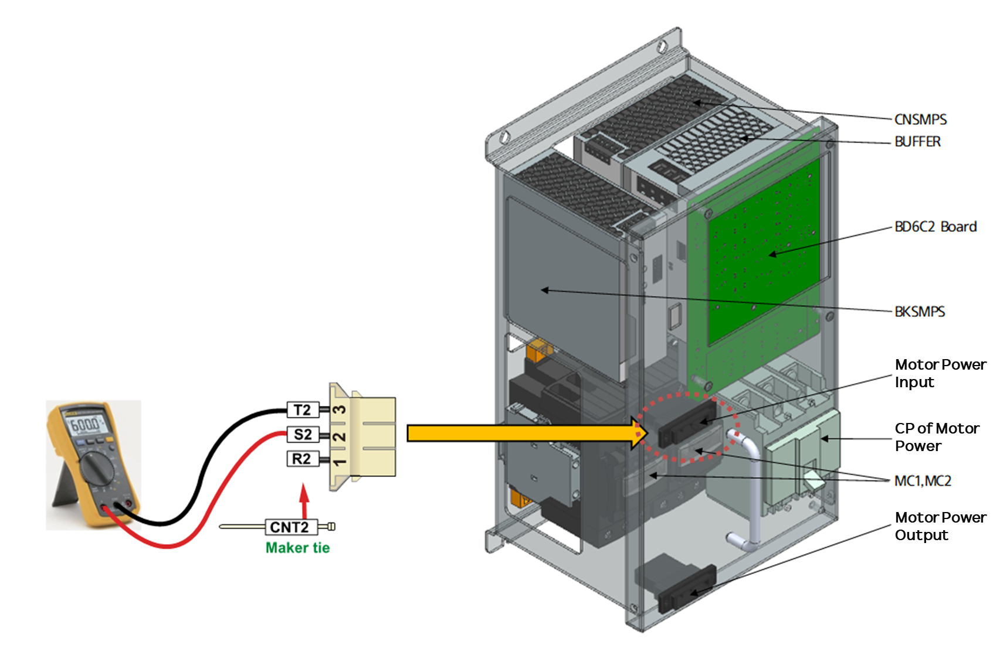

# 1.1. 电压检查1 - Hi6-N 控制器内部三相电压检查程序

(1) 检查控制器内部的三相电压。

附加在控制器前面的电源模块(PSM)负责分配和转发各种电源。三相电源通过电源模块中的磁开关打开和关闭。在电机停止的情况下，检查输入到电源模块的电压是否在220 V AC的10%公差范围内。如果测得的电压超出可接受范围，请执行以下检查。

 
图 1.1. 供电模块(PSM)的三相电源输入


在测量高电压时要小心，因为周围组件和相之间可能会发生短路。


1) 如果控制器铭牌上的电压为 AC 220V 
如果控制器输入电压为 AC 220V，则外部电源开关或接线端子输入的电压和在内部控制模块测得的电压必须相同。如果有差异，请检查三相电源接线。

2) 如果控制器铭牌上的电压不是 AC 220V 
如果控制器输入电源不是 AC 220V，则内置变压器将三相电源转换为 AC 220V，并连接到控制模块。检查在控制模块测得的电压是否在 AC 220V的10%公差范围内。如果测得的电压超出公差范围，请检查内置变压器的输入和输出端子之间的连接。内置变压器的初级端子必须连接到控制器铭牌上指示的电压。