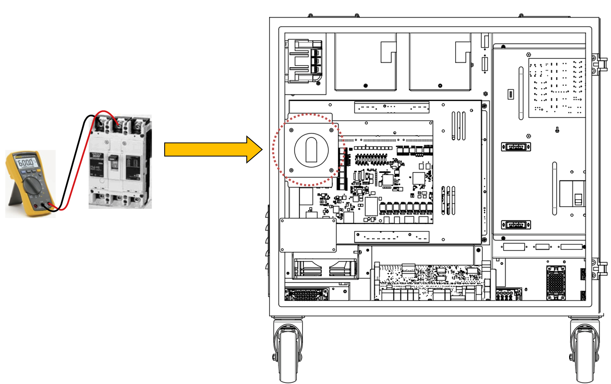

# 1.2. Voltage Check2 – Hi6-N Controller 3-Phase Voltage Check Procedure

(1)	Check the voltage on the nameplate attached to the controller against the actual input voltage.

Check that the voltage actually supplied to the controller is within the allowable range of the voltage printed on the nameplate. The allowable input voltage range is within 10% of the value printed on the nameplate and must be at least AC 198 V for AC 220 V. The figure below illustrates how to measure the controller's input voltage. If the measured voltage is outside the allowable range, inspect the power system.

* Measurement on the power line side of the front switch

 
(a) Hi6-N Controller

Figure 1.2. Measurement on the power line side of the power switch


Be careful when measuring high voltages, as there is a risk of short circuits in surrounding components and between phases.


