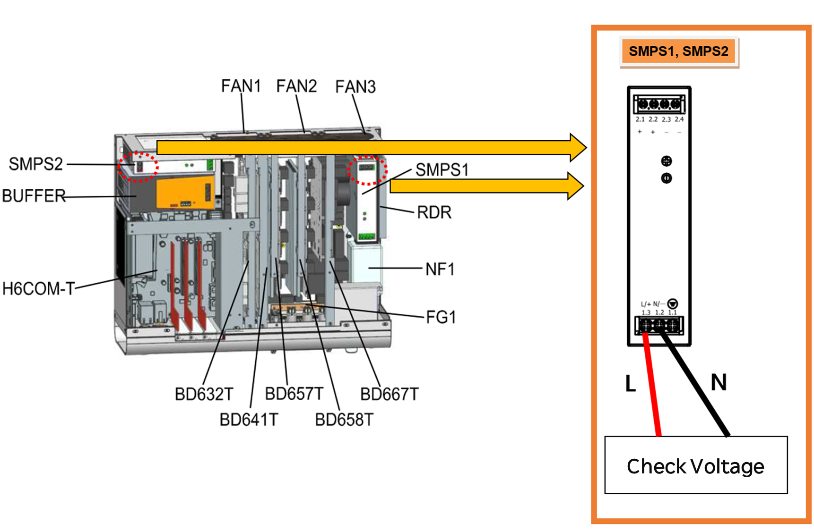

# 1.3. Voltage Check3 – Hi6-T Controller Input Single-Phase Voltage Check Procedure

(1) Check the voltage on the nameplate attached to the controller against the actual input voltage. 
Check that the voltage actually supplied to the controller is within the allowable range of the voltage indicated on the nameplate. The allowable input voltage range is within 10% of the value indicated on the nameplate and must be at least AC 198V for AC 220V. The figure below illustrates how to measure the controller's input voltage. If the measured voltage is outside the allowable range, inspect the power system.


Be careful when measuring high voltages, as there is a risk of short circuits between nearby components and phases.


 
Figure 1.3. H6-T15 Controller Single-Phase Power Input SMPS Terminal Block
