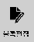

# 1.2.4.4 메뉴 버튼

<table>
  <thead>
    <tr>
      <th style="text-align:left"></th>
      <th style="text-align:left">번호</th>
      <th style="text-align:left">설명</th>
    </tr>
  </thead>
  <tbody>
    <tr>
      <td style="text-align:left"></td>
      <td style="text-align:left">
        
      </td>
      <td style="text-align:left">
        
메커니즘(mechanism): 선택된
          메커니즘을 확인하고
          설정합니다.

        
원하는 메커니즘 그룹이
          나타날 때까지 <b>[메커니즘]</b> 버튼을
          반복해서 터치하십시오.
          초기 설정에서 로봇 모델이
          선택되지 않은 경우, 메커니즘
          그룹이 표시되지 않고
          미초기화 표시가 나타납니다.

      </td>
    </tr>
    <tr>
      <td style="text-align:left">
        
      </td>
      <td style="text-align:left">
        
      </td>
      <td style="text-align:left">
        
좌표계(coordinate system): 조그 수행의
          기준 좌표계를 확인하고
          설정합니다.

        
원하는 좌표계 방식이
          나타날 때까지 <b>[좌표계]</b> 버튼을
          반복해서 터치하십시오.
          선택한 기준 좌표계에
          따라 변경된 축의 이름이
          화면 우측 조그 막대에
          나타납니다.

        <ul>
          <li>
            축(Joint) 좌표계: 조그 막대에
            각 축의 이름이 표시됩니다.
            축 이름 우측의 <b>[-/+]</b> 버튼을
            터치하면 해당하는 축을
            움직일 수 있습니다.</li>
          <li>
            로봇(Robot) 좌표계: 조그 막대에
            X, Y, Z, RX, RY, RZ와 부가축이 표시됩니다.
            로봇 좌표계를 기준으로
            로봇의 툴 끝(TCP, Tool Center Point)을
            이동 및 회전할 수 있습니다.</li>
          <li>
            사용자(User) 좌표계: 조그
            막대에 X, Y, Z, RX, RY, RZ와 부가축이
            표시됩니다. 사용자 좌표계를
            기준으로 로봇의 툴 끝(TCP)을
            이동 및 회전할 수 있습니다.</li>
          <li>
            툴(Tool) 좌표계: 조그 막대에
            X, Y, Z, RX, RY, RZ와 부가축이 표시됩니다.
            툴 좌표계를 기준으로
            로봇의 툴 끝(TCP)을 이동
            및 회전할 수 있습니다.</li>
        </ul>
      </td>
    </tr>
    <tr>
      <td style="text-align:left"></td>
      <td style="text-align:left">
        
      </td>
      <td style="text-align:left">
        
기록(RECord): JOB 프로그램에서
          move 문을 입력합니다.

        
<b>[기록]</b> 버튼을 터치하십시오.
          현재 커서 위치의 바로
          아래에 move 문이 입력됩니다.

        <ul>
          <li>로봇의 현재 자세가 타겟
            포즈로 기록되고 move 문의
            보간, 이동 속도와 단위,
            정밀도, 툴 번호, 메커니즘
            세트는 <b>[기록조건]</b> 버튼으로
            설정한 값이 적용됩니다.</li>
          <li>타겟 포즈와 move 문 기록
            조건값은 추후에 편집할
            수 있습니다.</li>
        </ul>
        

          (<b>&lt;shift&gt;</b> 키 조합 시) 위치
          수정: JOB 프로그램에서
          로봇의 현재 자세를 스텝의
          타겟 포즈로 적용합니다.

      </td>
    </tr>
    <tr>
      <td style="text-align:left"></td>
      <td style="text-align:left">
        
      </td>
      <td style="text-align:left">
        
명령 입력: 원하는 명령어를
          입력합니다.

        
<b>[명령입력]</b> 버튼을 터치한
          후 명령 입력창에서 명령어를
          터치하십시오. 현재 커서
          위치의 바로 아래에 명령문이
          입력됩니다. 명령 입력에
          대한 자세한 내용은 “
          <a
          href="../../../programming/prog-edit/statement-input/">3.2.2 명령문 입력</a>”을 참조하십시오.

        

          (<b>&lt;shift&gt;</b> 키 조합 시) 위치
          수정: JOB 프로그램에서
          로봇의 현재 자세를 스텝의
          타겟 포즈로 적용합니다.

      </td>
    </tr>
    <tr>
      <td style="text-align:left"></td>
      <td style="text-align:left">
        
      </td>
      <td style="text-align:left">
        
속성: 명령문의 속성을
          확인합니다.

        
명령문을 터치하여 선택한
          후 <b>[속성]</b> 버튼을 터치하십시오.
          명령문의 속성창이 나타납니다.

        

          (<b>&lt;shift&gt;</b> 키 조합 시) 블록
          편집: JOB 프로그램에서
          복사하기, 잘라내기, 붙여넣기를
          수행할 수 있는 블록 편집
          모드로 진입합니다. 블록
          편집에 대한 자세한 내용은
          “<a href="../../../programming/prog-edit/statement-edit/block-edit-mode.md">3.2.4.5 블록 편집 모드</a>”를
          참조하십시오.

      </td>
    </tr>
    <tr>
      <td style="text-align:left"></td>
      <td style="text-align:left">
        
      </td>
      <td style="text-align:left"><b>[메뉴]</b>: 프로그램의 서비스
        기능 메뉴를 사용합니다.</td>
    </tr>
    <tr>
      <td style="text-align:left"></td>
      <td style="text-align:left">
        
      </td>
      <td style="text-align:left"><b>[설정]</b>: 프로그램의 시스템
        메뉴를 이용해 사용 환경을
        설정합니다.</td>
    </tr>
    <tr>
      <td style="text-align:left"></td>
      <td style="text-align:left">
        
      </td>
      <td style="text-align:left">
        
즐겨찾기: 코드 번호를
          이용해 미리 지정한 기능을
          빠르게 실행합니다.

        
<b>[즐겨찾기]</b> 버튼을 터치한
          후 코드 번호를 입력하고 <b>[확인]</b> 버튼을
          터치하십시오. 지정된
          기능이 실행됩니다.

      </td>
    </tr>
    <tr>
      <td style="text-align:left"></td>
      <td style="text-align:left">
        
      </td>
      <td style="text-align:left">
        
사용자키: 사용자키 영역에
          버튼으로 할당한 기능을
          로봇 티칭 시 사용합니다.

        
<b>[사용자키]</b> 버튼을 터치하십시오.
          메뉴 버튼 영역이 사용자키
          영역으로 전환되어 미리
          버튼으로 할당한 기능을
          사용할 수 있습니다. 메뉴
          버튼 영역으로 돌아가려면, <b>[사용자키]</b> 버튼을
          터치하거나 <b>&lt;esc&gt;</b> 키를
          누르십시오.

      </td>
    </tr>
  </tbody>
</table>

