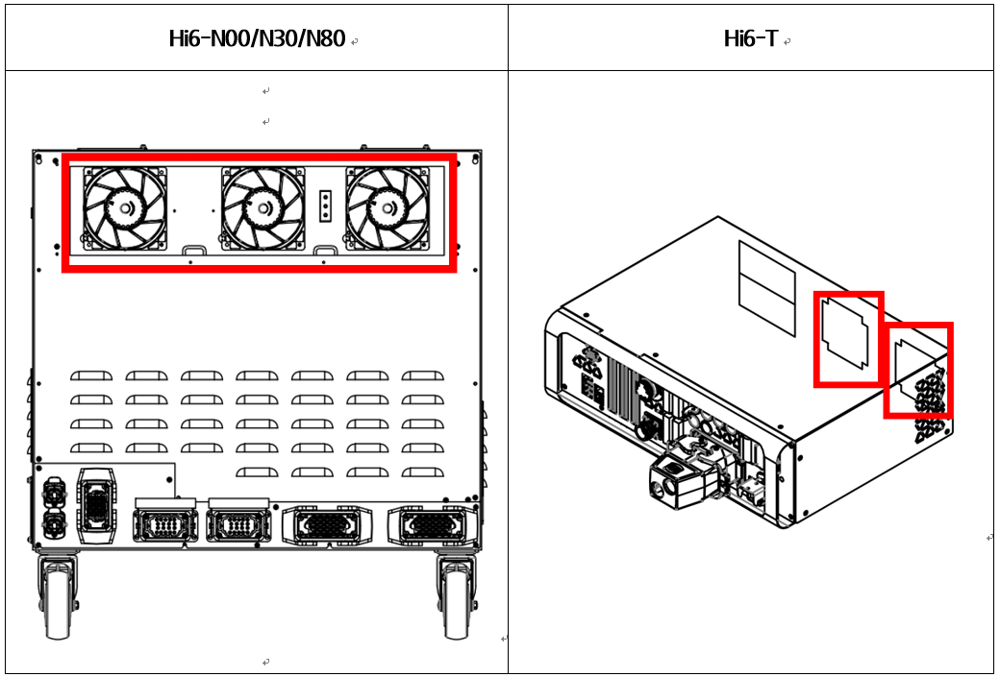

# 2.1. E02500 AMP Regenerative Discharge Resistor Overheat

### 1. Overview

This error relates to the overheating of the regenerative resistor, which dissipates the regenerative power generated during robot deceleration or descent in the direction of gravity. It can occur when the regenerative discharge capacity is exceeded due to degraded cooling fan performance, sudden rapid movements, or continuous robot operation.

### 2. Causes



The temperature of the regenerative discharge resistor has risen above the threshold. This is caused by excessive robot playback speed or an issue with the cooling system.

* <Cases occurring at a specific step depending on the robot's playback speed>

(1) Please check for errors by adjusting the robot's playback speed.

(2) Please inspect the resistance value of the regenerative discharge resistor.

* <Cases occurring more than 5 minutes after the robot has started>

(3)	Please inspect the controller's cooling system and the amount of regenerative power.

-> Check the operating status of each fan.

-> Check the power supply voltage of the fans.

(4)	Please inspect the amount of regenerative power generated by the robot.

-> Check for errors by lowering the robot's playback speed.



(1) Please check for errors by adjusting the robot's playback speed.

During robot deceleration or descent in the direction of gravity, the DC voltage of the servo drive increases. To prevent component damage caused by this voltage spike, power is dissipated through the regenerative discharge resistor. Errors can occur if the robot undergoes sudden deceleration or moves at high speeds in the direction of gravity. Please verify whether the error persists when the robot's playback speed is modified.

* Adjusting the Robot Playback Speed

A regenerative resistor overheat error may occur if the regenerative power generated by the robot's movement exceeds the controller's design specifications. Please operate the robot after lowering the speed of the specific step where the error occurs and check if the error is resolved.

(2)	Please inspect the resistance value of the regenerative discharge resistor.

* Checking the Regenerative Discharge Resistance Value

If the resistance value measured at the end of the CNDR cable deviates by more than 10% from the value specified in the manual, the resistor is defective. Please replace the resistor. Refer to the previous page for the detailed measurement procedure.

 (2)-1. Hi6-N Controller

-> Medium-sized (H6D6X) Regenerative Discharge Resistance: 5Ω (N00)

-> Large-sized (H6D6X) Regenerative Discharge Resistance: 4Ω (N80)

-> Small-sized (H6D6A) Regenerative Discharge Resistance: 15Ω (N30)

(2)-2. Hi6-T Controller

-> Regenerative Discharge Resistance: 20Ω

(3)	Please inspect the controller's cooling conditions and the amount of regenerative power.

If the regenerative resistor overheat error occurs more than 5 minutes after the robot starts, it indicates either a malfunction in the controller's cooling system or that the robot's playback speed exceeds the controller's design specifications. Fans are installed at the rear of the controller to cool the heat sinks of the servo drive units and the regenerative discharge resistors.

Table 1-1 Hi6 Controller Fan Installation Locations

* Checking the Operating Status of Each Fan

If a fan does not rotate or its speed is abnormally low, please replace the corresponding fan. The lifespan of a fan varies depending on the operating environment and total runtime.

* Checking the Fan Power Supply Voltage

If none of the fans are operating, please check the input voltage to the fans. The fan input voltage is set to AC 220V, with an allowable tolerance within ±10% of the rated voltage. If the voltage is more than 10% lower than the rated value, the cooling efficiency will decrease due to the reduced fan speed. If the voltage is low, please check the fan power connector (CNFN2) and the main input voltage of the controller.

(4)	Please inspect the amount of regenerative power generated by the robot.

* Check for errors based on the robot's playback speed.

If an overheat error occurs during continuous playback for more than 5 minutes, it is because the robot's repetitive movements have exceeded the controller's cooling capacity. Please verify if the error persists after lowering the robot's playback speed. If lowering the speed resolves the regenerative resistor overheat error but prevents you from achieving the required cycle time (operating speed), please contact our technical support department.