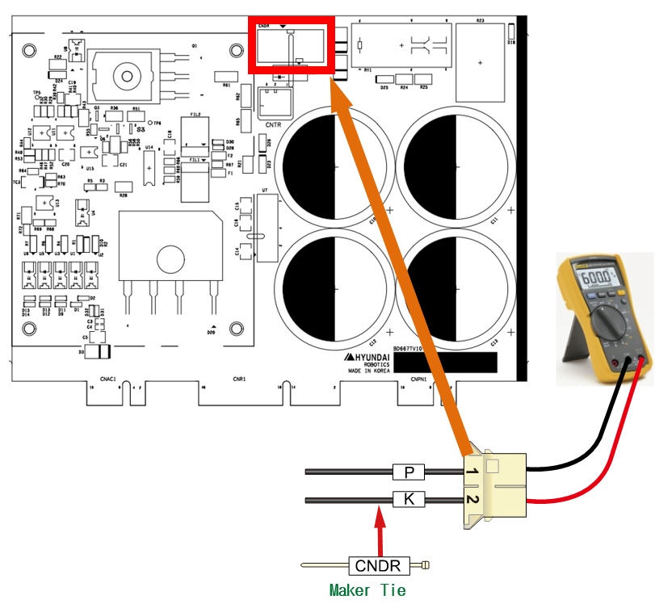

# 2.2. E02501 AMP 再生放电电阻开放电路、 电阻或电路错误

### 1. 概述

此错误与再生电阻相关，该电阻在机器人减速或沿重力下降时耗散产生的功率。它可以由于过热检测传感器电路故障、电阻的开放电路或过高的三相电源电压引起。

### 2. 原因和检查方法


过热错误也可能在电阻开放电路或放电控制异常时发生。此外，它们还可以由再生放电电阻值偏差或三相电源电压升高引起。

* < 电机开启时立即发生的情况 >

(1)	请检查再生放电电阻的电阻值。

-> 检查 CNDR 电缆上的电阻值。

(2)	请检查伺服驱动单元。

-> 更换伺服驱动单元后检查系统。

(3)	请检查与电源相关的组件。

-> 检查控制器内部的三相电压。

-> 检查控制器的输入三相电压。



(1)	请检查再生放电电阻的电阻值。

由于电阻的开放电路或再生放电电阻值增加，也可能发生过热错误。

* 检查再生电阻的开放电路

如果在 CNDR 电缆末端测得的电阻值在兆欧（MΩ）范围内，则表示电阻出现开放电路或内部接线连接不良。请用已知正常的单元更换再生电阻或修复接线。

(a) Hi6-N 控制器 (BD651/BD653 板)

(b) Hi6-T 控制器 (BD667T 板)

图 1.1 在 CNDR 测量电阻值

(2)	请检查与电源相关的组件。

过热错误也可能在放电控制电路异常时发生。

* 驱动单元更换和检查

请更换检测再生放电电阻过热的模块，并检查错误是否复发。模块内部的电路故障会导致错误持续存在。

(2)-1. Hi6-N 控制器

-> 中型机器人的伺服驱动单元：H6D6X

-> 小型机器人的伺服驱动单元：H6D6A

(2)-2 Hi6-T 控制器

-> BD667T

(3)	请检查与电源相关的组件。

过热错误可能由于电阻的开放电路或放电控制异常而发生。此外，它们还可能由再生放电电阻值偏差或三相电源电压升高引起。

* 检查控制器的内部三相电压

再生放电操作在约 DC 375V 时开始。如果输入伺服驱动单元的电压达到 AC 242V 或更高，可能在电机开启的瞬间发生再生放电电阻过热错误。如果输入电压超过允许范围，请按照“控制器输入电压检查程序”和“控制器内部三相电压检查程序”进行检查。

-> 伺服驱动单元输入电压规格：三相 AC 220V

-> 电机开启期间的允许范围：198V ~ 242V