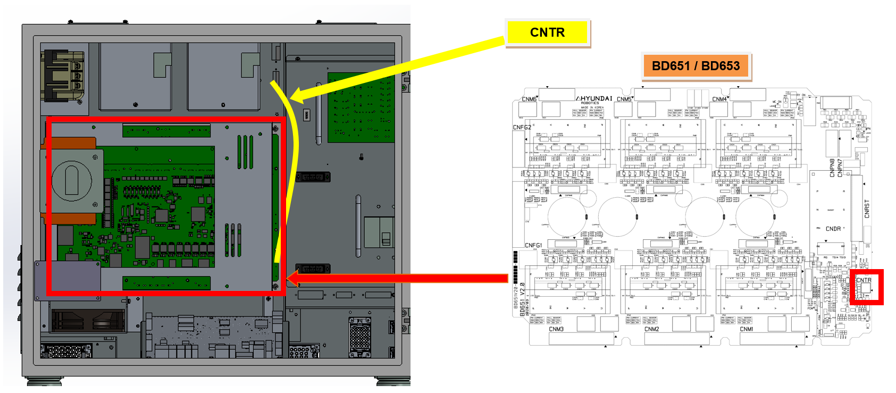
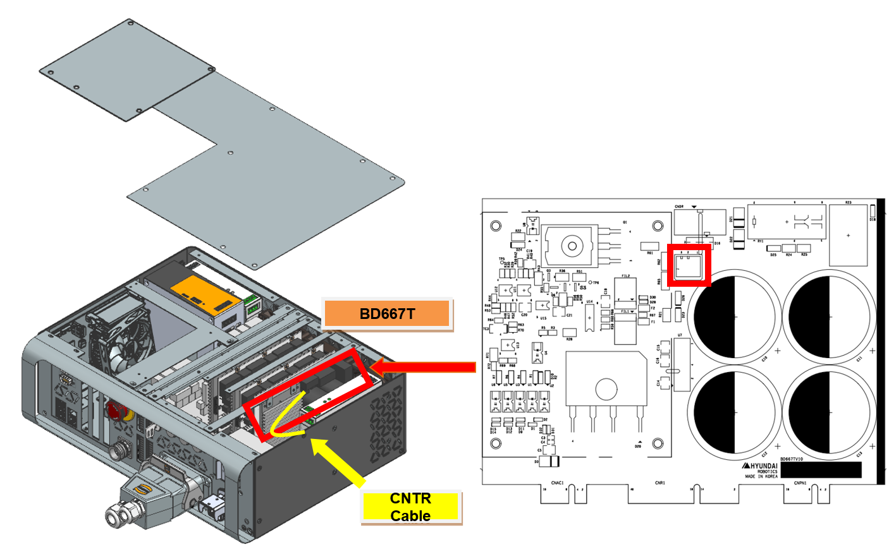
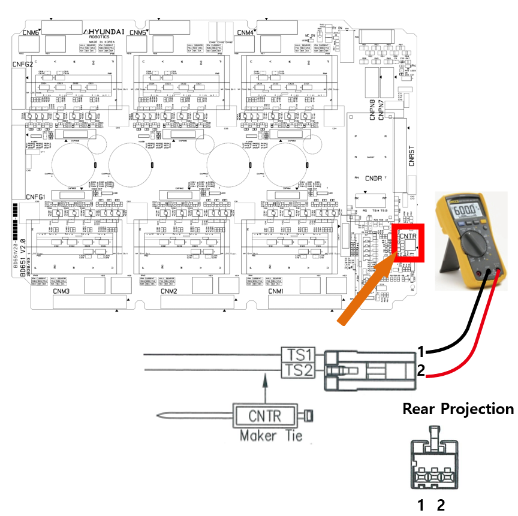
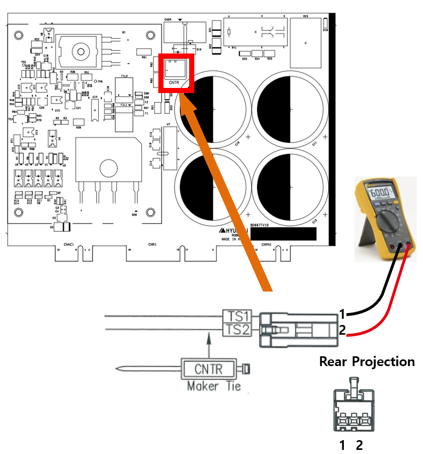

# 2.3. E02501 AMP Regenerative Discharge Resistor Detection Circuit Error

### 1. Overview

This error relates to the overheating of the regenerative resistor, which dissipates the regenerative power generated during robot deceleration or descent in the direction of gravity. It can be caused by a failure in the overheat detection sensor circuit or cable-related issues.

### 2. Causes and Inspection Methods



An abnormality has occurred in the path used to detect overheat errors, or the resistance value has changed.

* <Cases occurring even when the Motor is OFF>

(1)	Please inspect the cables related to overheat error detection. 

-> Check the resistance of the CNTR cable.

(2) Please inspect the components related to overheat error detection. 

-> Hi6-N Controller: Check after replacing the BD640 board. 

-> Hi6-T Controller: Check after replacing the BD641 board. 

-> Check after replacing the servo drive unit.



(1) Please inspect the overheat error detection cable.

The regenerative resistor overheat error is detected by the servo drive unit by monitoring the ON/OFF state of the thermal sensors attached to both ends of the regenerative resistor via the CNTR connector. In the Hi6-N controller, errors detected by the BD651/BD653 boards are transmitted through the BD652/BD654 and finally processed as software alerts by the BD640 board.

(a) Hi6-N Controller

Errors detected in the Hi6-T controller are transmitted from the BD667T board through the BD602T and are processed by software on the BD641T board.

(b) Hi6-T15 Controller

Figure 1.1 Component Layout for Regenerative Resistor Overheat Errors

* CNTR Cable Inspection 

Please check the condition of the sensor at the CNTR connector, which connects to the overheat detection sensor. Under normal conditions, the sensor resistance should measure less than 0.1Ω.

(a) Hi6-N Controller

(b) Hi6-T15 Controller

Figure 1.2 Measuring the Resistance Value at CNTR

(2) Please inspect the components related to overheat error detection.

* Servo Control Board Replacement and Inspection
 
 If the error is resolved after replacing the servo control board with a known functional unit, the original board is defective. Please replace it with a functional board to resume operation.

-> Hi6-N Controller: BD640

-> Hi6-T Controller: BD641T

* Servo Drive Unit Replacement and Inspection

The modules responsible for detecting regenerative discharge resistor overheat errors are as follows:

-> Hi6-N Controller: H6D6X (Medium-sized) or H6D6A (Small-sized) (excluding the servo board).

-> Hi6-T Controller: BD667T

Please identify the components of the controller currently in use before proceeding with the inspection. Verify whether the error recurs after replacing the suspected part with a known functional unit.
