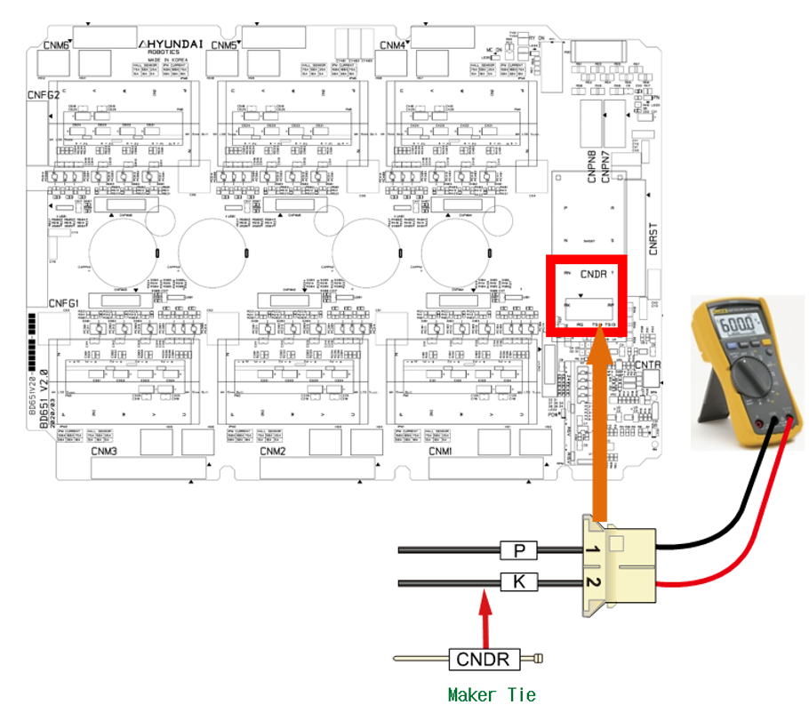
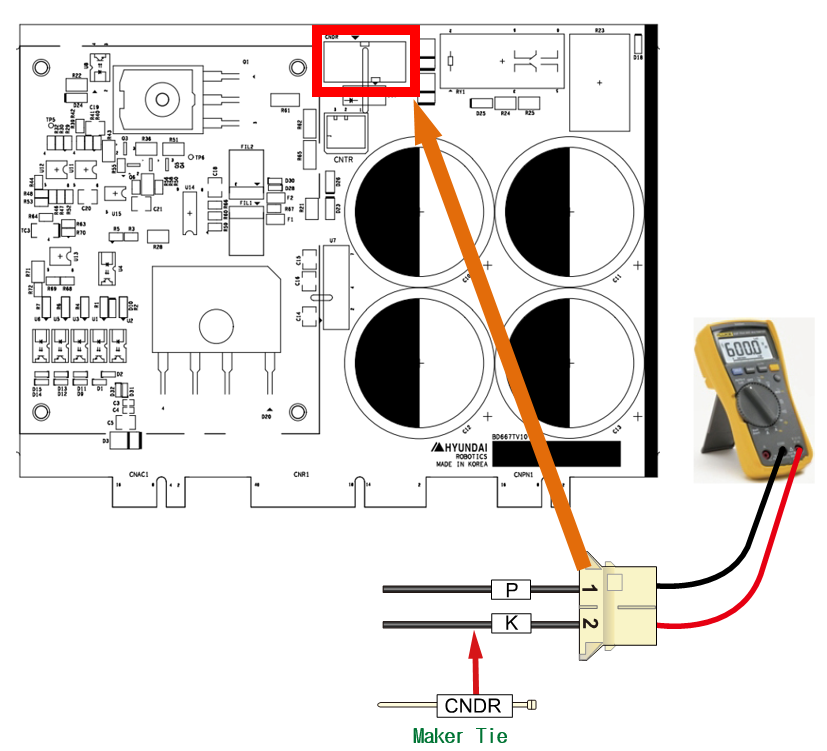

# 2.4. E02503 AMP PN Overvoltage Occurred

### 1. Overview

The DC voltage (P-N) of the servo drive unit that powers the motor has exceeded the predefined threshold.

### 2. Causes and Inspection Methods



This error may occur during sudden changes in the robot's movement. It can also be caused by an increase in the regenerative discharge resistance value.

* < Cases occurring at a specific step depending on the robot's playback speed >

(1) Please check for errors by adjusting the robot's playback speed.

(2) Please inspect the resistance value of the regenerative discharge resistor.



(1) Please check for errors according to the robot's playback speed.

Excessive voltage errors can occur when the robot decelerates abruptly or descends rapidly in the direction of gravity. Please verify whether the error persists depending on the robot's playback speed. Additionally, AMP overvoltage errors may be caused by a defective regenerative discharge resistance value or a malfunction in the regenerative discharge control system.

* Changing the Robot Playback Speed

An overvoltage error may occur if the regenerative power generated by the robot's movement exceeds the controller's design specifications. Please reduce the speed of the step where the error occurs and check if the issue persists. If the error does not occur at a lower speed, please adjust and use the modified step speed.

(2) Please check for errors according to the robot's playback speed.

* Inspection of Regenerative Discharge Resistance Value

If the regenerative resistance value is higher than the specified value, regenerative discharge may not function properly, leading to overvoltage errors. The specifications for regenerative resistance may vary depending on the controller's model and specifications. Please refer to the manual and the controller check sheet provided at the time of purchase. If the measured resistance value deviates by more than 10% from the specifications, the component must be replaced.

(2)-1. Hi6-N Controller - Regenerative Discharge Resistance Value

-> Mid-sized models (Hi6-N00, H6D6X): 5 ohm (N00)
-> Large-sized models (Hi6-N80, H6D6X): 4 ohm (N80)
-> Small-sized models (Hi6-N30, H6D6A): 15 ohm (N30)

(2)-2. Hi6-T Controller - Regenerative Discharge Resistance Value
-> 20ohm

(a) Hi6-N Controller

(b) Hi6-T Controller

Figure 1.1 Measuring the resistance value at CNDR