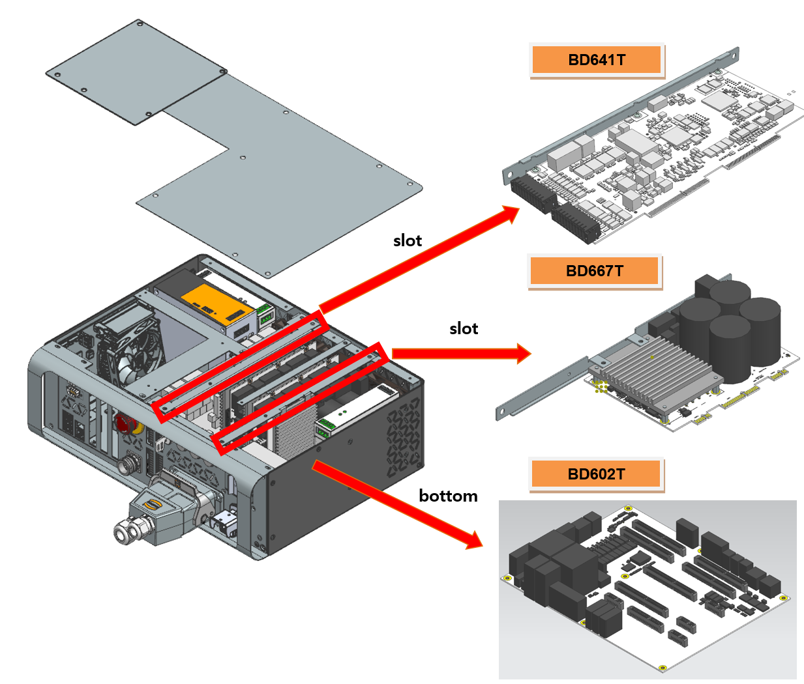

# 2.6. E02505 AMP PN 过压检测路径错误或放电错误

Previous Error Code: E0011 AMP 过压 (P-N) 发生了

### 1. 概述

驱动电机的伺服驱动单元的直流连接电压 (P-N) 已超出设定阈值。

### 2. 原因和检查方法



发生了路径故障，导致从二极管模块或在PN放电电路内部检测PN电压下降。

* < 如果错误在电机关闭时仍然持续发生 >

(1)	Hi6-N 控制器

-> 更换 BD640 板并检查错误是否持续存在。

-> 更换伺服驱动单元并检查错误是否持续存在。

(2)	Hi6-T 控制器

-> 更换 BD641T 板并检查错误是否持续存在。

-> 更换 BD602T 板并检查错误是否持续存在。

-> 更换 BD667T 板并检查错误是否持续存在。



(1)	Hi6-N 控制器

当供给单元的直流电源 (P-N) 超过预设水平时，Hi6-N 控制器 AMP 检测到过压错误。检测到的错误随后通过 AMP 板 (BD651/BD652/BD653/BD654) 由 BD640 板处理。

-> BD640 更换检查

用已知功能正常的板更换 BD640。如果错误不再发生，则原板故障。请更换为新的 BD640 板以继续使用。

-> 伺服驱动单元更换检查

负责检测 AMP 过压错误的模块如下：

* Hi6-N 控制器：中型 H6D6X，小型 H6D6A（不包括伺服板）

请在进行检查之前检查当前使用的控制器部件。用已知功能正常的单元更换可疑部分，以验证错误是否再次发生。

图 1.1 Hi6-N 控制器中过压错误的组件布局

 

(2)	Hi6-T 控制器

当供给单元的直流电源 (P-N) 超过预设水平时，Hi6-T 控制器 AMP 检测到过压错误。检测到的错误从 BD667T 传输到 BD602T 板，然后由 BD641T 板处理。

-> BD641T 更换检查

用已知功能正常的板更换 BD641T。如果错误不再发生，则原板故障。请更换为新的 BD641T 板。

-> BD602T 更换检查

用已知功能正常的板更换 BD602T。如果错误不再发生，则原板故障。请更换为新的 BD602T 板。

-> BD667T 更换检查

用已知功能正常的板更换 BD667T。如果错误不再发生，则原板故障。请更换为新的 BD667T 板。

请在进行检查之前检查当前使用的控制器部件。用已知功能正常的单元更换可疑部分，以验证错误是否再次发生。

图 1.2 Hi6-T 控制器中过压错误的组件布局