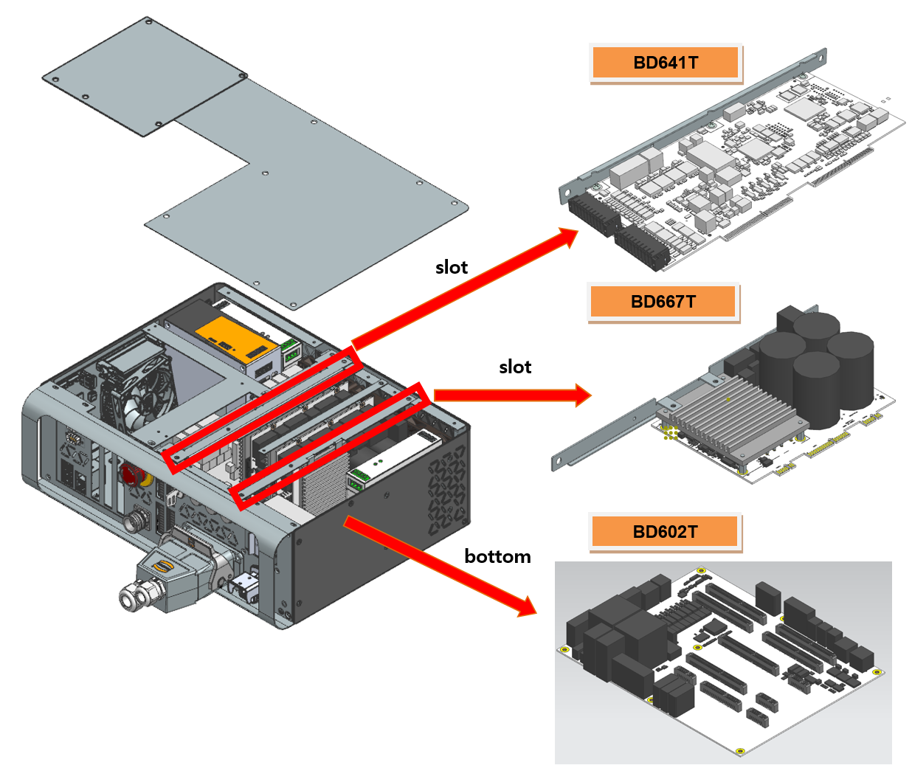

# 2.9. E02508 AMP PN Under-voltage Detection Path Error or Discharge Error

Previous Error Code: E0033 AMP PN Under-voltage Occurred

### 1. Overview

The DC link voltage (P-N) of the servo drive unit that powers the motor has been measured at or below the under-voltage setpoint.

### 2. Causes and Inspection Methods



A failure has occurred in the path detecting the PN voltage drop from the diode module or within the PN discharge circuit.

* <If the error occurs even when the motor is OFF>

  * Hi6-N Controller

     (1)	Inspect components related to under-voltage error detection.
     
     -> Replace the BD640 board and check if the error persists.

     -> Replace the servo drive unit and check if the error persists.

    
  * Hi6-T Controller

     (2)	Inspect components related to under-voltage error detection.
     
     -> Replace the BD641T board and check if the error persists.

     -> Replace the BD602T board and check if the error persists.	

     -> Replace the BD667T and check if the error persists.



(1)	Please inspect components related to under-voltage error detection.

* BD640 Replacement Inspection

   Replace the BD640 with a known functional board. If the error does not recur, the original board is defective.

* Servo Drive Unit Replacement Inspection

   The modules responsible for detecting AMP under-voltage errors are as follows:

  -> Hi6-N Controller: Mid-sized H6D6X, Small-sized H6D6A (Excluding servo boards)

  Please check the components of the controller currently in use before proceeding with the inspection. Replace the suspected part with a known functional unit to verify whether the error recurs.

Figure 1.1 Replacement of BD640 and Servo Drive Unit

 

(2)	Please inspect components related to under-voltage error detection.

*  BD641T Replacement Inspection

   Replace the BD641T with a known functional board. If the error does not recur, the original board is defective.

*  BD602T Replacement Inspection

   Replace the BD602T with a known functional board. If the error does not recur, the original board is defective.

*  BD667T Replacement Inspection

   Replace the BD667T, which is the module responsible for detecting AMP under-voltage errors, with a known functional board. If the error does not recur, the original board is defective.

   Please check the components of the controller currently in use before proceeding with the inspection. Replace the suspected part with a known functional unit to verify whether the error recurs.

Figure 1.1 Replacement of BD641T, BD602T, and BD667T
