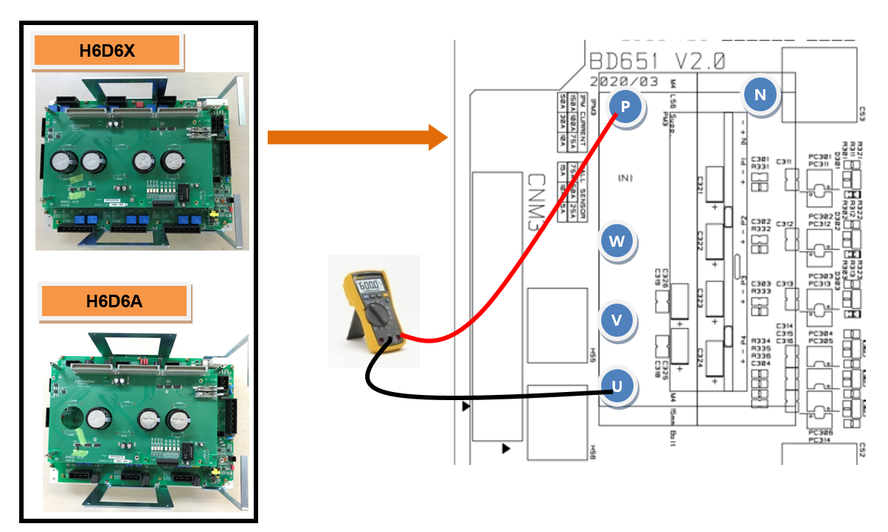
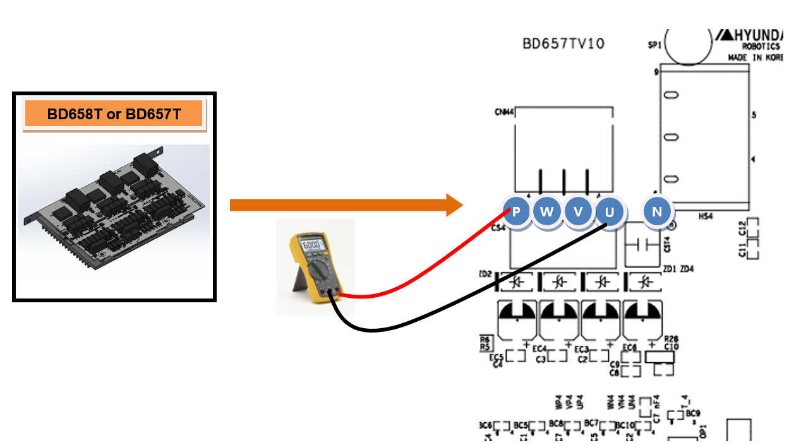

# 2.10. E02520 (Axis ○) IPM Fault

### 1. Overview

A fault output has been generated from the IPM (Intelligent Power Module), which is the switching element within the servo drive unit that powers the motor. An IPM fault can be caused by an increase in the heatsink temperature, a drop in the IPM control voltage, or an overcurrent output.

### 2. Causes and Inspection Methods



* < If the error occurs at the moment the motor is turned ON or occurs intermittently >

(1)	Please inspect the components used for motor drive.

->	Check the output cables connected to the servo drive unit.

->	Inspect the terminals of the switching elements (IPM) within the servo drive unit.

->	Replace the servo board and verify if the error persists.

*	Hi6-N Controller: BD640

*	Hi6-T Controller: BD641T

->	Replace the servo drive unit and verify if the error persists.

*	Hi6-N Controller: Mid-sized H6D6X, Small-sized H6D6A (Excluding servo boards)

*	Hi6-T Controller: BD657T, BD658T

->	Replace the servo motor and verify if the error persists.

<If the error occurs after the robot has been operating for 5 minutes or longer>

(2)	Please inspect the cooling fans of the controller.

->	Check the operational status of each fan.

->	Inspect the power supply voltage provided to the fans.



(1)	Please inspect the components used for motor drive.

The servo drive unit, which powers the motor, receives commands from the servo board (BD640) via a board-to-board direct connector. The current output from the internal amplification circuit is then transmitted to the motor through the wiring connected to each axis's connector.

->	Inspection of the output cables connected to the servo drive unit

Inspect the condition of the wiring connecting the servo drive unit to the motor. During inspection, ensure the controller power is OFF, disconnect the connector from the servo drive unit, and measure the resistance between each phase and the ground on the cable side to check for short circuits.

(a) Hi6-N Controller

(b) Hi6-T Controller

Figure 1.1 Inspection of Servo Drive Unit Output Cables

 

->	Inspection of Switching Elements in the Servo Drive Unit

The switching elements of the servo drive unit output AC current for each phase by switching the DC voltage supplied from the diode module. If a short circuit occurs at the internal terminals of the switching element, overcurrent flows, triggering an IPM fault error. With the connectors disconnected, check for a short circuit between the output terminals (U, V, or W) of the servo drive unit and P or N. If a short circuit is confirmed, the servo drive unit must be replaced, and the cables connecting the servo drive unit to the motor must also be inspected.

*	Hi6-N Controller

    -	Servo drive unit for mid-sized robots: H6D6X (Excluding servo boards)

    -	Servo drive unit for small-sized robots: H6D6A (Excluding servo boards)

*	Hi6-T Controller

    -	Main-axis Servo Drive Unit: BD658T

    -	Sub-axis Servo Drive Unit: BD657T

(a) Hi6-N Controller (H6D6X / H6D6A)

(b) Hi6-T Controller (BD658T / BD657T)

Figure 1.2 Switching Element Short-Circuit Inspection

 

->	Servo Board Replacement Inspection

If the error does not recur after replacing the servo board, the original board is defective. Please replace the servo board with a known functional unit.

*	Hi6-N Controller: BD640

*	Hi6-T Controller: BD641T

->	Servo Drive Unit Replacement Inspection

If the error does not recur after replacing the servo drive unit, the original unit is defective. Please replace the servo drive unit with a known functional unit.

*	Hi6-N Controller

    -	Servo drive unit for mid-sized robots: H6D6X (Excluding servo boards)

    -	Servo drive unit for small-sized robots: H6D6A (Excluding servo boards)

*	Hi6-T Controller

    -	Main-axis servo drive unit: BD658T

    -	Sub-axis servo drive unit: BD657T

->	Servo Motor Replacement Inspection

f the error does not recur after replacing the servo motor, the original motor is defective. Please replace the servo motor with a known functional unit. The figure below illustrates the location of each axis motor for the robot. For other robot models, please refer to the corresponding mechanical maintenance manual for replacement instructions.

Figure 1.3 Motor Locations for Each Axis of the Robot

 

(2)	Please inspect the controller's cooling fans.

f an IPM fault error occurs after the robot has been operating for 5 minutes or longer, it indicates that the controller's cooling system is malfunctioning, causing the IPM to exceed its allowable operating temperature specification. Fans are installed at the rear of the controller to cool the servo drive unit's heatsink and the regenerative discharge resistor.

 

Table 1-1 Installation Locations of Hi6 Controller Fans

->	Inspection of Fan Operational Status

If a fan is not rotating or its speed is abnormally low, please replace the corresponding fan. The lifespan of a fan varies depending on the operating environment and usage hours.

->	Inspection of Fan Power Supply Voltage

If all fans are inoperative, please verify the fan input voltage. The fan input voltage is set to AC 220V, with an allowable range within 10% of the rated voltage. If the voltage is more than 10% below the rating, the cooling efficiency will decrease due to the reduced fan rotation speed. If the voltage is low, please inspect the power connectors for the rear cooling fans and the overall input voltage of the controller.
