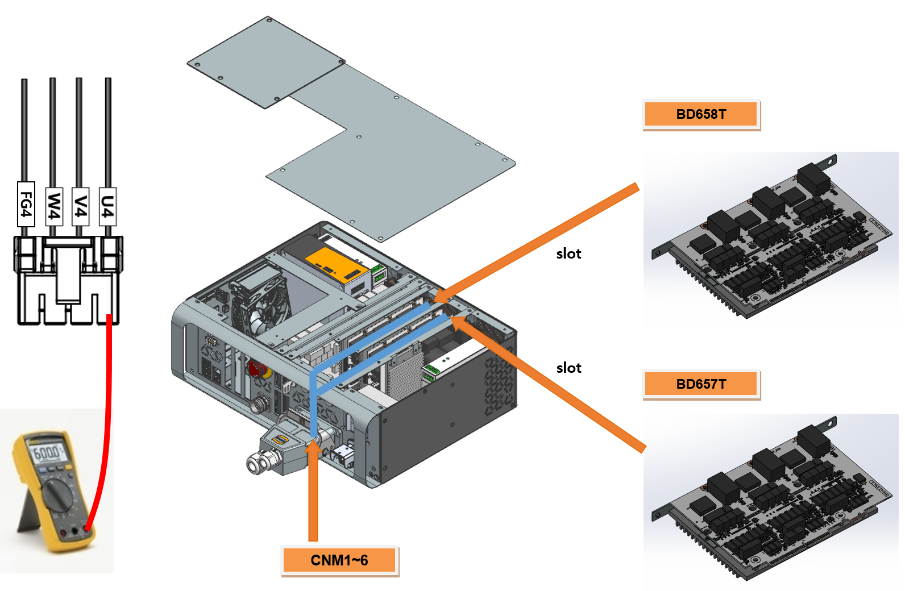

# 2.11. E02521 (Axis ○) IPM故障 - 驱动电源欠压

### 1. 概述

来自IPM（智能功率模块）的故障输出已生成，IPM是伺服驱动单元中的开关元件。虽然IPM故障通常由散热器温度升高、控制电压下降或过电流引起，但此特定错误是在伺服处于OFF状态时发生IPM故障时检测到的。由于IPM仅在伺服关闭状态下监测控制电压下降，请检查与放大器的栅极驱动电源相关的项目。

### 2. 原因和检查方法



* < 如果在伺服关闭时发生IPM故障错误 >

(1) 请检查用于电机驱动的组件。

->  检查连接到伺服驱动单元的输出电缆。

->  更换伺服驱动单元并验证错误是否仍然存在。

->  更换伺服板并验证错误是否仍然存在。



(1) 请检查用于电机驱动的组件。

为电机供电的伺服驱动单元通过连接到接口板的板对板连接器从伺服板接收命令。然后，从内部放大电路的电流输出通过连接到每个轴的连接器的线缆传递给电机。

->  检查连接到伺服驱动单元的输出电缆

检查连接伺服驱动单元到电机的线路状态。在检查过程中，确保控制器电源关闭，断开伺服驱动单元的连接器，并测量电缆侧每个相位与地面之间的电阻，以检查短路。

(a) Hi6-N 控制器

(b) Hi6-T 控制器

图1.1 伺服驱动单元输出电缆检查

->  替换伺服驱动单元检查

如果更换伺服驱动单元后错误未再出现，则原单元存在缺陷。请用已知功能正常的单元替换伺服驱动单元。

*   Hi6-N 控制器

    -   中型机器人用伺服驱动单元：H6D6X
    -   小型机器人用伺服驱动单元：H6D6A

*   Hi6-T15 控制器

    -   主3轴伺服驱动单元：BD658T
    -   副3轴伺服驱动单元：BD657T

->  替换伺服板（BD544）检查

如果更换伺服板后错误未再出现，则原板存在缺陷。请用已知功能正常的单元替换伺服板。

*   Hi6-N 控制器：BD640
*   Hi6-T15 控制器：BD641T