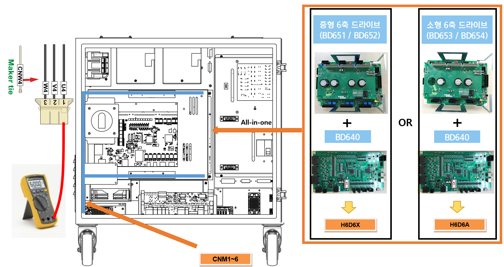

# 2.11. E02521 (Axis ○) IPM Fault - Gate Drive Power Under-voltage

### 1. Overview

A fault output has been generated from the IPM (Intelligent Power Module), the switching element within the servo drive unit. While IPM faults can generally be caused by heatsink temperature rise, control voltage drops, or overcurrent, this specific error is detected when an IPM fault occurs while the servo is OFF. Since the IPM only monitors for control voltage drops during the servo-off state, please inspect items related to the amplifier's gate drive power supply.

### 2. Causes and Inspection Methods



* < If the IPM fault error occurs while the servo is OFF >

(1) Please inspect the components used for motor drive.

->  Inspect the output cables connected to the servo drive unit.

->  Replace the servo drive unit and verify if the error persists.

->  Replace the servo board and verify if the error persists.



(1)	Please inspect the components used for motor drive.

The servo drive unit, which powers the motor, receives commands from the servo board via a board-to-board connector linked to the interface board. The current output from the internal amplification circuit is then transmitted to the motor through the wiring connected to each axis's connector.

->  Inspection of the output cables connected to the servo drive unit

Inspect the condition of the wiring connecting the servo drive unit to the motor. During inspection, ensure the controller power is OFF, disconnect the connector from the servo drive unit, and measure the resistance between each phase and the ground on the cable side to check for short circuits.

(a) Hi6-N Controller

(b) Hi6-T Controller

Figure 1.1 Inspection of Servo Drive Unit Output Cables

->  Servo Drive Unit Replacement Inspection

If the error does not recur after replacing the servo drive unit, the original unit is defective. Please replace the servo drive unit with a known functional unit.

*   Hi6-N Controller

    -   Servo drive unit for mid-sized robots: H6D6X
    -   Servo drive unit for small-sized robots: H6D6A

*   Hi6-T15 Controller

    -   Main 3-axis servo drive unit: BD658T
    -   Sub 3-axis servo drive unit: BD657T

->  Servo Board (BD544) Replacement Inspection

If the error does not recur after replacing the servo board, the original board is defective. Please replace the servo board with a known functional unit.

*   Hi6-N Controller: BD640
*   Hi6-T15 Controller: BD641T