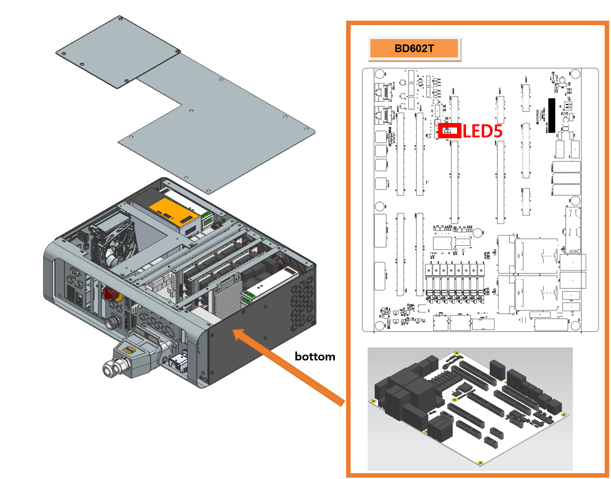

# 2.13. E02541 驱动单元控制电压下降

### 1. 概述

提供给伺服驱动单元的 +15V 控制电源已降至阈值以下。根据控制器型号，通过不同路径检测到此错误，然后传输至伺服板。

*   Hi6-N: 在伺服驱动单元处检测到。
*   Hi6-T: 在背板电路板 (BD602T) 处检测到。

### 2. 原因和检查方法



*   < 检查电源 LED 指示灯 >

    (1)	请检查电源状态 LED。

    ->  Hi6-N: 检查伺服驱动单元上的 "POW" LED。

    ->  Hi6-T: 检查背板电路板 (BD602T) 上的 "LED5"。

    ->  检查 CMSMPS (控制主开关电源) 上的 "DC OK" LED。

*   < 如果电路板 LED 和 SMPS LED 均为关闭 >

    (2)	请验证控制电源单位的输出。

    ->  Hi6-N

    *  断开 CN24VB1 连接器，从 BD640 断开，并检查 PSM 上的 "SMPS OK" LED 是否亮起。

    *  移除 BD640 板，并检查伺服驱动单元上的 "POW" LED。

    ->  Hi6-T 

    *   断开 CN24VB1 连接器，从 BD602T 断开，并检查 CMSMPS 上的 "DC OK" LED 是否亮起。

    *   移除 BD641T 板，并检查背板电路板 (BD602T) 上的 "LED5"。

    (3)	请检查控制电源单位。

    ->  验证提供给 CMSMPS 的输入电压。

    ->  更换 CMSMPS 并检查 LED 是否亮起。

    * < 如果只有电路板 LED 关闭 >

    (4)	更换相关组件并检查电源状态 LED。

    -> Hi6-N

    * 更换连接 PSM 和 BD640 的 CN24VB1 电缆，然后检查 LED 状态。

    * 更换伺服板并检查 LED 状态。

    * 更换伺服驱动单元并检查 LED 状态。

    ->  Hi6-T

    * 更换连接 CMSMPS 和背板电路板 (BD602T) 的 CN24VB1 电缆，然后检查 LED 状态。

    * 更换伺服板并检查 LED 状态。

    * 更换背板电路板 (BD602T) 并检查 LED 状态。



(1)	请检查电源状态 LED。

“驱动单元控制电压下降”错误是由于 +15V 控制电源下降造成的。该状态根据控制器型号通过不同路径检测到，然后传输至伺服板。

*   Hi6-N : 在伺服驱动单元处检测到。

*   Hi6-T : 在背板电路板 (BD602T) 处检测到。

(a) Hi6-N 控制器伺服驱动单元上的 "POW LED" 位置

(b) Hi6-T 控制器背板电路板上的 "LED5" 位置

图 1.1 控制器电源状态 LED 的位置

 

(2)	请验证控制电源单位的输出。

->  Hi6-N

*   断开 CN24VB1 连接器，从 BD640 断开，然后检查 PSM 上的 "SMPS OK" LED 是否亮起。

*   移除 BD640 板，然后检查伺服驱动单元上的 "POW" LED。

->  Hi6-T

*   断开 CN24VB1 连接器，从 BD602T 断开，然后检查 CMSMPS 上的 "DC OK" LED 是否亮起。

*   移除 BD641T 板，然后检查背板电路板 (BD602T) 上的 "LED5"。

(3)	请检查控制电源单位。

->  验证提供给 CMSMPS 的输入电压。

->  更换 CMSMPS 并验证 LED 状态。

(4)	更换相关组件并检查电源状态 LED。

->  Hi6-N

*   更换连接 PSM 和 BD640 的 CN24VB1 电缆，然后检查 LED 状态。

*   更换伺服板并检查 LED 状态。

*   更换伺服驱动单元并检查 LED 状态。

->  Hi6-T

*   更换连接 CMSMPS 和背板电路板 (BD602T) 的 CN24VB1 电缆，然后检查 LED 状态。

*   更换伺服板并检查 LED 状态。

*   更换背板电路板 (BD602T) 并检查 LED 状态。