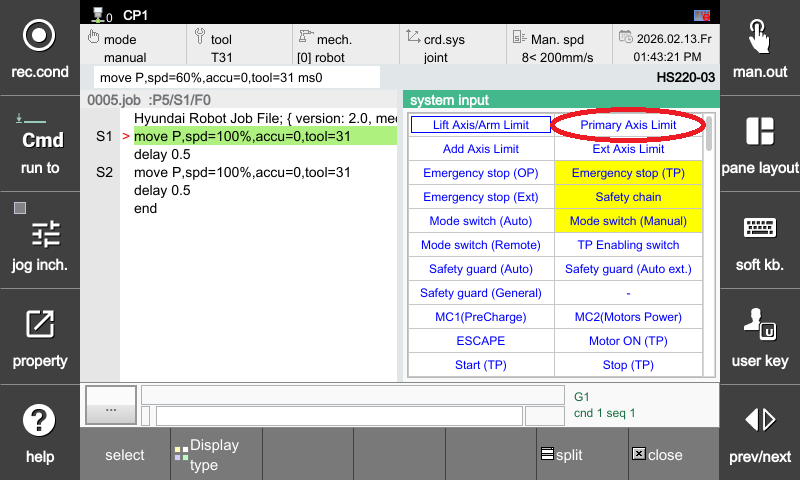
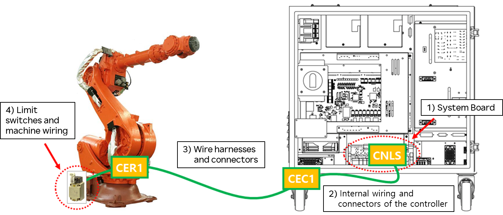
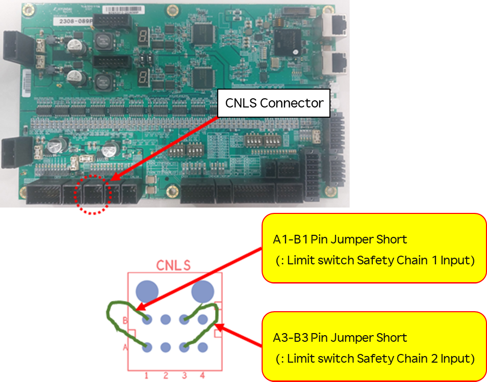
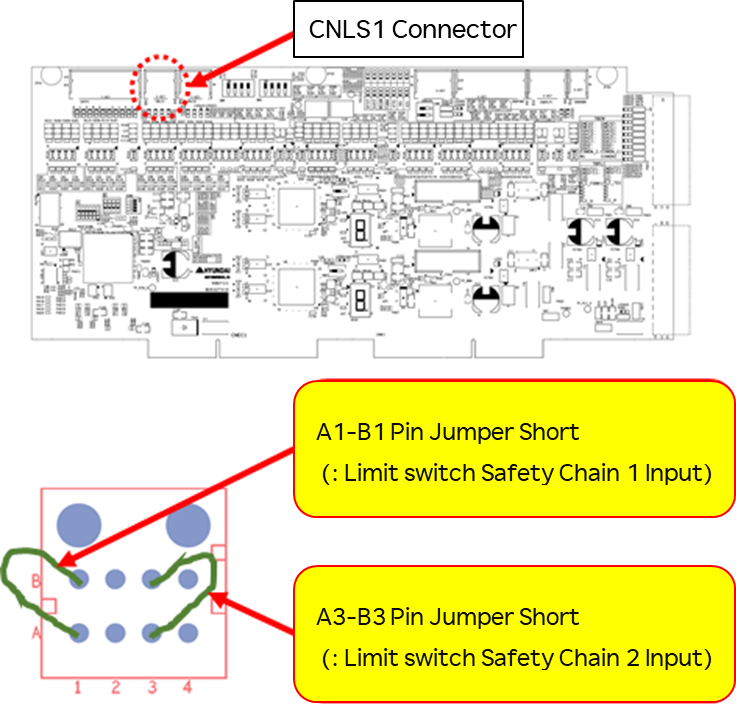
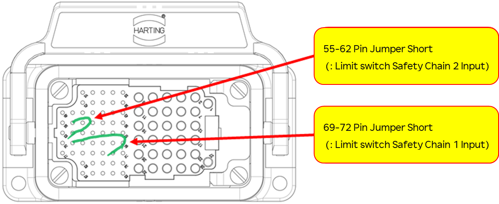

# 3.1. E00002. Hardware Limit Switch Triggered

### 1. Overview

The limit switch installed at the end of the operating range for each robot axis has been triggered. For safety reasons, the robot stops immediately and cannot be operated normally until it is moved back into a safe operating range using the appropriate procedures.

### 2. Causes and Inspections



**(1) Verify if the robot has actually exceeded its operating range.**
* Recovery procedure for operating range excursions

**(2) If the error occurs even though the robot is within its operating range**
* How to inspect from the system board connector (CNLS)  
* How to inspect from the wire harness (C(M)ER1 or C(M)EC1)  
* How to inspect the limit switches and internal body wiring  
* How to inspect the safety board (BD632) 



#### (1) Verify if the robot has actually exceeded its operating range.
Check if the robot has physically moved outside its designated operating range. If a Soft Limit Error has occurred simultaneously, it confirms that the robot has exceeded its operating range. Move the robot back into the safe operating range using the appropriate manual operations.   

The operating range varies depending on the robot model. Since the installation positions of the limit switches may also differ, please refer to the "Operating Range Limits" section in the maintenance manual for the specific robot model.

 
Figure 1 Example of hardware limit switch installation positions (HS165/HS200 Robot)

 
Figure 2 Example of hardware limit switch operating range (HS165/HS200 S Axis)

### [Recovery procedure for operating range excursions]
To move the robot while the hardware limit switch is engaged, you must follow the conditions and steps outlined below:

A) Enter System mode from Manual mode. B) Grip the Enabling Switch on the Teach Pendant. > 『Manual Mode』 + 『System』 + 『TP Enabling Switch ON』

C) Turn the motors ON in this state. D) Use the Jog keys to move the robot back into the safe operating range.

#### (2) If the error occurs even though the robot is within the operating range
First, check the dedicated input signal window on the Teach Pendant to see if the **Over-Travel (Limit)** item is continuously being input. You can view this window by selecting **"『Window Layout』 → 『Select』 → 『System Input』"**. If the **Over-Travel** item is highlighted in **yellow**, it indicates an error state.

### [Caution]
In Manual mode, the Enabling Switch on the Teach Pendant must be **ON** for monitoring. In Auto mode, monitoring is active regardless of the Enabling Switch status.

 
Figure 3 Over-Travel monitoring display in the System Input window

In such cases, the cause can be found in components related to the limit switches. As shown in the following figure, the limit switches are connected from the robot body to the system board of the controller via the "CEC1 – CER1" cables for the Hi6-N model, or the "CMEC1 – CMER1" cables for the Hi6-T model.

 
Figure 4 Wiring structure of the hardware limit switches

The main inspection points and sequence are as follows:

A) System Board  
B) Internal Controller Wiring and Connectors 
C) Wire Harness and Connectors 
D) Limit Switches and Internal Body Wiring 

You must jumper the limit switch input lines at the appropriate points and verify if the Over-Travel item in the monitoring window changes to white.  
Please proceed according to the following steps.

### [How to inspect from the system board connector (CNLS)]



Warning  
Always ensure that the controller power is turned OFF when connecting or removing cables. Electrical hazards can lead to personal injury or property damage.



This procedure determines whether the system board itself is faulty. As shown in the figure below, jumper (short-circuit) the pins related to the limit switch input on the CNLS connector. Then, check the Over-Travel status in the dedicated input signal monitoring window.

① If the status changes to white: The system board is faulty. Replace the board. 
② If the status remains yellow (error state): The system board is functioning correctly. Inspect for faults in the section from the system board to the robot's hardware limit switches. 

 
Figure 5 Hi6-N System Board

 
Figure 6 Hi6-T System Board

###  How to inspect from the wire harness (C(M)ER1 or C(M)EC1)



Warning  
Always ensure that the controller power is turned OFF when connecting or disconnecting cables. Electrical hazards can lead to personal injury or property damage.



This procedure is used to determine if the cable is faulty through the C(M)ER1 or C(M)EC1 wire harness connectors. First, remove the C(M)EC1 wire harness from the controller. Then, jumper-short the pins related to the limit switch on the C(M)EC1 connector mounted on the controller. In this state, check the Over-Travel item through the dedicated input signal monitoring window.

① If the status changes to white:  
The fault lies in the cable or the connector between the controller's internal C(M)EC1 connector and the system board. Inspect or replace these components.

② If the status remains yellow (error state):  
The fault is located in the section between the C(M)EC1 connector and the robot body's limit switches.

Reconnect the C(M)EC1 wire harness, then disconnect the C(M)ER1 wire harness from the robot body. Jumper-short the pins related to the limit switch on the C(M)ER1 connector of the wire harness. In this state, check the status of the Over-Travel item in the dedicated input signal monitoring window.

① If the status changes to white:  
The fault lies in the wire harness cable or the connectors between the C(M)ER1 and C(M)EC1 connectors. Inspect or replace the wire harness.

② If the status remains yellow (error state):  
The fault is located in the section from the robot body's C(M)ER1 connector to the limit switches. Check the internal body wiring or the switches themselves.

 
Figure 7 Hardware Limit Switch Harness C(M)EC Structure

### [How to Inspect the Limit Switch and Internal Wiring of the Main Unit]



**Warning**  
Always ensure that the controller power is turned off before connecting or disconnecting any cables.  
Electrical hazards may result in serious personal injury or property damage.



After disconnecting the CER1 wire harness from the main unit, use a multimeter to perform a short-circuit test on the limit switch–related lines at the CER1 connector of the main unit.

① If the resistance is measured as **open**, 
the limit switch itself or the connector between the limit switch and CER1 may be faulty.  
Inspect the components or replace them as necessary.

② If the resistance is measured as **short**, 
check for faults in other parts of the system.  
Please contact our technical support.

 
Figure 8 Hardware Limit Switch Harness C(M)ER Structure

### [How to Inspect the Safety Board (BD632)]

 
**Figure 9** Safety Board (BD632)

1) How to check the IO power status 
A. Verify that the two LEDs shown in the figure above are lit **green**. 
B. If the IO power LED is **red** or **off**, check whether the indicated fuse is in normal condition. 
C. If the fuse is blown, replace it with a new one. 

2) How to check whether the IO power becomes unstable when the motor is ON 
A. When the motor is ON, verify that the IO power LED is lit **green**. 
B. If the LED turns **red** or turns **off** at the moment the motor is turned ON, the IO power is unstable during motor operation. 

3) If the IO power status is unstable 
A. Check the connection of the IO power connector. 
B. Inspect the IO power cable. 
C. Check the grounding condition of the Safety Board (BD632)   
(ground cable and grounding terminal connection status). 

