# 3.2. E0014. Momentary Contact of Safety Switches (EM, OTR, TS, etc.)

### 1. Overview

For some reason, the motor power supplied to the amplifier has been cut off.  
The main controller checks the safety signals to identify the cause of the motor power shutdown.  
If no abnormal condition is detected in the safety signal inputs, this message is displayed.

The figure below shows the configuration of various safety signals that can interrupt the motor power.  
The main controller periodically monitors the ON/OFF status of these safety signals.  
If a momentary contact failure occurs for a duration shorter than the monitoring cycle, the main controller may not detect it and will display this message.

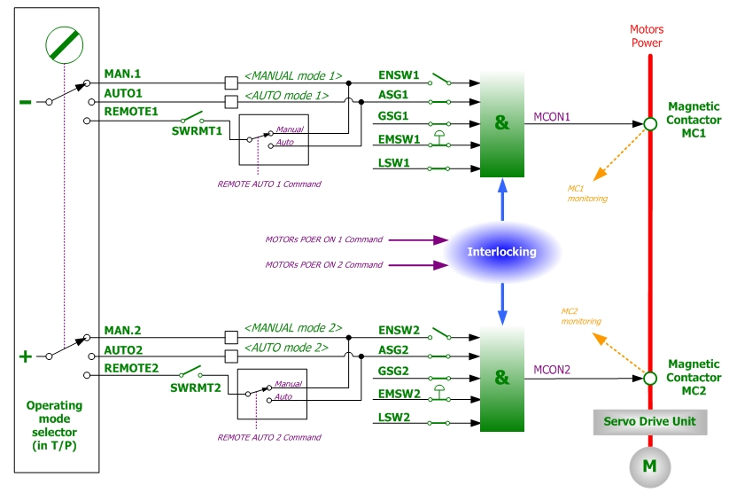 
**Figure 1** Conceptual Diagram of the Safety Circuit for Motor Power Switching

### 2. Causes and Inspection



(1) Check the DC 24 V power supply and cable condition. 

(2) Check the safety switches and signal wiring. 

(3) Check the system board and electrical module. 



### (1) Check the DC 24 V Power Supply and Cable Condition

Verify that the DC 24 V control power is being supplied normally to the system board.  
If there is an issue with the power supply, it may affect the safety sequence of the system board and cause this error.

For the **Hi6-N controller**, power is supplied through the following connections:  
- Electrical module connectors **CN24VB3** and **CN24VB4**  
- System board connectors **CNSMPS1** and **CNSMPS2**

Check whether the power supply voltage is fluctuating or if there are any abnormalities in the cables.

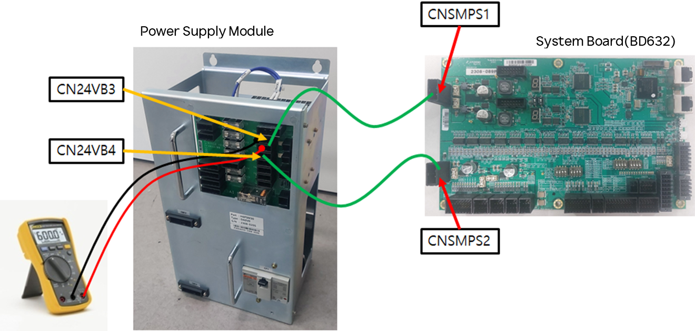 
**Figure 2** DC 24 V Power Connection and Voltage Check Method for the Hi6-N System Board (BD632)

For the **Hi6-T controller**, power is supplied through:  
- **SMPS & BUFFER connector**  
- Backplane board connector **CN24VB1**  
- Board-to-board connections between the backplane board and the system board

Check whether the power supply voltage is fluctuating or if there are any abnormalities in the cables.

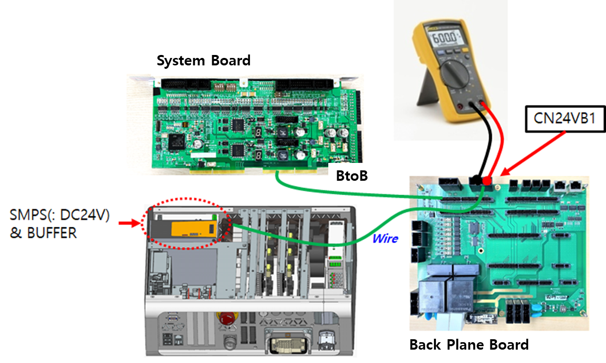 
**Figure 3** DC 24 V Power Connection for the Hi6-T Controller

### (2) Check the Safety Switches and Signal Wiring

A condition may occur where the safety switch input momentarily turns OFF for a duration too short for the MAIN board to recognize.

Possible causes include:

- **Safety switch failure**
- **Wiring failure**: damage such as cuts or abrasion of the cable
- **Improper cable routing**:  
  Signal cables must be routed at least **10 cm** away from power lines or cables that carry high current.  
  Alternatively, electronic shielding should be applied using metal plates or equivalent shielding materials.



**Caution**  
Disabling or bypassing safety-related functions must be used **for testing purposes only** and must be restored immediately after testing.  
Operating the system while safety functions are ignored may lead to serious safety hazards.



The following types of safety switches can be used and must be connected through the system board.  
Please refer to the specifications corresponding to the safety switches currently in use.

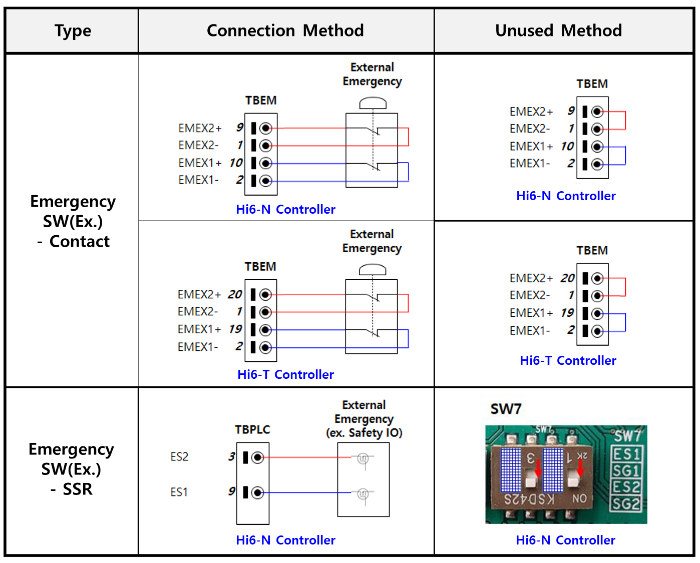 
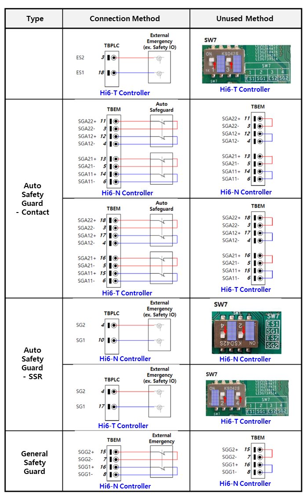 
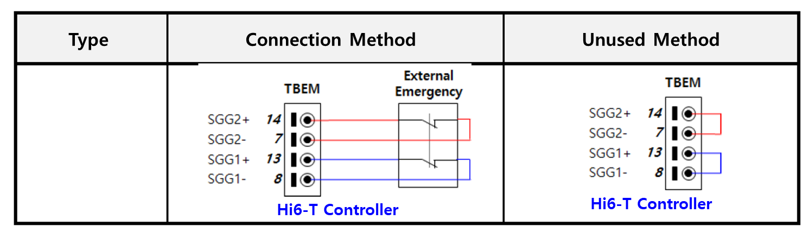 



**Caution**  
Disabling or bypassing safety-related functions must be used **for testing purposes only** and must be restored to their original state immediately.  
Operating the system while safety functions are ignored may cause serious safety-related issues.



Other safety-related and system operation switches that may affect this error include the following:

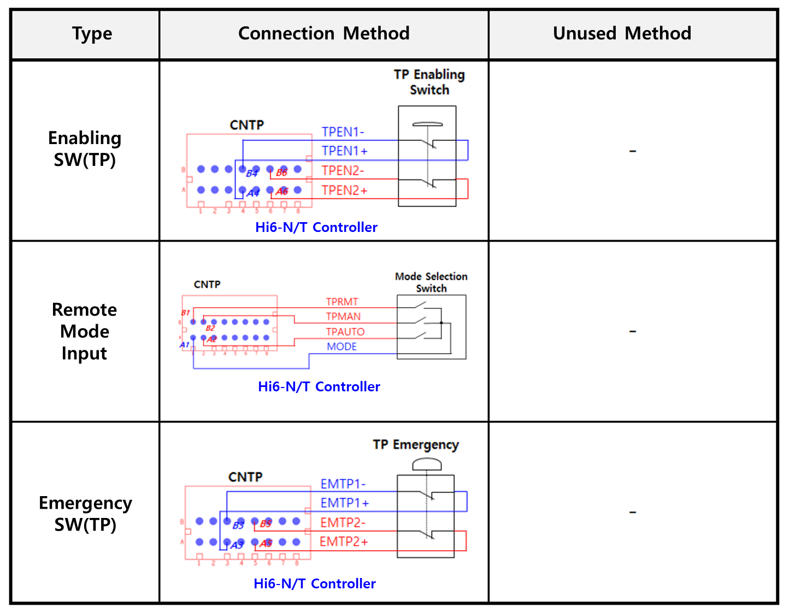 
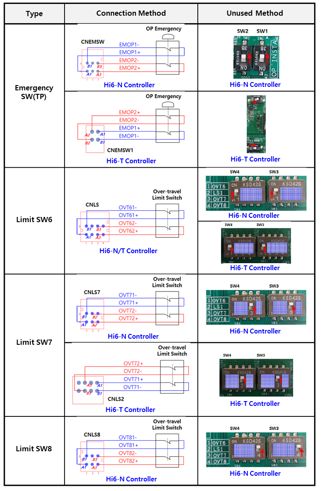 
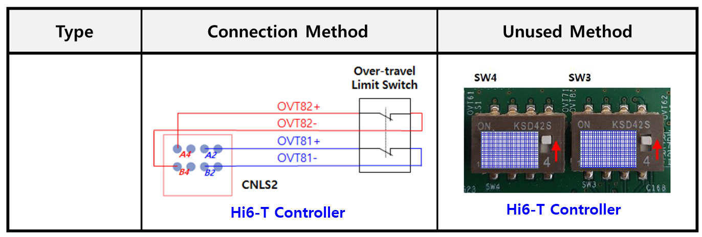 

### (3) Check the System Board and Electrical Module

- **Cabling failure (wires, connectors, etc.)**

For the **Hi6-N controller**, check the cabling between the electrical module  
(**PSM or PDM**), where the electromagnetic contactor is installed, and the system board that collects the monitoring signals.

The cable name is **CNMC**, and it is routed from the lower front side of the system board to the electrical module.  
Check the connector connection status of this cable.

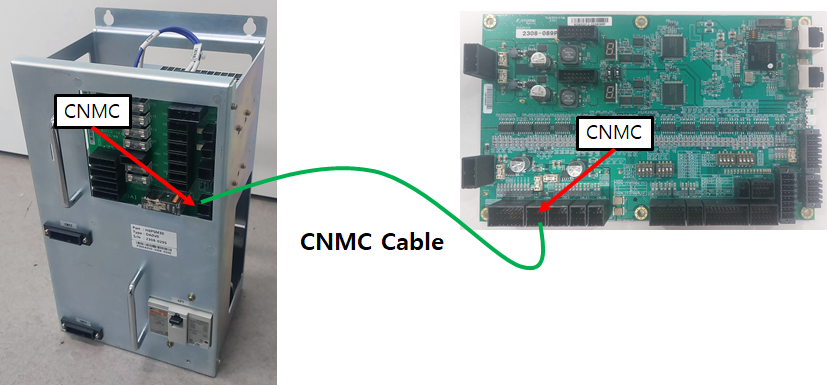 
**Figure 4** Hi6-N Controller

For the **Hi6-T controller**, the electromagnetic contactor is installed on the PCB board, and the monitoring signals are connected to the system board through **board-to-board** connections.  
Check the board-to-board connection status.

 
**Figure 5** CNMC Cable Between the Electrical Module and the System Board

- **System Board Failure**

A failure in the input signal processing circuitry inside the system board may also cause this error.  
Replace the system board to verify.

- **Electrical Module Failure (Hi6-N Controller Only)**

Failures inside the electrical module can be broadly classified into the following components:
- Electrical board (**BD6C2**)
- Electromagnetic contactors (**MC1**, **MC2**)
- Wiring between the electrical board and the electromagnetic contactors

However, since it is difficult to inspect the inside of the electrical module at a site where the robot is already installed,  
replace the entire electrical module.

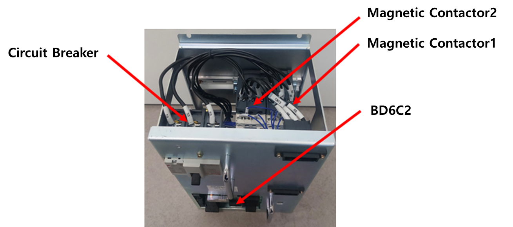 
**Figure 6** Electrical Module Structure and Nomenclature for the Hi6-N Controller
