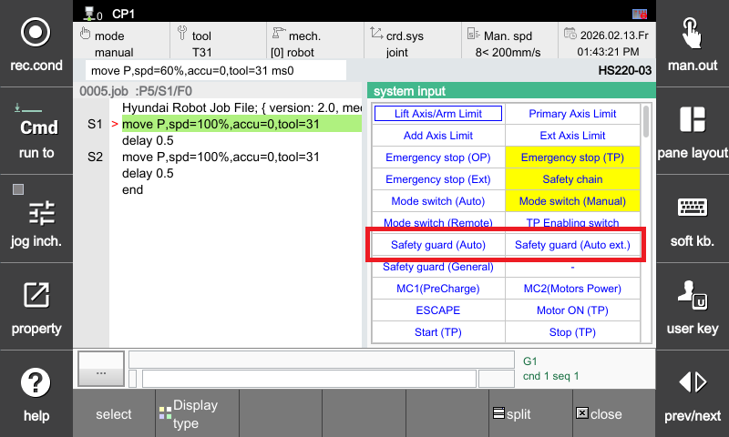
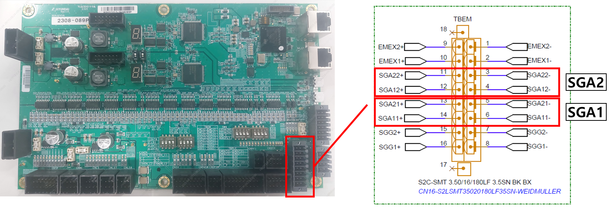
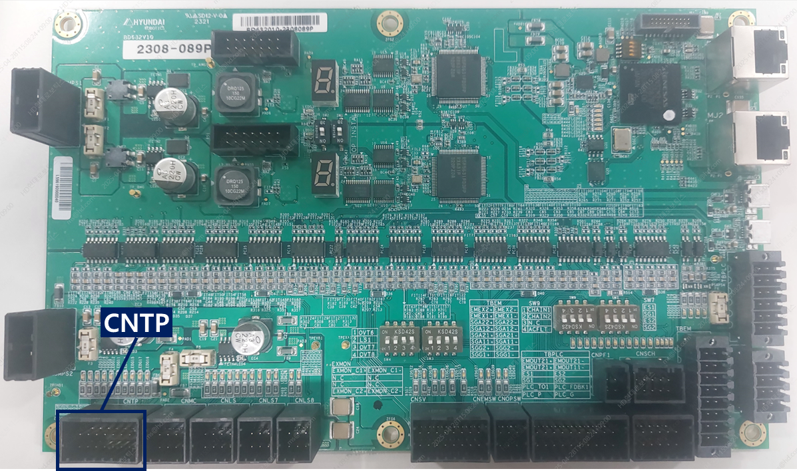

# 3.3. E0043. Auto Mode Safety Guard (Auto Guard) Switch Connection Error

### 1. Overview

A connection error has occurred in the safety plug (Auto Guard) switch while in **Auto mode**.  
In Auto mode, the motor ON state cannot be maintained when this error occurs.

### 2. Causes and Inspection Methods



(1) When the input of the Auto Mode Safety Guard switches (**SGA1**, **SGA2**) is unstable  
- How to check the input status of the Auto Mode Safety Guard switches (SGA1, SGA2)

(2) When the error occurs regardless of the input state of the Auto Mode Safety Guard switches (**SGA1**, **SGA2**)  
- How to inspect the Safety Board (BD632)  
- How to check the connection status with the Teaching Pendant (TP630)



### (1) When the input of the Auto Mode Safety Guard switches (SGA1, SGA2) is unstable

- How to check the input status of the Auto Mode Safety Guard switches (SGA1, SGA2)

 

1) Use the system input screen on the Teaching Pendant (TP) to check the Auto Safety Guard signal input status and identify which Auto Safety Guard signals are currently active  
&nbsp;&nbsp;&nbsp;&nbsp;(SGA1 on the left, SGA2 on the right).

2) At the **TBEM terminal**, check the connection status of the **SGA1** and **SGA2** terminals, the condition of the cables, and whether there are any abnormalities in the input switches.

 

### (2) When the error occurs regardless of the input state of the Auto Mode Safety Guard switches (SGA1, SGA2)

- How to inspect the Safety Board (BD632)

 

1) How to check the IO power status 
A. Verify that the two LEDs shown in the figure above are lit **green**. 
B. If the IO power LED is **red** or **off**, check whether the indicated fuse is in normal condition. 
C. If the fuse is blown, replace it with a new one. 

2) How to check whether the IO power becomes unstable when the motor is ON 
A. When the motor is ON, verify that the IO power LED is lit **green**. 
B. If the LED turns **red** or turns **off** at the moment the motor is turned ON, the IO power is unstable during motor operation. 

3) If the IO power status is unstable 
A. Check the connection of the IO power connector. 
B. Inspect the IO power cable. 
C. Check the grounding condition of the Safety Board (BD632, ground cable and grounding terminal connection status). 

- How to check the connection status with the Teaching Pendant (TP630)

 

1) Check the connection status of the **CNTP** connector. 
2) Inspect the **CNTP cable**   
– Check for cable damage   
– Verify that the cable length is **40 m or less**   
– Use a **certified cable** 
3) Check the grounding condition of the Safety Board (**BD632**)  
– Ground cable condition  
– Ground terminal connection status

