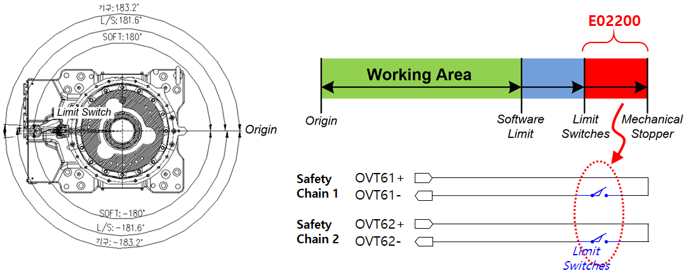
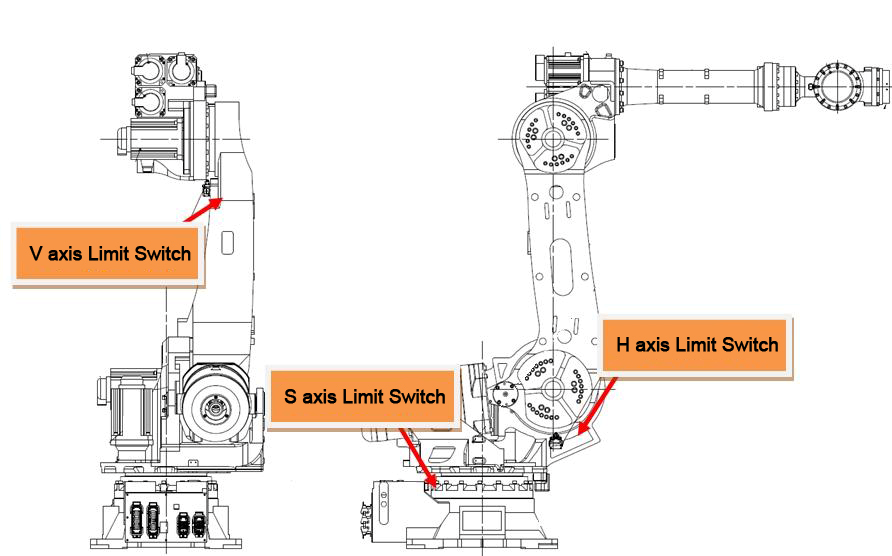

# 3.4. E02200. Main Unit Limit Switch Activated

## 1. Overview

The limit switch installed at the end of the operating range of each robot axis has been activated.  
For safety reasons, the robot stops immediately and normal operation cannot be resumed until the robot is moved back into a safe operating range using an appropriate recovery method.

## 2. Causes and Inspection Methods



(1) The robot has moved beyond the hardware operating range.

(2) Move the robot back into the operating range.  
- Recovery method when the robot has moved outside the operating range



### (1) The robot has moved beyond the hardware operating range

Check once again whether the robot has actually moved outside the operating range.  
A software limit error is likely to have occurred simultaneously, indicating that the robot has exceeded its maximum operating range.  
Using an appropriate operation method, move the robot back into the operating range.

 
**Figure 1** Occurrence of E02200: Main Unit Limit Switch Activated

The operating range varies depending on the robot model.  
Accordingly, the installation position of the limit switches may also differ.  
Refer to the **“Operating Range Limitation”** section in the corresponding mechanical maintenance manual.

 
**Figure 2** Example of Hardware Limit Switch Installation Positions (HS165 / HS200)

 
**Figure 3** Example of Hardware Limit Switch Operating Range  
(HS165 / HS200, S-axis)

### (2) Move the robot back into the operating range

Refer to the following recovery method for operating range violation and move the robot back into the operating range.

- Recovery method when the robot has moved outside the operating range

To move the robot while the hardware limit switch is activated, execute the following conditions and steps in order.

A) Enter **System mode** from **Manual mode**. 
B) Hold the **Enabling Switch** on the Teaching Pendant (TP). 

『Manual Mode』 + 『System』 + 『TP Enabling Switch ON』

C) In this state, turn the **Motor ON**. 
D) Use the **Jog keys** to move the robot back into the operating range. 
