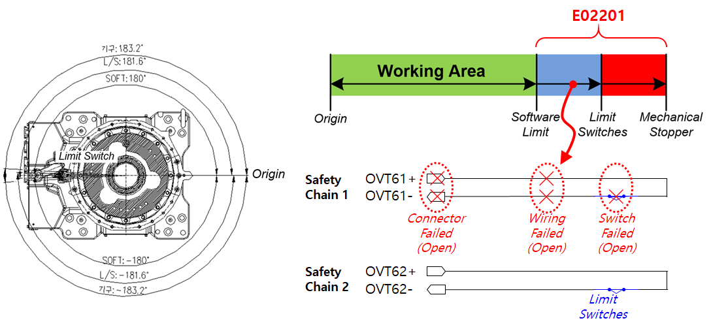
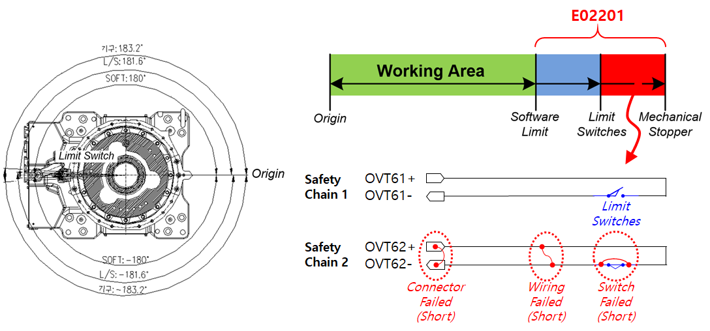

# 3.6. E02201. Body Limit SW Input Mismatch (Safety Chain 1 OFF)

### 1. Overview

The robot has moved outside the software limit area. However, the input from the limit switches installed at the end of each robot axis operating range is not normal.  
Since the input of Safety Chain 1 differs from the input of Safety Chain 2, inspection is required.

### 2. Causes and Inspection Methods



(1) If the robot has NOT exceeded the hardware operating range  
* A problem exists in Safety Chain 1. Inspect the limit SW wiring.

(2) If the robot HAS exceeded the hardware operating range  
* A problem exists in Safety Chain 2. Inspect the limit SW wiring.



(1) When the robot has NOT exceeded the hardware operating range

 
Figure 1 E02201 Body Limit SW Input Mismatch (Safety Chain 1 OFF) – Inside the hardware operating range

Since there is a problem in Safety Chain 1, inspect the limit SW wiring.

Although the robot is within the area where the hardware limit SW is installed, Safety Chain 1 is monitored as OFF.  
This condition may be caused by the following reasons:

* Hardware limit SW failure: The switch is damaged or opened (Open) for some reason.
* Wiring: The wiring is disconnected or damaged, causing poor contact.
* Connector: The connector is disconnected or damaged, resulting in disconnection or poor contact.

For detailed inspection points, refer to the section “Hardware Limit Switch Inspection Method”.

(2) When the robot HAS exceeded the hardware operating range
 
Figure 2 E02201 Body Limit SW Input Mismatch (Safety Chain 1 OFF) – Outside the hardware operating range

Since there is a problem in Safety Chain 2, inspect the limit SW wiring.

Although the robot has moved outside the area where the hardware limit SW is installed, Safety Chain 2 fails to detect the abnormal condition.  
In other words, Safety Chain 2 remains continuously closed.

This condition may be caused by the following reasons:

* Hardware limit SW failure: The switch is damaged or short-circuited (Short) for some reason.
* Wiring: The two lines of a wire pair are short-circuited.
* Connector: The connector is damaged, causing a short circuit between pins.

For detailed inspection points, refer to the section “Hardware Limit Switch Inspection Method”.
