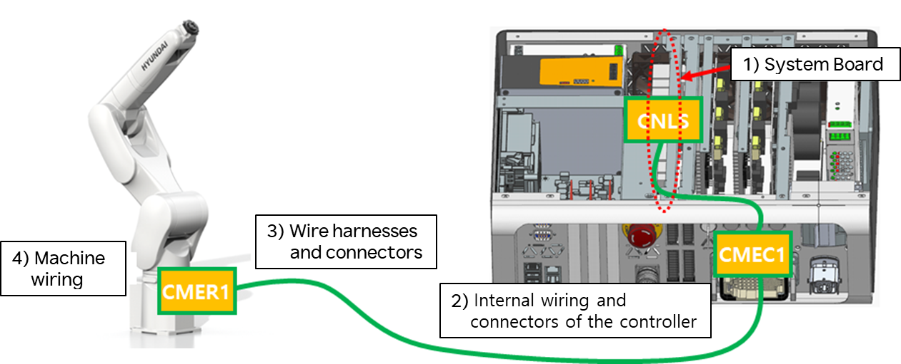
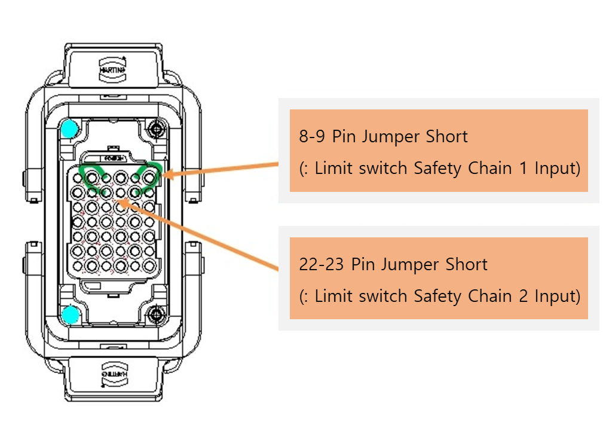
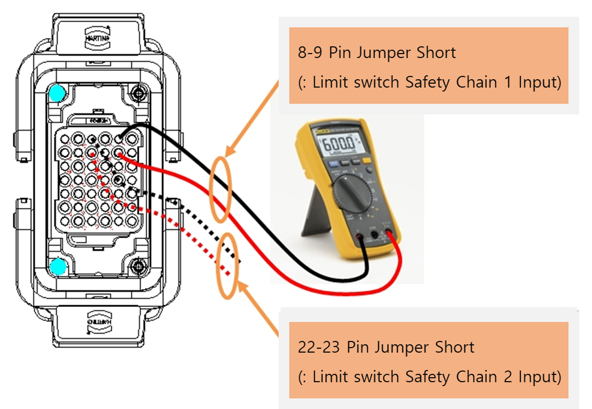
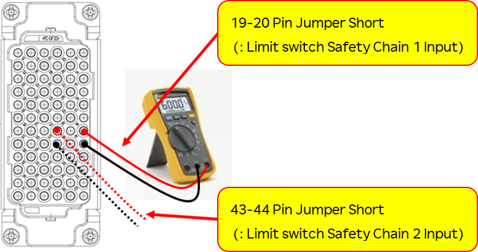

# 3.5. E02001 ~ E02208 Hardware Limit Switch Inspection Method

## 1. Causes and Inspection Methods

If the hardware limit switch operates abnormally, refer to the following inspection methods.

### (1) Switch Status Monitoring

The hardware limit input status can be checked through the dedicated input signal screen on the Teaching Pendant (TP).  
This screen can be accessed by selecting  
**『Window Setup』 → 『Select』 → 『System Input』**.

If the **Limit (Over-Travel)** item is displayed in **yellow**, the hardware limit switch is activated (open),  
indicating that the robot has moved outside the hardware operating range.

- **Caution:**  
  In **Manual mode**, monitoring is available only when the **Enabling Switch** on the Teaching Pendant is turned **ON**.  
  In **Auto mode**, monitoring is available regardless of the Enabling Switch state.

 
**Figure 1** Hardware Limit Switch Input Status Display (Teaching Pendant Screen)

### (2) Hardware Limit Switch Wiring Structure

To identify the cause within the components related to the hardware limit switch, it is necessary to understand the wiring structure.  
As shown in the figure below, the hardware limit switch signal starts from the limit switch inside the robot mechanical unit and is connected via cables to the system board inside the controller.

- Limit switch and internal robot mechanical unit wiring  
- Wire harness and connectors  
  (For Hi6-N: **CER1 – CEC1**, for Hi6-T: **CMER1 – CMEC1**)  
- Internal controller wiring and connectors  
  (For Hi6-N: **CEC1 – CNLS**, for Hi6-T: **CMEC1 – CNLS1**)  
- System board  
  (For Hi6-N: **BD632**, for Hi6-T: **BD632T**)

 
(a) Hi6-N Controller

 
(b) Hi6-T Controller

**Figure 2** Hardware Limit Switch Wiring Structure

### (3) Hardware Limit Switch Inspection Method

#### Inspection via System Board Connector (CNLS)


**Warning**  
Always turn **OFF the controller power** before connecting or disconnecting cables.  
Electrical hazards may result in serious personal injury or property damage.


This inspection method is used to **determine whether the system board is faulty**.

As shown in the figure below, **jumper-short the pins related to the limit switch inputs** at the **CNLS connector** on the system board.  
Then check the **Limit (Over-Travel)** status in the **Dedicated Input Signal Monitoring** window.

- **① If the indication changes to white**  
  → The system board is faulty.  
  → Replace the system board.

- **② If the indication remains yellow (error state)**  
  → Check for faults in the section from the system board to the hardware limit switches in the robot body.

 
(a) Hi6-N System Board

 
(b) Hi6-T System Board

Figure 3 System Board

#### [Inspection Method at the Wire Harness (C(M)ER1 or C(M)EC1)]


When connecting or disconnecting cables, always perform the operation with the controller power turned OFF.  
Electrical hazards may cause personal injury or property damage.


This method is used to determine whether there is a cable failure through the wire harness connector C(M)ER1 or C(M)EC1.

First, disconnect the C(M)EC1 wire harness from the controller.  
Then, jumper-short the pins related to the limit switch (Limit SW) at the C(M)EC1 connector attached to the controller.

In this condition, check the **Limit (Over-Travel)** item in the dedicated input signal monitoring window.

① **If the status changes to white:**  
The cable or connector between the internal C(M)EC1 connector and the system board inside the controller is faulty.  
Inspect or replace the cable or connector.

② **If the status remains yellow (error state):**  
Check for a failure in the area after the C(M)EC1 connector up to the robot body limit switch.

 
(a) Hi6-N Controller

 
(b) Hi6-T Controller

Figure 4 Structure of the Hardware Limit SW Harness C(M)EC1

#### [How to Check the Limit SW and Internal Wiring of the Robot Body]

After removing the C(M)ER1 wire harness from the robot body, use a multimeter to perform a short test on the limit SW–related lines at the C(M)ER1 connector on the robot body to check for abnormalities.

① If the resistance is measured as open, 
This indicates a failure of the limit SW itself, or a fault in the connector or wiring between the limit SW and CER1.  
Inspect and repair or replace the faulty component.

② If the resistance is measured as short, 
A fault exists in another area. Further troubleshooting is required. Please contact our service department.

 
(a) Hi6-N Controller

 
(b) Hi6-T Controller

Figure 5 Structure of the Hardware Limit SW Harness C(M)ER1

