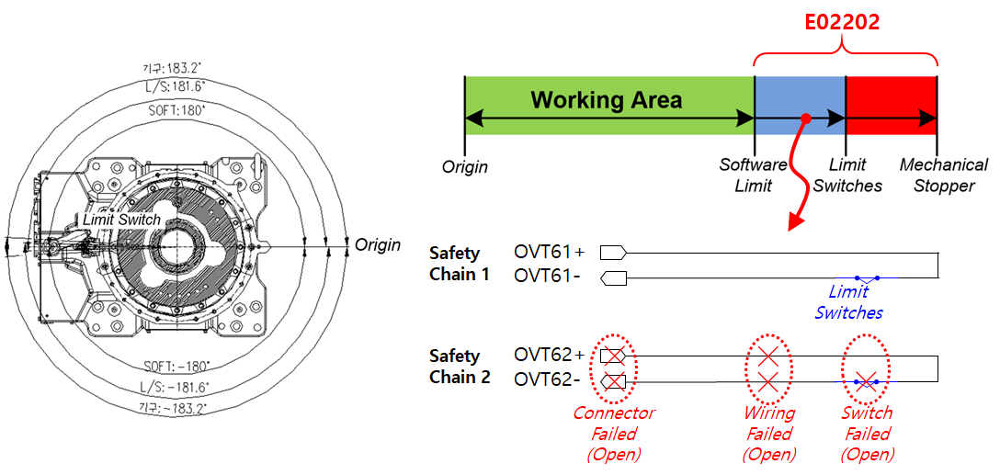
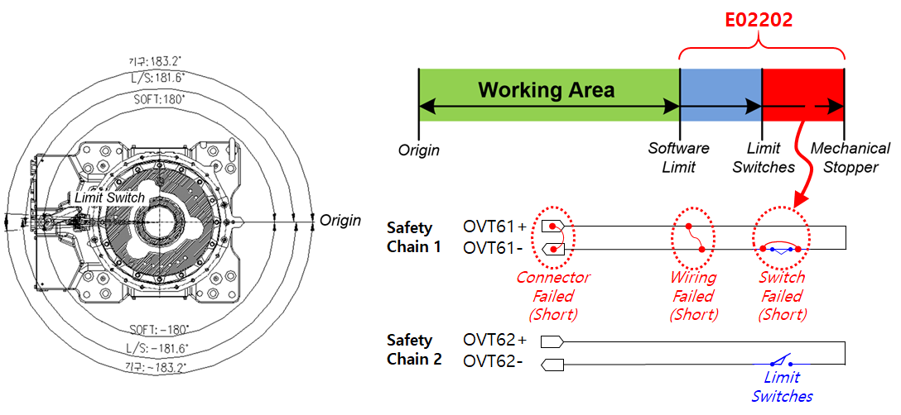

# 3.7. E02202. 机身限制 SW 输入不匹配 (安全链 2 关闭)

### 1. 概述

机器人超出了软限制范围。  
然而，安装在每个机器人轴操作范围末端的限制开关输入不正常。  
由于安全链 1 和安全链 2 的输入不同，需要检验。

### 2. 原因和检查方法



(1) 当硬件操作范围未超出时  
* 由于安全链 2 存在问题，请检查限制 SW 接线。

(2) 当硬件操作范围已超出时  
* 由于安全链 1 存在问题，请检查限制 SW 接线。



(1) 当硬件操作范围未超出时

 
图 1 E02202 机身限制 SW 输入不匹配 (安全链 2 关闭) – 在硬件操作范围内

由于安全链 2 存在问题，请检查限制 SW 接线。

尽管机器人位于安装硬件限制 SW 的区域内，但安全链 2 被监测为关闭。  
这一状态可能由以下原因引起：

* 硬件限制 SW 故障：开关由于某种原因损坏或断开（打开）。
* 接线：接线断开或损坏，导致接触不良。
* 连接器：连接器断开或损坏，导致断开或接触不良。

有关详细检查点，请参阅“硬件限位开关检查方法”一节。

(2) 当硬件操作范围已超出时

 
图 2 E02202 机身限制 SW 输入不匹配 (安全链 2 关闭) – 在硬件操作范围外

由于安全链 1 存在问题，请检查限制 SW 接线。

尽管机器人已移动到安装硬件限制 SW 区域之外，但安全链 1 并未检测到任何异常情况。  
换句话说，安全链 1 持续保持闭合状态。

这一状态可能由以下原因引起：

* 硬件限制 SW 故障：开关由于某种原因损坏或短路（短路）。
* 接线：一对导线中的两条线短路。
* 连接器：连接器损坏，导致引脚之间短路。

有关详细检查点，请参阅“硬件限位开关检查方法”一节。