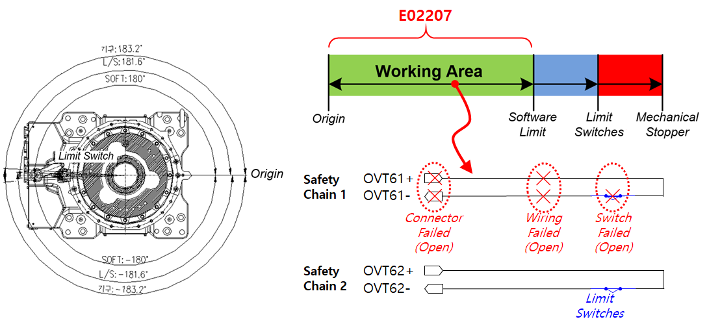

# 3.9. E02207. 机体限位开关输入不匹配 (安全链 1 关闭)

### 1. 概述

尽管机器人没有超过软限位范围，但安装在每个机器人轴操作范围尽头的限位开关被检测为已激活。  
由于安全链 1 的输入状态与安全链 2 不同，需要进行检查。

### 2. 原因和检查方法



这是一个异常情况，即使没有超过软限位，硬件限位开关操作仍被检测到。

由于开关或接线系统存在问题，请执行检查。



 
图 1. E02207 机体限位开关输入不匹配 (安全链 1 关闭) 的发生

这是一个异常情况，即使没有超过软限位，硬件限位开关操作仍被检测到。  
问题发生是因为安全链 1 处于打开状态。检查相关开关和接线系统。

* 硬件限位开关故障：开关损坏或因某种原因处于打开状态。
* 接线：接线断裂或损坏，造成接触不良。
* 连接器：连接器断开或损坏，导致开路或接触故障。

有关详细检查点，请参阅 **“硬件限位开关检查方法。”**