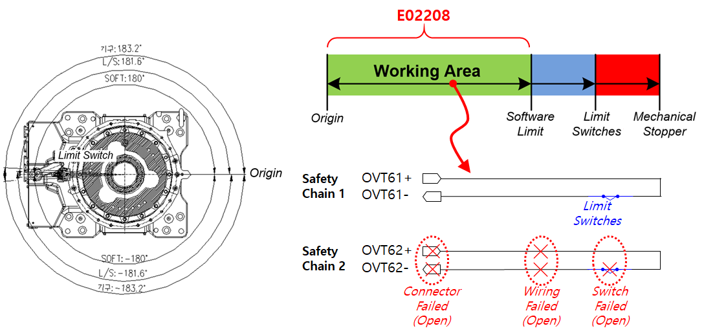

# 3.10. E02208. Body Limit SW Input Mismatch (Safety Chain 2 OFF)

### 1. 概述

虽然机器人没有超过软限制区域，但每个轴运动范围末端安装的限制开关被检测为已激活。  
由于安全链 1 和安全链 2 的输入状态不同，需要进行检查。

### 2. 原因和检查方法



这是一个异常情况，即使软限制尚未超过，硬件限制开关操作也被检测到。

检查开关和接线系统，因为这些组件可能存在问题。



 
图 1 E02208 机身限制 SW 输入不匹配（安全链 2 关闭）的发生

这是一个异常情况，即使软限制尚未超过，硬件限制开关操作也被检测到。  
问题发生是因为安全链 2 处于打开状态。  
检查相关的开关和接线系统。

* 硬件限制开关故障：开关因某种原因损坏或处于打开状态。
* 接线：接线损坏或受损，导致接触不良。
* 连接器：连接器断开或受损，导致因接触不良而开路。

有关详细的检查要点，请参阅“硬件限制开关检查方法”部分。