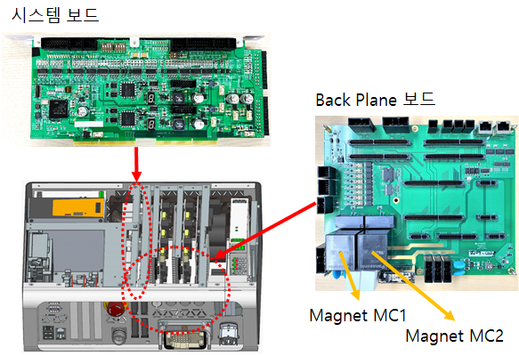
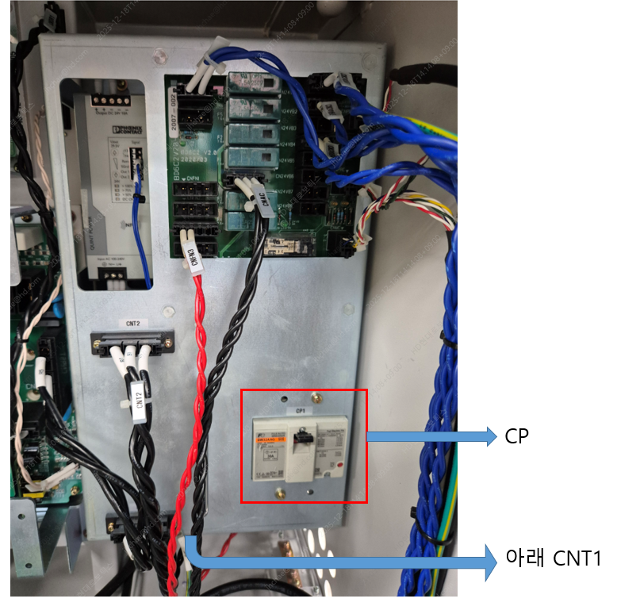

# 3.11. E02260. 서보ON 시도중 전자접촉기(MC2) 고장/검지이상

### 1. 개요

서보 ON 시도중에 마그네트(전자접촉기, magnetic contactor) MC2가 동작하지 않았습니다.

### 2. 원인 및 점검 방법



(1)	모니터링 계통을 점검하십시오. 
(2)	마그네트 MC2를 점검하십시오. 
(3) CNT1 케이블의 연결 및 전원공급모듈의 CP 개/폐 상태를 확인하십시오. 
(4)	전장보드를 점검하십시오. 
(5)	전원공급모듈(H6PSM30)를 점검하십시오. 
(6)	서보앰프를 점검하십시오. 
(7)	서보 보드(BD640)을 2개 이상 사용하는 시스템에서 해당에러가 발생하는 경우 확장축 안전 인터페이스 보드(BD6H0)의 DIP 스위치 설정 상태를 확인 하십시오. 



### (1)	모니터링 계통을 점검하십시오.

Hi6-N 제어기의 경우, 전자접촉기가 설치되어 있는 전장모듈(PSM or PDM)과 모니터링 신호를 수집하는 시스템보드 간의 케이블링을 확인합니다. 케이블 이름은 CNMC이며 시스템보드 하단 앞면을 통하여 전장모듈로 들어 갑니다. 이 케이블의 커넥터 접속상태를 점검하십시오.

 
그림 1 Hi6-N 제어기

Hi6-T 제어기의 경우, 전자접촉기가 PCB 보드에 설치되어 있고 모니터링 신호를 수집하는 스스템보드 간에 보드-TO-보드로 연결되어 있습니다. 보드-TO-보드 접속상태를 점검하십시오.

 
그림 2 Hi6-T 제어기

### (2)	마그네트 MC2를 점검하십시오.

Hi6-N 제어기의 경우, 전장모듈 내부에 있는 마그네트 MC2가 정상적으로 동작하는지 점검하십시오.

 
그림 3 Hi6-N 제어기(전장모듈의 내부에 설치된 마그네트 MC2)

Hi6-T 제어기의 경우, Back Plane 보드에 있는 마그네트 MC2가 정상적으로 동작하는지 점검하십시오.

 
그림 4 Hi6-T 제어기(Back Plane 보드에 설치된 마그네트 MC2)

### (3)	CNT1 케이블의 연결 및 전원공급모듈의 CP 개/폐 상태를 확인하십시오.

Hi6-N 제어기의 경우, 전장모듈의 CNT1 케이블의 연결 상태 및 CP의 개/폐 상태를 확인하십시오.

 
그림 5 Hi6-N 제어기 CNT1 케이블 및 CP

### (4)	전장보드를 점검하십시오.

Hi6-N 제어기의 경우, 시스템보드와 마그네트를 중계하는 전장보드, 케이블배선에 문제가 있을 수 있으므로 점검 또는 교체하십시오.

 
그림 6 Hi6-N 제어기(전장모듈의 내부에 설치된 전장보드)

Hi6-T 제어기의 경우, 해당 케이블배선이 없으므로 해당 사항 없습니다.

### (5)	전원공급모듈(H6PSM30)를 점검하십시오.

### (6)	서보앰프를 점검하십시오.

### (7)	서보 보드(BD640)을 2개 이상 사용하는 시스템에서 해당에러가 발생하는 경우 확장축 안전 인터페이스 보드(BD6H0)의 DIP 스위치 설정 상태를 확인 하십시오.

서보보드(BD640)을 2개 이상 사용하는 시스템에서 축 설정을 변경했을 때에는 확장축 안전 인터페이스 보드의 switch를 조정해야 합니다. 아래 그림에서 보는 바와 같이 확장축 안전 인터페이스 보드(BD6H0)와 서보보드(BD640)를 CNSSM1~4 커넥터를 이용해 연결해주시고 만약 4개의 서보보드(BD640)가 모두 연결되지 않은 경우에는 연결되지 않은 CNSSM번호와 일치하는 스위치(SW1~4))를 ON 상태로 두어야 합니다.

EX) 2개의 서보보드(BD640)만 사용하는 경우 
* CNSSM1, CNSSM2 커넥터를 이용해 SSM 2개를 연결
* SW1, SW2는 OFF 상태, SW3, SW4는 ON 상태로 두어야 함

 
그림 7 확장축 안전 인터페이스 보드(BD6H0)의 DIP 스위치 설정 
