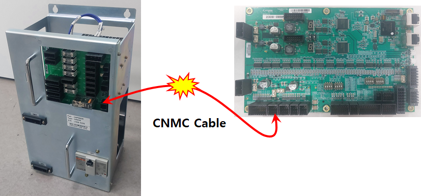
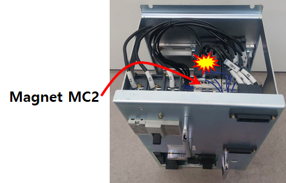
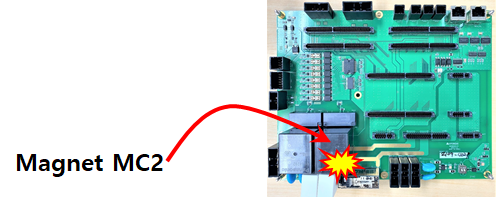
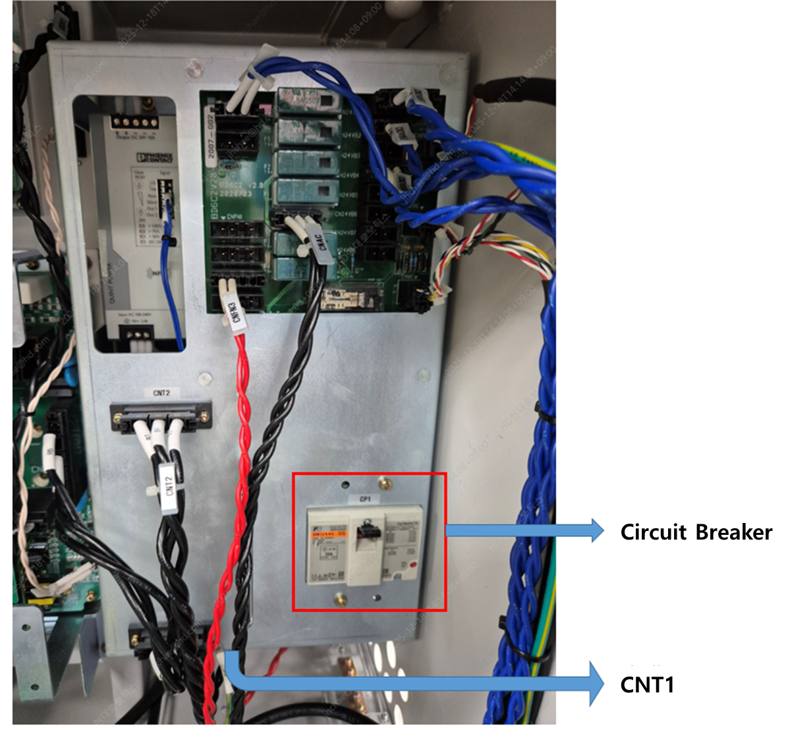
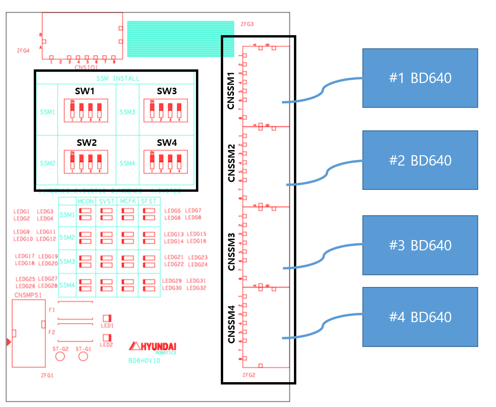

# 3.11. E02260. 磁性接触器 (MC2) 故障 / 在尝试伺服打开时的检测错误

### 1. 概述

在尝试将伺服打开时，磁性接触器 (MC2) 没有工作。

### 2. 原因和检查方法



(1) 检查监控系统。 
(2) 检查磁性接触器 MC2。 
(3) 检查 CNT1 电缆的连接以及电源模块 CP 的开/关状态。 
(4) 检查电源板。 
(5) 检查电源模块 (H6PSM30)。 
(6) 检查伺服放大器。 
(7) 如果此错误发生在使用两个或更多伺服板 (BD640) 的系统中，请检查扩展轴安全接口板 (BD6H0) 的 DIP 开关设置。 



### (1) 检查监控系统

对于 Hi6-N 控制器，检查电源模块 (PSM 或 PDM) 与收集监控信号的系统板之间的布线，其中安装了磁性接触器。  
电缆名称为 CNMC，路由从系统板的下前侧进入电源模块。  
检查此电缆的连接状态。

 
图 1 Hi6-N 控制器

对于 Hi6-T 控制器，磁性接触器安装在 PCB 板上，并通过板对板连接与收集监控信号的系统板连接。  
检查板对板连接的状态。

 
图 2 Hi6-T 控制器

### (2) 检查磁性接触器 MC2

对于 Hi6-N 控制器，检查安装在电源模块内的磁性接触器 MC2 是否正常工作。

 
图 3 Hi6-N 控制器 (磁性接触器 MC2 安装在电源模块内)

对于 Hi6-T 控制器，检查安装在背板上的磁性接触器 MC2 是否正常工作。

 
图 4 Hi6-T 控制器 (磁性接触器 MC2 安装在背板上)

### (3) 检查 CNT1 电缆的连接以及电源模块 CP 的开/关状态

对于 Hi6-N 控制器，检查 CNT1 电缆的连接状态以及电源模块中 CP 的开/关状态。

 
图 5 Hi6-N 控制器 CNT1 电缆和 CP

### (4) 检查电源板

对于 Hi6-N 控制器，检查或更换电源板和电缆布线，它们在系统板和磁性接触器之间中继信号，可能存在问题。

 
图 6 Hi6-N 控制器 (电源板安装在电源模块内)

对于 Hi6-T 控制器，此项不适用，因为没有相应的电缆布线。

### (5) 检查电源模块 (H6PSM30)

检查电源模块 (H6PSM30)，以验证其是否正常工作。

### (6) 检查伺服放大器

检查伺服放大器以检查是否存在任何异常。

### (7) 检查扩展轴安全接口板 (BD6H0) 的 DIP 开关设置  
(当使用两个或更多伺服板 (BD640) 时)

如果此错误发生在使用两个或更多伺服板 (BD640) 的系统中，请检查扩展轴安全接口板 (BD6H0) 的 DIP 开关设置。

当在使用两个或更多伺服板 (BD640) 的系统中更改轴配置时，必须调整扩展轴安全接口板上的开关。

如下面的图所示，使用 CNSSM1 到 CNSSM4 连接器将扩展轴安全接口板 (BD6H0) 和伺服板 (BD640) 连接起来。  
如果所有四个伺服板 (BD640) 没有连接，将未连接的 CNSSM 编号对应的开关 (SW1 到 SW4) 设置为 ON 位置。

**示例)** 当仅使用两个伺服板 (BD640) 时：
* 使用 CNSSM1 和 CNSSM2 连接两个 SSM。
* 将 SW1 和 SW2 设置为 OFF 位置。
* 将 SW3 和 SW4 设置为 ON 位置。

 
图 7. 扩展轴安全接口板 (BD6H0) 的 DIP 开关设置