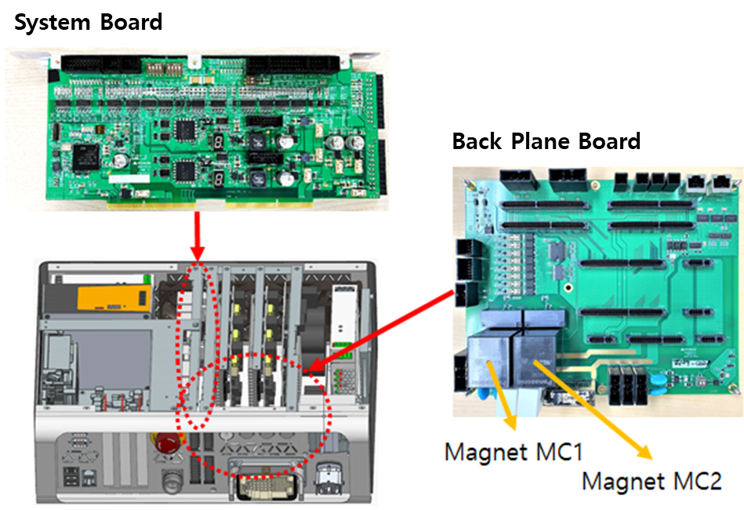
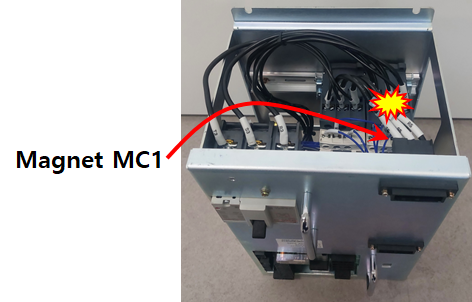
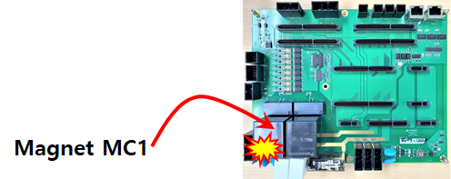
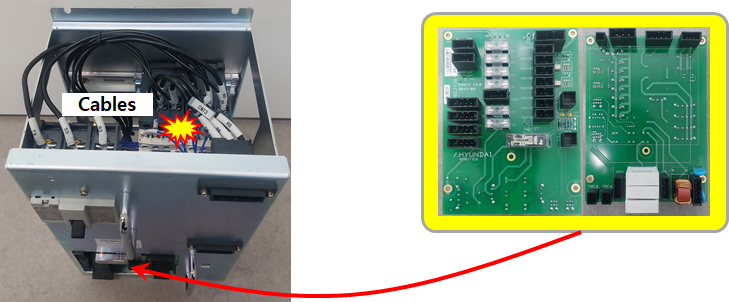

# 3.13. E02280. 서보ON 시도중 전자접촉기(MC1) 고장/검지이상

### 1. 개요

서보 ON 시도중에 마그네트(전자접촉기, magnetic contactor) MC1이 동작하지 않았습니다.

### 2. 원인 및 점검 방법



(1)	모니터링 계통을 점검하십시오.
(2)	마그네트 MC1을 점검하십시오.
(3)	전장보드를 점검하십시오.
(4)	시스템보드를 점검하십시오.



(1)	모니터링 계통을 점검하십시오.

Hi6-N 제어기의 경우, 전자접촉기가 설치되어 있는 전장모듈(PSM or PDM)과 모니터링 신호를 수집하는 시스템보드 간의 케이블링을 확인합니다. 케이블 이름은 CNMC이며 시스템보드 하단 앞면을 통하여 전장모듈로 들어 갑니다. 이 케이블의 커넥터 접속상태를 점검하십시오.

 
그림 1 Hi6-N 제어기

Hi6-T 제어기의 경우, 전자접촉기가 PCB 보드에 설치되어 있고 모니터링 신호를 수집하는 스스템보드 간에 보드-TO-보드로 연결되어 있습니다. 보드-TO-보드 접속상태를 점검하십시오.

  
그림 2 Hi6-T 제어기

 
(2)	마그네트 MC1을 점검하십시오.

Hi6-N 제어기의 경우, 전장모듈 내부에 있는 마그네트 MC1이 정상적으로 동작하는지 점검하십시오.

 
그림 3 Hi6-N 제어기(전장모듈의 내부에 설치된 마그네트 MC2)

Hi6-T 제어기의 경우, Back Plane 보드에 있는 마그네트 MC2가 정상적으로 동작하는지 점검하십시오.

 
그림 4 Hi6-T 제어기(Back Plane 보드에 설치된 마그네트 MC2)

(3)	전장보드를 점검하십시오.

Hi6-N 제어기의 경우, 시스템보드와 마그네트를 중계하는 전장보드, 케이블배선에 문제가 있을 수 있으므로 점검 또는 교체하십시오.

 
그림 5 Hi6-N 제어기(전장모듈의 내부에 설치된 전장보드)

Hi6-T 제어기의 경우, 해당 케이블배선이 없으므로 해당 사항 없습니다.

(4)	시스템보드를 점검하십시오.

모니터링 계통, 마그네트, 전장보드에 문제가 없을 경우에는 시스템보드를 교체하십시오.

