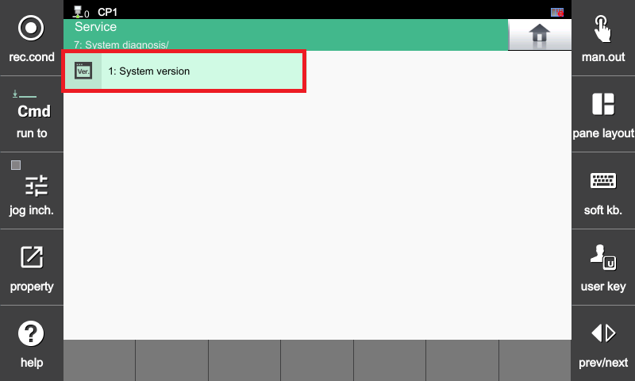
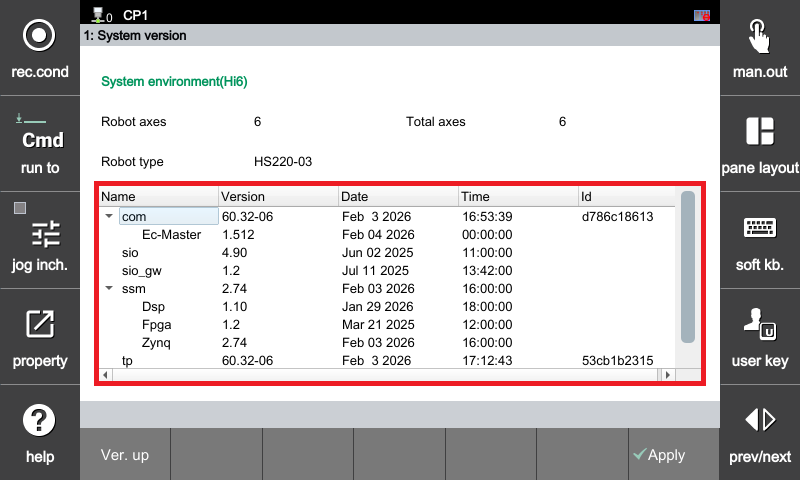
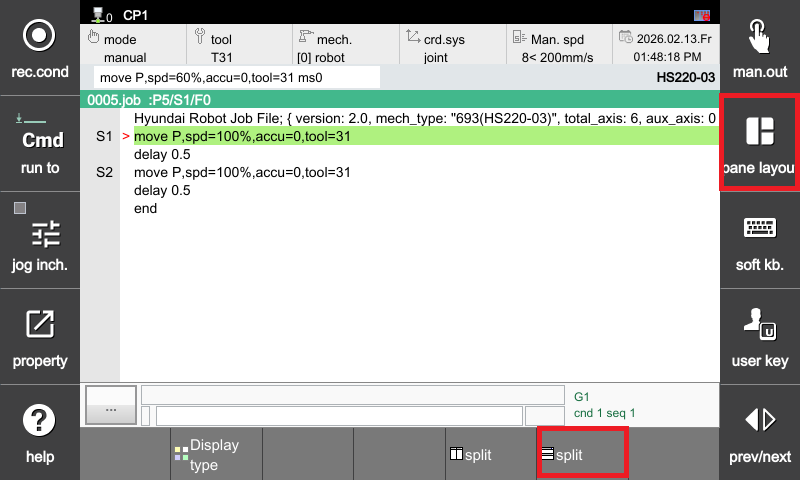
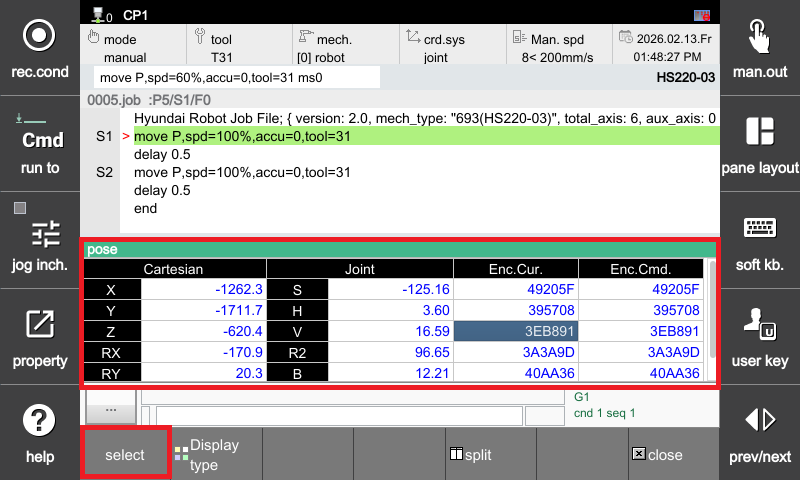
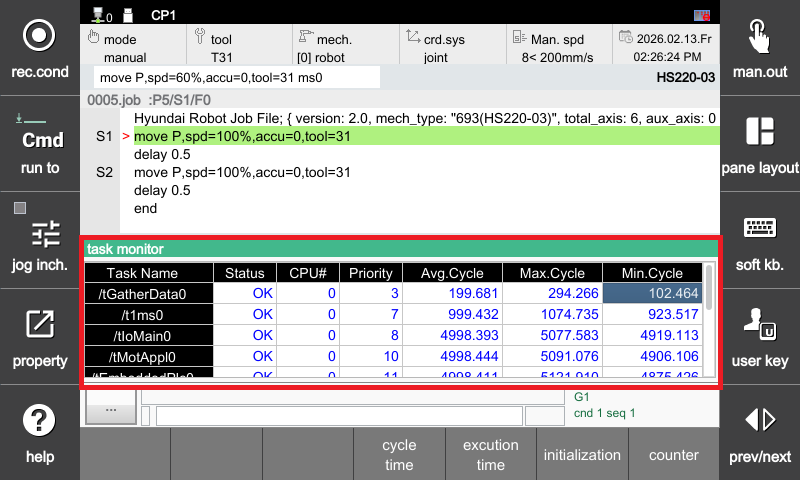

# 3.15. E2301. CPUERR 信号不匹配 (H6COM 任务错误)

### 1. 概述

发生了 CPUERR 信号不匹配 (H6COM 任务错误)。如果 H6COM-T 中某些任务的执行时间或周期超过正常范围，则可能会发生此警报。在这种情况下，系统无法开启电机。

### 2. 原因和检查



(1) 如果主任务周期不在正常范围内：
* 未安装最新版本的软件。
* 与外部设备的通信问题影响系统。

(2) 如果安全板 (BD632) 出现问题：
* 检查安全板 (BD632)。



### (1) 如果主任务周期不在正常范围内

#### [当未安装最新版本的软件时]

进入 TP 屏幕：服务 -> 系统诊断 -> 系统版本，检查当前安装的版本是否为最新软件版本。

 
 
 
 

#### [当与外部设备的通信问题影响系统时]

系统可能会受到影响，具体取决于与外部设备的通信是否处于活动状态。在这种情况下，比较启用和禁用通信时 `/tIOMain0` 的任务执行时间。

如果最大执行时间超过 10,000 usec，请与软件开发团队咨询使用条件。

#### [如何检查任务执行时间]
进入：窗口调整 -> 分割 (上下) -> 选择下窗口 -> 按选择按钮 -> 选择任务监视器

 
 
 
 

按初始化按钮，并在一定时间后（大约 10 分钟）检查最大执行时间。

### (2) 如果安全板 (BD632) 出现问题

#### [如何检查安全板 (BD632)]
 

1) **如何检查 IO 电源状态**  
A. 检查上图中的两个 LED 是否亮绿。  
B. 如果 IO 电源 LED 为红色或熄灭，请检查指示的保险丝是否完整。  
C. 如果保险丝熔断，请更换它。

2) **检查电机开启时 IO 电源是否不稳定**  
A. 检查电机开启时 IO 电源 LED 是否为绿色。  
B. 如果 LED 在电机开启的一瞬间变为红色或熄灭，则电机运行期间 IO 电源不稳定。

3) **如果 IO 电源不稳定**  
A. 检查 IO 电源连接器的连接状态。  
B. 检查 IO 电源电缆。  
C. 检查安全板 (BD632) 的接地状态，包括接地电缆和接地端子连接。