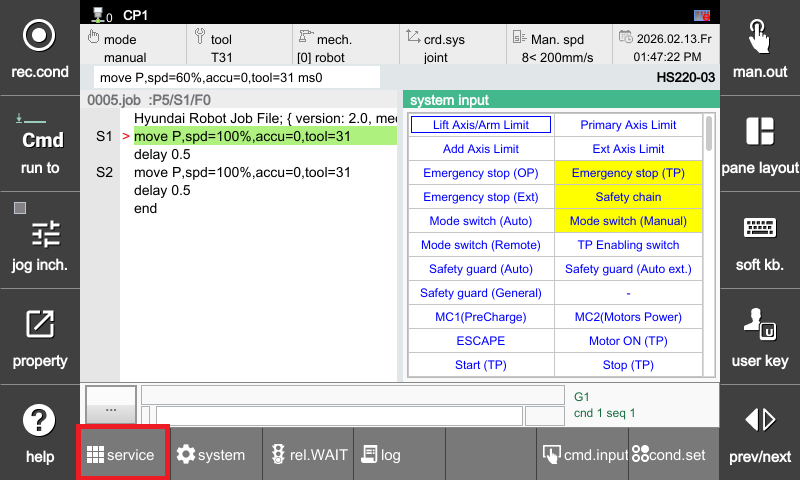
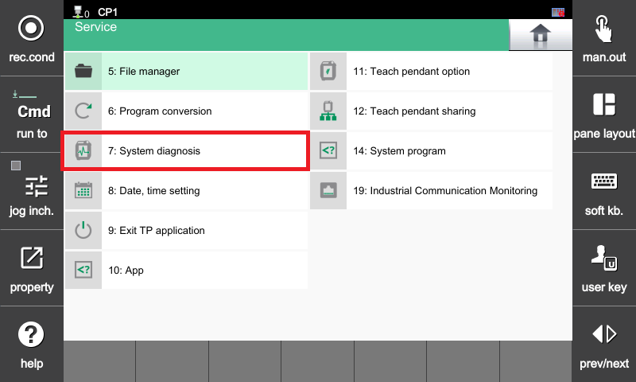
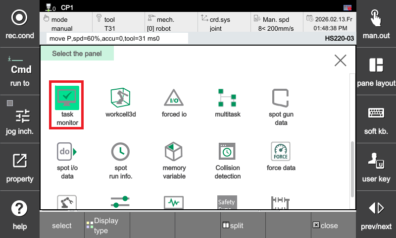
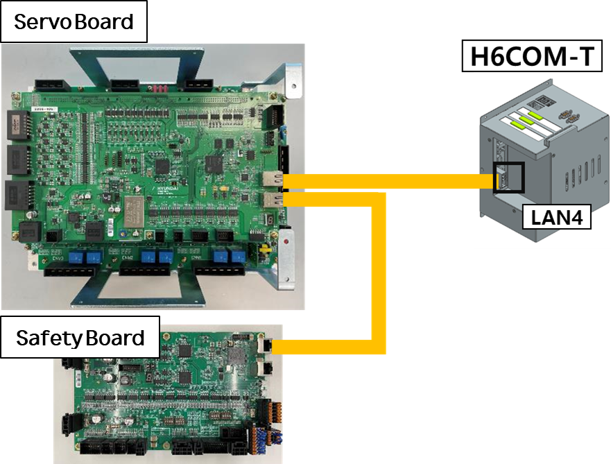
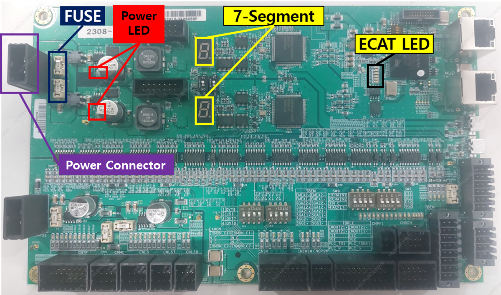

# 3.16. E64002 H6COM-T 心跳更新停止错误

### 1. 概述

安全板 (BD632) 没有收到来自主控制模块 (H6COM-T) 的刷新心跳。在这种情况下，系统将不允许电机启动。

### 2. 原因和检查



(1) 如果主任务周期超出正常范围：  
* 未安装最新版本的软件。  
* 与外部设备的通信问题影响了系统。

(2) 检查互板通信电缆的接线状态。

(3) 检查安全板 (BD632)。



### (1) 如果主任务周期超出正常范围

#### [如果未安装最新版本的软件]

在TP屏幕上，导航到**服务 -> 系统诊断 -> 系统版本**，检查当前安装的版本是否为最新软件版本。

 
 
 
 

#### [如果与外部设备的通信问题影响了系统]

系统性能可能会受到影响，具体取决于与外部设备的通信是否开启。在这种情况下，根据与外部设备的通信状态，比较**/tIOMain0**的任务执行时间。

如果最大执行时间超过10,000微秒，请咨询机器人软件开发团队有关操作条件。

#### [如何检查任务执行时间]
导航到**窗格布局 -> 拆分 (上下) -> 选择下窗口 -> 按下选择按钮 -> 任务监控**。

 
 
 

按下**初始化**按钮，等待一定时间（大约10分钟），然后检查最大执行时间。

 

### (2) 检查互板通信电缆的接线状态

#### [检查各模块之间的以太网电缆连接 (主控制模块 (H6COM-T)、伺服板 (BD640)、安全板 (BD632))]

 

1) 检查项目  
A. 主控制模块 (H6COM-T) ↔ 伺服板 (BD640) 之间的以太网电缆  
B. 伺服板 (BD640) ↔ 安全板 (BD632) 之间的以太网电缆  

2) 检查清单  
A. 验证电缆两端的连接器是否牢固连接  
B. 目视检查电缆是否有断裂、压接损伤、弯曲或其他物理损坏  
C. 检查连接器引脚（端子）是否有生锈、污染或弯曲  

3) 检查步骤  
A. 在电源关闭的情况下，拔出并重新连接电缆  
B. 插入连接器时应听到清脆的点击声（‘卡嗒’声）  
C. 如有必要，用备用电缆替换并重试  
D. 重新检查连接顺序并确认使用正确的LAN端口  

4) 其他检查  
A. 检查伺服板 (BD640) 和安全板 (BD632) 上的Link/Act LED 状态  
- 正常：绿色（左）闪烁，黄色（右）常亮  
- 异常：绿色（左）和黄色（右）熄灭或持续常亮  

 

B. 如果频繁发生断开，请考虑内部电缆断裂的可能性 → 更换电缆  
C. 检查以太网连接器（PCB端子）是否有可能的损坏

### (3) 检查安全板 (BD632)

#### [如何检查安全板 (BD632)]

 

1) 检查电源状态  
A. 验证图中的两个电源LED是否点亮为绿色  
B. 如果电源LED为红色或熄灭，请检查所示的保险丝是否完整  
C. 如果保险丝熔断，请更换保险丝  

2) 验证电机开启时电源是否不稳定  
A. 检查电机开启时电源LED是否为绿色  
B. 如果电机启动时LED变为红色或熄灭，说明电机开启时电源不稳定

3) 如果电源不稳定  
A. 检查电源连接器是否正确插入  
B. 检查电源电缆  
C. 检查安全板 (BD632) 的接地 – 验证接地电缆和端子连接  

4) 验证安全板是否正常启动  
A. 在主控制模块 (H6COM-T) 完全启动后（电源开启大约50秒后），两个7段显示器应显示'S'  
B. ECAT LED 不应出现红色闪烁或常亮  

5) 如果从1)到4)的所有检查都没有异常，但通信问题仍然存在，请更换安全板 (BD632)