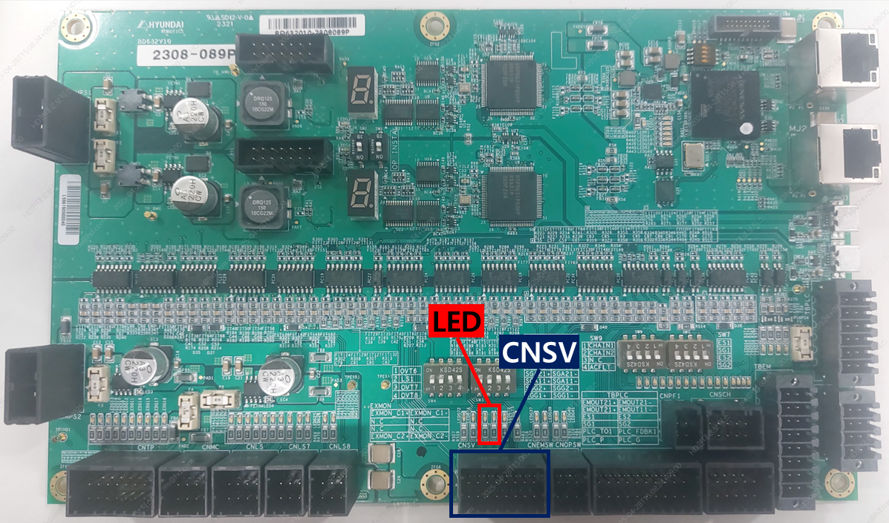
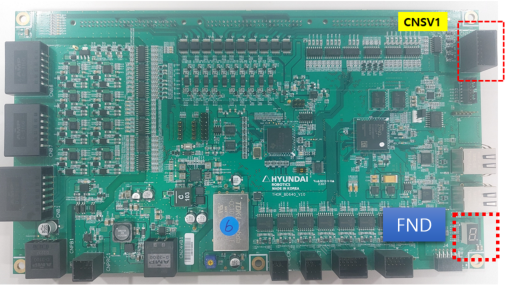
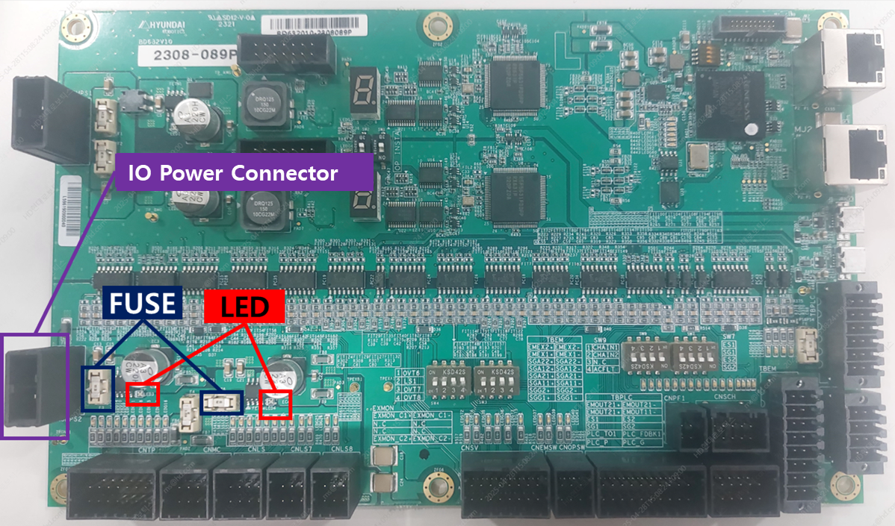

# 3.17. E64003 Servo Board (BD640) Status Input Error

### 1. Overview

The Safety Board (BD632) detected an abnormal input from the servo board (BD640) status signals. Inspection of the servo board (BD640) is required.

### 2. Causes and Checks



(1) Check the CNSV connector and wiring for proper condition. 
(2) Inspect the servo board (BD640). 
(3) Inspect the Safety Board (BD632). 



(1) Check the CNSV connector and wiring status.  
* How to inspect the connection with the servo board (BD640):

 

1) Verify the LED blinking status (observe after H6COM-T is fully booted, ~50 seconds after power on).  
   - Two LEDs should blink at approximately 0.5-second intervals for normal operation.  
2) Check the CNSV connector seating.  
3) Inspect the CNSV cable for damage or loose connections.  
4) Check the Safety Board (BD632) grounding status (ground cable and terminal connections).

(2) Inspect the servo board (BD640).  
* How to inspect the servo board (BD640):

 

1) Observe the FND status values changing sequentially (observe after H6COM-T is fully booted, ~50 seconds after power on).  
   - If the FND does not operate: verify 24V power supply and replace the board if necessary.  
   - FND value P.001: initialization in progress. If it does not change to P.002, check EtherCAT connection, BD632 boot status, and main computer boot status.  
   - FND value P.002: normal operation.
2) If servo board errors persist even after initialization, check the version compatibility between the Main COM, Servo Board (BD640), and Safety Board (BD632).

3) If errors continue despite version compatibility being correct, replace the Servo Board (BD640).

(3) Check the Safety Board (BD632).

* How to inspect the Safety Board (BD632)

1) Verify the IO power status:  
A. Confirm that the two LEDs shown in the figure are lit green.  
B. If the IO power LEDs are red or off, check the fuses indicated to ensure they are intact.  
C. If a fuse is blown, replace it.

2) Check if the IO power is unstable when the motor is ON:  
A. Confirm that the IO power LED is green during motor ON.  
B. If the LED turns red or goes off at the moment the motor is ON, the IO power is unstable during motor operation.

3) If the IO power is unstable:  
A. Check the connection status of the IO power connector.  
B. Inspect the IO power cable.  
C. Verify the grounding of the Safety Board (BD632), including grounding cables and terminal connections.
