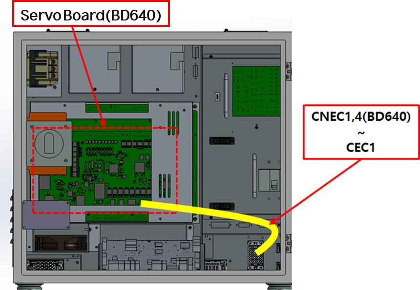
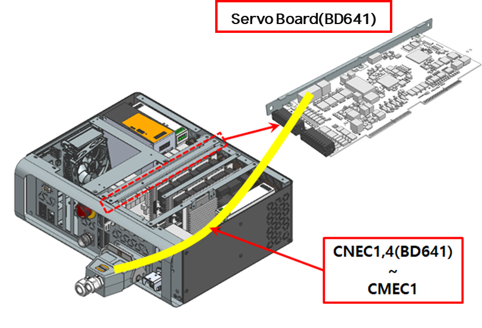
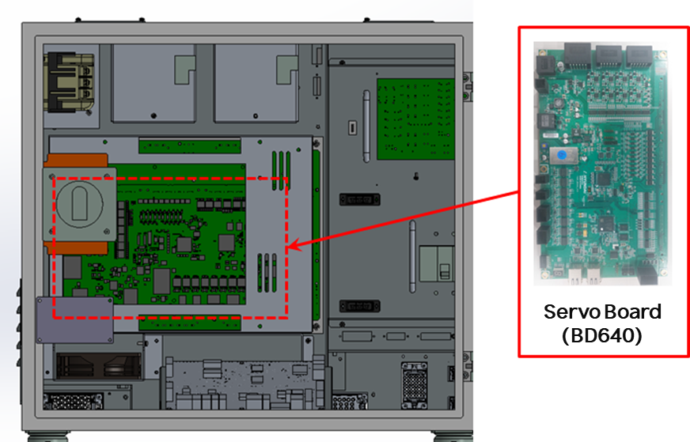
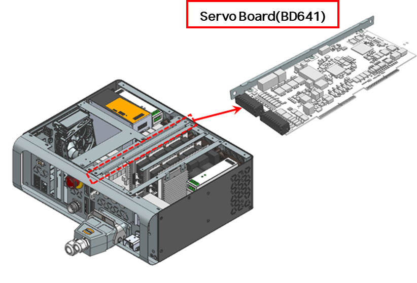
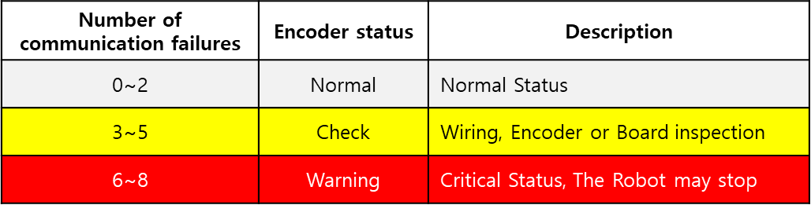

# 4.1. E02450. (O Axis) No Encoder Response

### 1. Overview

伺服板与编码器进行串行通信以控制伺服电机，并定期接收编码器数据。当从编码器接收到的数据违反指定的通信协议时，就会发生此错误。

此错误可能是由传输/接收编码器数据的组件故障，或接线或编码器屏蔽线处理问题引起的。

### 2. Cause and Inspection



(1)	检查编码器供电电压。

(2)	检查编码器接线。

(3)	进行伺服板的更换测试。

(4)	进行电机（编码器）的更换测试。

(5)	在完成措施后检查接线的通信状态。



(1)	检查编码器供电电压。 
供给编码器的电源电压必须在编码器侧连接器的5V±5%（4.75V ~ 5.25V）范围内。如果编码器侧连接器的电压降至4.75V以下，编码器可能无法正常工作，从而导致上述错误。

请测量编码器侧连接器的引脚（3-4）电压。

    (Figure 4.1 Encoder Connector Pin Information)

如果测得的电压低于参考电压，请调整伺服板上的VR1可变电阻（BD640），使编码器侧连接器的电压落在参考电压范围内。

    (Figure 4.2 BD640 Variable Resistor)

(2)	检查编码器接线。

检查编码器接线的步骤如下。

1st: 检查与编码器接线相关的连接器是否接触不良。

2nd: 检查编码器接线是否短路。使用万用表（测试仪）逐相1:1检查每相的接线。

3rd: 进行编码器接线的更换测试。

如果编码器接线未断开，但存在屏蔽线接触不良或编码器信号线与其他电源线或机器人机身金属部分接触等问题，则无法通过短路测试检测到，因此请执行接线更换测试。

* 检查控制器的内部接线。
检查CNEC1,4（BD640）连接器与CEC1之间的接线。

    (Figure 4.3 Hi6-N Controller Encoder Wiring Inspection)

    (Figure 4.4 Hi6-T15 Controller Encoder Wiring Inspection)

* 检查控制器与机器人之间的接线。
在Hi6-N控制器的情况下，检查CNEC1和CER1之间的接线；在Hi6-T15控制器的情况下，检查CMEC1和CMER1之间的接线。

    (Figure 4.5 Hi6-N Controller and Robot Basic Installation Configuration Diagram)

    (Figure 4.6 Hi6-T15 Controller and Robot Basic Installation Configuration Diagram)

    (Figure 4.7 Hi6-N Controller and Robot Basic Installation Configuration Diagram Detail)

    (Figure 4.8 Hi6-N Controller and Robot Basic Installation Configuration Diagram Detail)

* 检查机身内部的接线。
检查CER1和编码器侧连接器之间的接线。
有关接线检查，请参阅机器人维护手册中的接线连接图。

    (Figure 4.9 Robot Internal Wiring)

(3)	进行伺服板的更换测试。 
如果更换伺服板后错误未再发生，则伺服板的编码器接收部分存在缺陷。请将伺服板更换为正常板。

    (Figure 4.10 N Controller Servo Board Replacement)

    (Figure 4.11 T Controller Servo Board Replacement)

(4)	进行电机（编码器）的更换测试。 
如果更换伺服电机后错误未再发生，则伺服电机存在缺陷。请将伺服电机更换为正常电机。下图显示了机器人各轴电机的位置；如需更换其他机器人，请参阅相应的机械维护手册。

    (Figure 4.12 Robot Axis Motor Positions)

(5)	在完成措施后检查接线的通信状态。
在问题部分的措施完成后，请参阅“编码器通信故障计数显示功能手册”以检查通信状态。

    (Figure 4.13 Encoder Communication Failure Monitoring)

