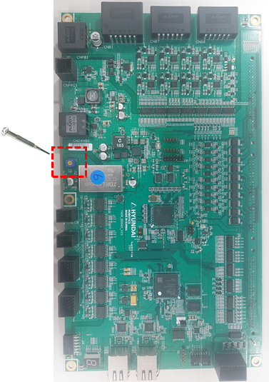
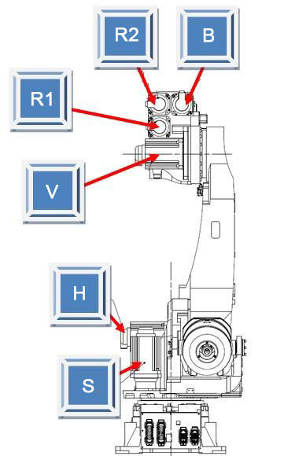

# 4.8. E02460. (O Axis) Encoder Internal Rotation Value Error (CE Bit Detected)

### 1. Overview

The servo board performs serial communication with the encoder to control the servo motor and receives encoder data periodically; this error occurs when an error occurs in the calculation of the rotation value within the encoder and the CE (Counter Error) bit is set.

This can occur when the data received from the encoder is normal, but the encoder is in an error state (CE) as a result of monitoring its own internal status.
 
CE (Counter Error): Occurs when a position mismatch occurs due to malfunction or failure of 1-turn data when the encoder main power is turned on.

### 2. Cause and Inspection



(1)	Check the encoder supply voltage.

(2)	After clearing the serial encoder error, turn the controller power off and then on again.

(3)	If the error persists, perform a replacement test of the motor (encoder). 



(1)	Check the encoder supply voltage. 
The power voltage supplied to the encoder must be within the range of 5V±5% (4.75V ~ 5.25V) at the encoder-side connector. If the voltage at the encoder-side connector drops below 4.75V, the encoder may not operate normally, which may cause the above error.

Please measure the voltage of pins (3-4) on the encoder-side connector.

        (Figure 4.25 Encoder Connector Pin Information)

If the measured voltage is lower than the reference voltage, adjust the VR1 variable resistor on the servo board (BD640) so that the encoder-side connector voltage is within the reference voltage.

        (Figure 4.26 BD640 Variable Resistor)

(2)	After clearing the serial encoder error, turn the controller power off and then on again.

If the error persists when turning the main power OFF/ON after clearing the error, perform a motor (encoder) replacement test.
The error clearing is executed in the menu below.

        System -> 5. Initialization -> 4. Serial Encoder Reset - Error Reset

        (Figure 4.27 Serial Encoder Error Reset)

(3)	If the error persists, perform a replacement test of the motor (encoder). 

If the error does not occur after replacing the servo motor, the servo motor is defective. Please replace the servo motor with a normal one. The figure below shows the positions of the motors for each axis of the HS165 robot; for other robots, please refer to the corresponding mechanical maintenance manual for replacement.

        (Figure 4.28 HS165 Robot Axis Motor Positions)