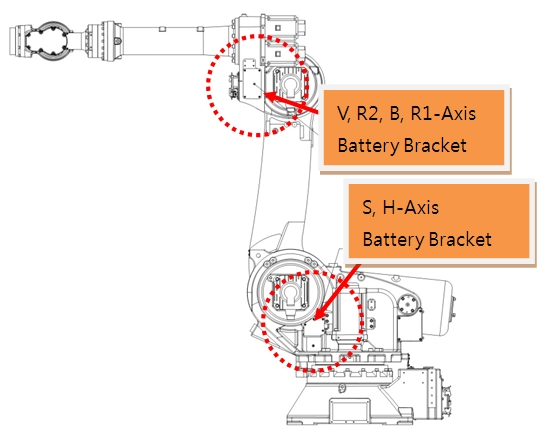

# 4.13. E02470. (O Axis) Encoder Error: Reset Required

### 1. Overview

In order for the encoder to preserve the motor's position data, power must be supplied to the encoder at all times. 

Power to the encoder is supplied either by keeping the controller power ON or by the encoder backup battery. If the controller power is turned OFF while the encoder backup battery is discharged, the encoder loses its position data, resulting in an error. 

Similarly, when a motor is replaced, the same error occurs because the encoder of the new motor was already in a state where no power was being supplied.
Resetting the encoder changes the reference position data for the corresponding axis; therefore, you must move the robot to the reference posture using manual operation in the axis coordinate system and re-perform encoder calibration for the corresponding axis.

### 2. Cause and Inspection



(1)	Check the encoder battery voltage. 
(2)	Inspect the encoder battery wiring connection. 
(3)	Perform a replacement test of the motor. 
(4)	After resetting the encoder, encoder calibration must be re-performed at the robot's reference position. 



(1)	Check the encoder battery voltage.  
The battery for the encoder is 3.6V. If this voltage drops to 3.0V–3.2V, "W0104 (Axis O) Encoder Battery Voltage Low" is displayed. When this warning occurs, the encoder battery must be replaced. The encoder battery must be replaced while the controller power is ON. If the battery is replaced with a normal one in this state, the robot can continue to be used without problems.

If the encoder battery voltage drops to 2.5V–3.0V after the replacement period has passed, the error "E2470 (Axis O) Encoder Error: Encoder Reset Required" occurs. When this error occurs, the encoder's position data has already been lost. After replacing the encoder battery and resetting the encoder, you must move the robot to the reference posture using manual operation in the axis coordinate system and re-perform encoder calibration for the corresponding axis.

    (Figure 4.34 Encoder Battery Replacement Location)

The encoder reset is executed in the menu below.

    System -> 5. Initialization -> 4. Serial Encoder Reset

    (Figure 4.35 Serial Encoder Reset)

(2) Inspect the encoder battery wiring connection. 

Check the condition of the battery wiring connected from the encoder battery location to the motor.

(3) Perform a replacement test of the motor.

If the problem is not resolved by the above measures, there is a high possibility that the encoder itself is defective. Perform a replacement test of the motor.

    
