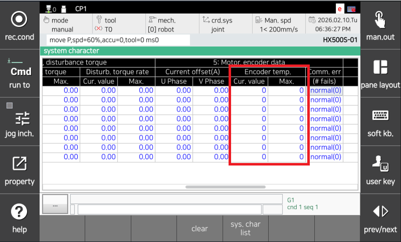

# 4.27. E02472. (O Axis) Encoder Overheat Detected (OH Bit Set)

### 1. Overview

The servo board performs serial communication with the encoder to control the servo motor and receives encoder data periodically; this error occurs when the OH bit is detected from the encoder.

The OH bit is set when the internal temperature of the encoder exceeds the allowable range. The threshold reference temperature is approximately 90°C to 100°C; however, since specifications vary by encoder model, please check the manufacturer's manual.

### 2. Cause and Inspection



(1)	Perform a replacement test of the motor (encoder)

(2)	Check the operating conditions (speed, load, etc.)

(3)	Inspect the ambient temperature around the encoder

(4)	Replace the servo board (BD640)



((1)	Perform a replacement test of the motor (encoder).

If the error does not occur after replacing the servo motor, the servo motor is defective. Please replace the servo motor with a normal one. The figure below shows the positions of the motors for each axis of the HS165 robot; for other robots, please refer to the corresponding mechanical maintenance manual for replacement.

    (Figure 4.36 Motor (Encoder) Replacement Position)

(2)	Check the operating conditions (speed, load, etc.).

Check the saturated encoder temperature while running the Job program. The encoder temperature can be checked as follows:

    Engineering Mode -> Window Adjustment -> System Characteristics -> System Characteristics List - Motor/Encoder

    (Figure 4.37 Checking Encoder Temperature)

(3)	Inspect the ambient temperature around the encoder.

The internal temperature of the encoder may increase due to the external temperature, causing an error.

(4)	Perform a replacement test of the servo board. 

If the error does not occur after replacing the servo board, it can be determined as a failure in the encoder data receiving unit of the servo board.

    (Figure 4.38 Replacing N Controller Servo Board)

    (Figure 4.39 Replacing T Controller Servo Board)
