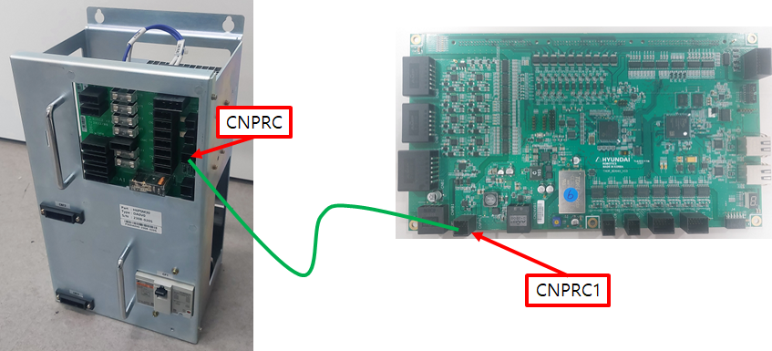

# 4.28. E02554. Initial Pre-Charge Relay Operation Failure

### 1. Overview

The servo board (BD640) operates the initial charge relay during the motor power-on process and generates an error by monitoring the operating status of the initial charge relay. Since the initial charge relay functions to suppress inrush current, if a relay operation abnormality occurs, an error is generated for safety and the motor power application is cut off.

### 2. Cause and Inspection



(1)	Inspect the monitoring system.

(2)	Inspect the electronic boards.

(3)	Inspect the servo board (BD640).



(1)	Inspect the monitoring system.

Check the cabling between the electronic module (PSM or PDM), where the initial charge resistor and relay are installed, and the servo board (BD640), which collects monitoring signals. The cable name is CNPRC, and it enters the electronic module through the bottom left side of the servo board. Inspect the connector connection status of this cable. In the case of the Hi6-T controller, this is not applicable as there is no such cable wiring.

    (Figure 4.40 CNPRC Cable Connection)

(2)	Inspect the electronic boards

In the case of the Hi6-N controller, there may be problems with the servo board, electronic board, or cable wiring, so please inspect or replace them. In the case of the Hi6-T controller, this is not applicable as there is no such cable wiring.

    (그림 4.41 전장모듈 내부 전장보드)

(3)	Perform a replacement test of the servo board. 

If the error does not occur after replacing the servo board, it can be determined as a failure in the encoder data receiving unit of the servo board.

                    (Figure 4.42 Replacing N Controller Servo Board)

                    (Figure 4.43 Replacing T Controller Servo Board)
    
