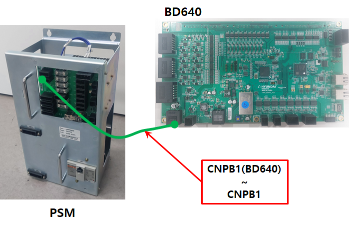
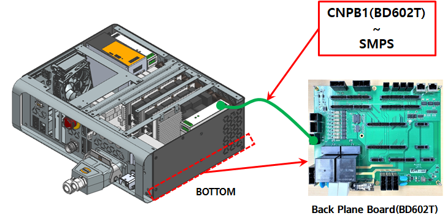

# 4.29. E02560. 制动电源故障

### 1. 概述

当伺服板监测制动电源（24V）时，如果电压超出设定的正常范围，将产生错误。如果制动电源未正常供电，机器人的轴可能会变得不稳定；因此，伺服控制器检测到这一点，生成错误并安全停止机器人。

### 2. 原因和检查



(1)	验证制动电源（24V）是否正常供电

(2)	检查制动电源电缆是否有断开或接触不良

(3)	更换伺服板（BD640）



(1)	验证制动电源（24V）是否正常供电

制动电源接线的检查顺序如下：

第1步：检查与制动电源接线相关的连接器是否有接触不良。

第2步：检查制动电源接线是否短路。使用万用表（测试仪）进行1:1检查。

    * 检查功率电子模块的内部接线。
        Hi6-T15控制器不适用，因为它没有功率电子模块。

                    (图4.44 功率电子模块)

(2)	检查制动电源电缆是否有断开或接触不良。

检查控制器的内部接线。对于Hi6-N控制器，检查CNPB1（BD640）连接器和CNPB1（电子板）连接器之间的接线。对于Hi6-T15控制器，检查CNPB1（BD602T）连接器和制动SMPS输出之间的接线。

                    (图4.45 N控制器制动电源检查)

                    (图4.45 T控制器制动电源检查)

(3)	执行伺服板的更换测试。

如果更换伺服板后没有发生错误，可以确定为伺服板监测电路的故障。

                    (图4.46 更换N控制器伺服板)

                    (图4.47 更换T控制器伺服板)