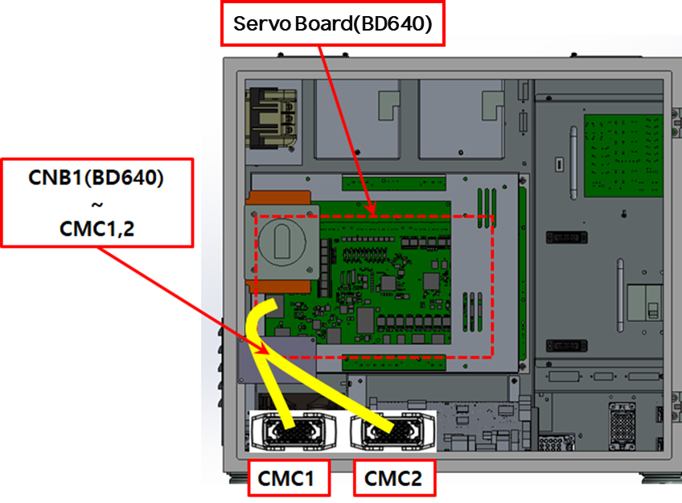
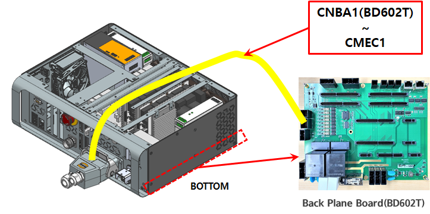
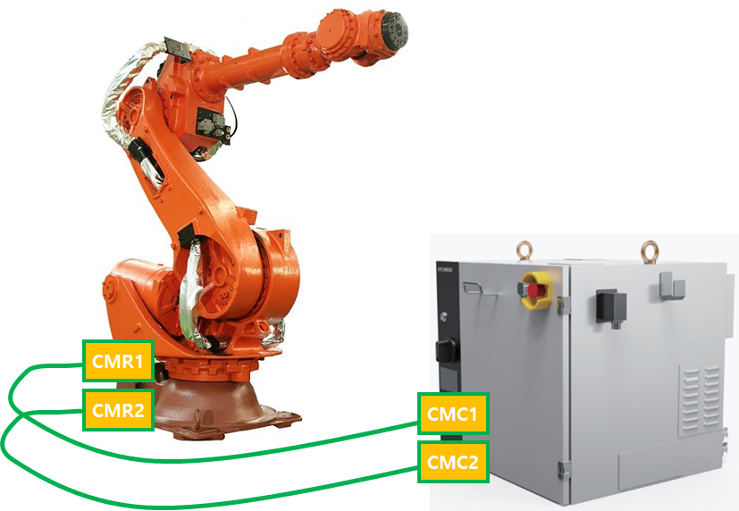
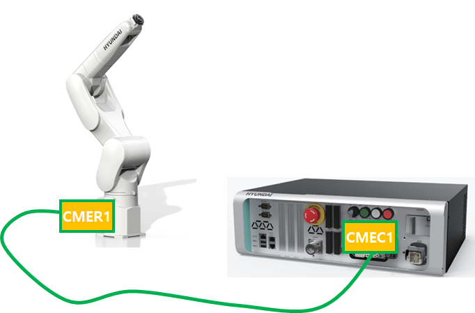

# 4.31. E02564. (O轴) 制动输出过电流检测到

### 1. 概述

伺服板（BD640）监测制动输出电路的过电流状态；如果检测到来自连接到输出电路的保护电路（IC）的故障信号，则判断为过电流情况并生成错误。如果发生此类异常情况，制动控制的可靠性无法得到保证；因此，伺服板立即检测到这一点并安全地停止机器人。

### 2. 原因与检查



(1)	检查制动电缆。

(2)	检查伺服板（BD640）。



(1)	检查制动电缆。

制动电缆的检查顺序如下：

第1步：检查与制动电缆相关的连接器是否有接触不良。

第2步：检查制动电缆是否短路。使用万用表（测试仪）等设备对每个轴的电缆进行1:1检查。

第3步：执行制动电缆的更换测试。

如果出现接触不良的现象，或者即使制动电缆没有断开，制动电源线与其他电源线或机器人本体的金属部分接触，也无法通过短路测试检测到；因此，请执行电缆更换测试。

    * 检查控制器的内部连接。
        对于 Hi6-N 控制器，检查 CNB1 (BD640) 连接器与 CMC1、CMC2 之间的连线。

                    (图 4.48 N 控制器制动输出电缆连线)

                    (图 4.49 T 控制器制动输出电缆连线)
    
* 检查控制器与机器人的连接。
        对于 Hi6-N 控制器，检查 CMC1 和 CMR1 之间的连线，以及 CMC2 和 CMR2 之间的连线。对于 Hi6-T15 控制器，检查 CMEC1 和 CMER1 之间的连线。

                    (图 4.50 N 控制器制动输出电缆连线)

                    (图 4.51 T 控制器制动输出电缆连线)

(2)	执行伺服板的更换测试。

如果在更换伺服板后错误不发生，则可以确定伺服板的监测电路出现故障。

                    (图 4.52 更换 N 控制器伺服板)

                    (图 4.53 更换 T 控制器伺服板)