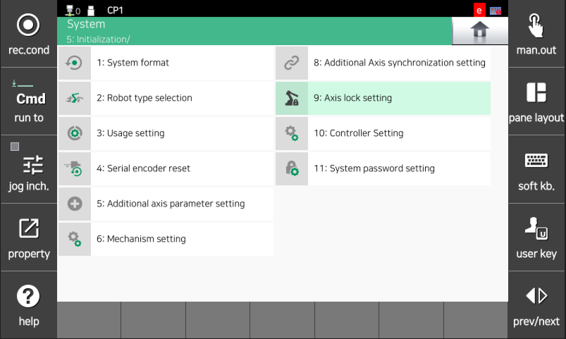
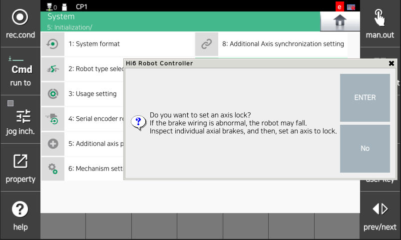
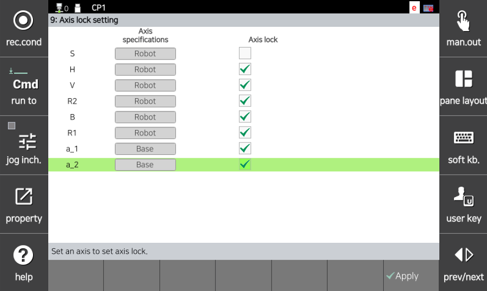
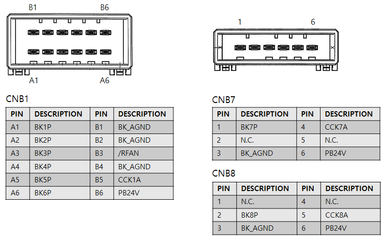
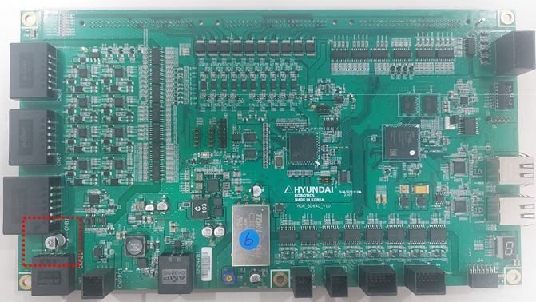
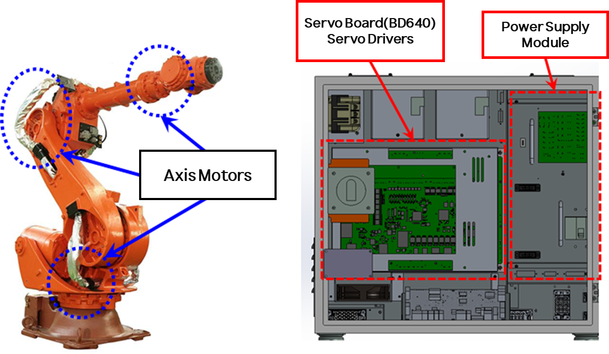
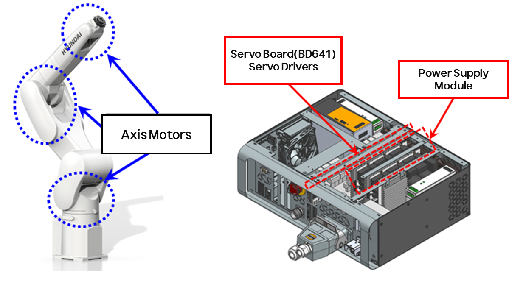

# 4.14. E02630. (O Axis) position deviation exceeded

### 1. Overview
This error occurs when the position deviation exceeds the set value during robot operation. While the robot is operating under servo control, if the difference between the commanded movement position and the actual position is too large, the servo board detects this as an error and stops the robot.

### 2. Cause and Inspection


(1)	Check if the axis where the error occurred has mechanical interference with other equipment. 
(2)	Verify that the robot model is configured correctly. 
(3)	Verify that the brake release is operating normally. 
    - Inspect for abnormalities in individual axis brake release. 
    - Inspect for abnormalities in brake power supply. 
(4)	Inspect the wiring condition. 
(5)	Check if the rated load is being exceeded. 
(6)	Verify the position deviation setting level. 
(7)	Check the versions of the servo board (BD640) and the main COM. 
(8)	Replace other components. 



(1)	Check if the axis where the error occurred has mechanical interference with other equipment.

This error can occur if there is mechanical interference or a collision with the robot. If the robot is outside the restricted area, move it to a safe area using manual operation.

(2)	Verify that the robot model is configured correctly.

                    (Figure 4.60 Checking Robot Model on TP)
    Verify that the robot model registered on the TP (Teach Pendant) screen matches the actually installed robot.

(3)	Verify that the brake release is operating normally.

There may be a problem with the brake release function of the corresponding axis or an abnormality in the brake release voltage.
 * Inspect for abnormalities in individual axis brake release.

Verify the operation of the brake release function for the corresponding axis using the Axis Lock function.
After performing an Axis Lock on all axes except the one you wish to check, repeatedly turn the motor on/off and listen for a "click" sound of the brake releasing from the motor in the mechanical unit.

The procedure for using the Axis Lock function is as follows:
    
        System -> 5. Initialization -> 9. Axis Lock Setting -> OK -> Individual Axis Lock

                    (Figure 4.61 Axis Lock Setting Screen 1)

                    (Figure 4.62 Axis Lock Setting Screen 2)

                    (Figure 4.63 Axis Lock Setting Screen 3)

   If the brake for the corresponding axis does not release, the brake output status of the servo board must be checked. Remove the brake wiring (CNB1, CNB7, CNB8 connectors) and output the brake voltage. Measure whether the brake voltage for the corresponding axis is output at 20V or higher from the CNB1, CNB7, or CNB8 connectors. If there is an axis where the voltage output is below 20V, the servo board (BD640) is defective and must be replaced.

                    (Figure 4.64 Pin Assignment of CNB1, CNB7, and CNB8 Connectors)

 * Inspect for abnormalities in brake power supply

The inspection sequence for the brake power wiring is as follows:

Step 1: Inspect the connectors related to the brake power wiring for any poor contact.

Step 2: Check the brake power wiring for short circuits. Perform a 1:1 check using equipment such as a multimeter (tester).

    * Inspect the internal wiring of the power electronic module. 
      The Hi6-T15 controller is not applicable as it does not have a power electronic module.

                    (Figure 4.65 Electronic Module and Electronic Board)

 * Inspect the servo board (BD640).

If the power electronic module is normal, measure the brake power (DC24V) on the servo board. The measured value at the test point (PAD24V0BK1) in the red area of the figure below must be DC24V or higher to be considered normal. If it is less than 20V, there is an abnormality in the power supply unit that generates the brake power. Replace the electronic module.

                    (Figure 4.66 Servo Board Brake Power)

(4)	Inspect the wiring condition.

Verify that the motor wiring (U, V, W phases) is connected correctly.
Also, check if the motor wiring is shorted to other wiring or the ground wire (FG).

(5)	Check if the rated load is being exceeded.

If the total weight, including the workpiece, exceeds the rated load, adjust the load to within the rated capacity by referring to the robot's specification manual.

(6)	Position deviation setting level error

If the position deviation setting value is smaller than the following measured maximum value, increase the setting value.

             Maximum measured position deviation after operating for a few cycles x 1.5

                (Figure 4.67 Monitoring screen for maximum measured position deviation)

                (Figure 4.68 Position deviation setting change screen)

(7)	Check the versions of the servo board (BD640) and the main COM.

This error can occur if the compatibility between the servo board (BD640) and the main COM version is broken. Especially in cases where a module has been replaced, perform a version upgrade to match the version of each module with the current main COM version. The version of each module can be checked at the following path.

    Service -> 7. System Diagnosis -> 1. System Version

                (Figure 4.69 Version check window for each module on TP)

(8)	Replace other components.

Check if the error occurs by replacing components in the following order: Servo Board (BD640) → Servo Drive Unit → Power Electronic Module → Motor.

                (Figure 4.70 N Controller Motor and Drive Module)

                (Figure 4.71 T Controller Motor and Drive Module)

