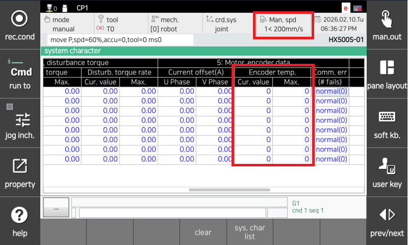
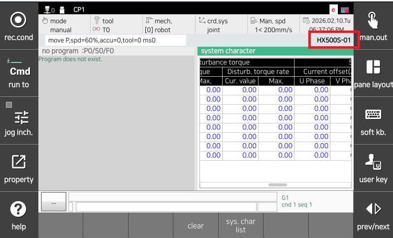

# 4.18. E02634. (O Axis) Position Deviation Excess (Increased Friction at Low Temperature)

### 1. Overview

The position (velocity) deviation is larger than the set value. While the robot is operating under servo control, if the difference between the commanded movement position and the actual position is too large, the servo board detects an error during servo calculation and stops the robot.
This error occurs when the position deviation is large and the encoder temperature is low.
Normally, at low temperatures (encoder at 5°C or below), the friction component increases due to the viscosity of the grease, requiring additional torque compared to normal conditions. Therefore, operating the robot at high speeds may trigger this error.

### 2. Cause and Inspection


(1)	Operate the robot at low speed (playback speed of 30% or less) until the encoder temperature reaches a normal level (approximately 15°C or higher), then restart at normal speed. 
(2)	Verify that the robot model is configured correctly. 



(1)	Operate the robot at low speed (playback speed of 30% or less) until the encoder temperature reaches a normal level (approximately 15°C or higher), then restart at normal speed.

                    (Figure 4.84 Encoder Temperature Check Screen)

(2)	Verify that the robot model is configured correctly.

                    (Figure 4.85 Checking Robot Model)

 Verify that the robot model registered on the TP screen matches the actually installed robot.