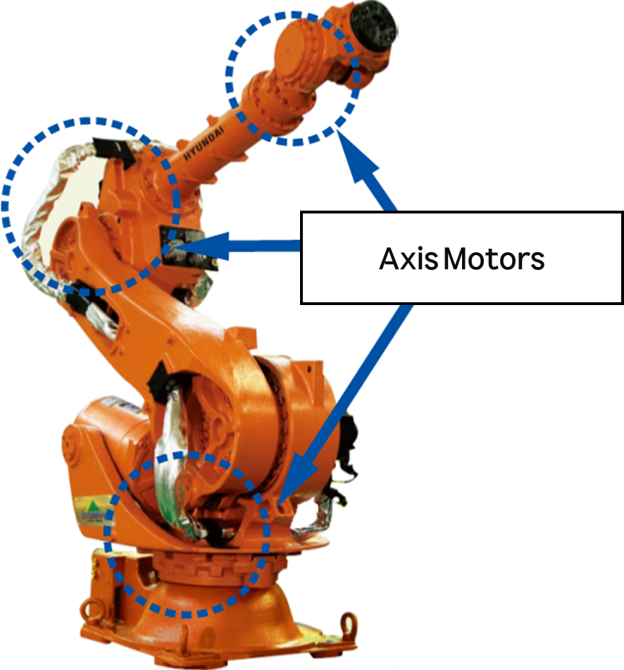

# 4.19. E02650. (O Axis) Motor Overload

### 1. Overview

The motor or drive unit is operating excessively. If the motor or drive unit operates more strainfully than the set value, the servo board detects an error and stops the robot.

### 2. Cause and Inspection



(1)	Check if the load is installed within the robot's rated capacity.

(2)	Check for any collision factors during robot operation.

(3)	Verify that the axis brakes are operating normally.

(4)	Inspect the connection status of motor cables and connectors.

(5)	Replace the servo board to check for abnormalities.

(6)	Inspect whether the drive unit is operating normally.



(1)	Check if the load is installed within the robot's rated capacity.

Verify that the load installed is within the robot's maximum specifications. If the specifications are exceeded, an error may occur. (In this context, "load" includes not only the tool installed at the end of the robot but also cables and all other parts attached to the robot mechanism.)

While using a measuring instrument is the most accurate way to verify the load, if that is not feasible, you can use the load estimation function among the controller features. The load estimation function can only estimate the tool installed at the end of the robot.

The load estimation procedure is as follows:

* Enter the load estimation function.

        System -> 6. Auto Calibration -> 4. Load Estimation

                    (Figure 4.86 Load Estimation 1)

                    (Figure 4.87 Load Estimation 2)

                    (Figure 4.88 Load Estimation 3)

 * Use the load estimation function to select the tool number to save after estimation.

                    (Figure 4.89 Load Estimation 4)

* Click "Normal Operation" to perform the task.

    Press the Motor On switch, hold the deadman switch, and then click "Normal Operation."

                    (Figure 4.90 Load Estimation 5)

* Once the load estimation operation is complete, the estimated results will be displayed on the screen.

                    (Figure 4.91 Load Estimation 6)

(2)	Check for any collision factors during robot operation.

Check if there are any parts in the robot's work area that interfere or collide with the robot. If interference occurs between the robot and other mechanical structures, an error may be generated. In this case, modify the work program to prevent interference from occurring.

(3) Verify that the brake release is operating normally.

There may be a problem with the brake release function of the corresponding axis or an abnormality in the brake release voltage.
 * Inspect for abnormalities in individual axis brake release.

    Verify the operation of the brake release function for the corresponding axis using the Axis Lock function.
After performing an Axis Lock on all axes except the one you wish to check, repeatedly turn the motor on/off and listen for a "click" sound of the brake releasing from the motor in the mechanical unit.

    The procedure for using the Axis Lock function is as follows:
        System -> 5. Initialization -> 9. Axis Lock Setting -> OK -> Individual Axis Lock

                    (Figure 4.92 Axis Lock Setting Screen 1)

                    (Figure 4.93 Axis Lock Setting Screen 2)

                    (Figure 4.94 Axis Lock Setting Screen 3)

 If the brake for the corresponding axis does not release, the brake output status of the servo board must be checked. Remove the brake wiring (CNB1, CNB7, CNB8 connectors) and output the brake voltage. Measure whether the brake voltage for the corresponding axis is output at 20V or higher from the CNB1, CNB7, or CNB8 connectors. If there is an axis where the voltage output is below 20V, the servo board (BD640) is defective and must be replaced.

                    (Figure 4.95 Pin Assignment of CNB1, CNB7, and CNB8 Connectors)

 * Inspect for abnormalities in brake power supply

The inspection sequence for the brake power wiring is as follows:

Step 1: Inspect the connectors related to the brake power wiring for any poor contact.

Step 2: Check the brake power wiring for short circuits. Perform a 1:1 check using equipment such as a multimeter (tester).

    * Inspect the internal wiring of the power electronic module. 
      The Hi6-T15 controller is not applicable as it does not have a power electronic module.

                    (Figure 4.96 Electronic Module and Electronic Board)

 * Inspect the servo board (BD640).

If the power electronic module is normal, measure the brake power (DC24V) on the servo board. The measured value at the test point (PAD24V0BK1) in the red area of the figure below must be DC24V or higher to be considered normal. If it is less than 20V, there is an abnormality in the power supply unit that generates the brake power. Replace the electronic module.

    

                    (Figure 4.97 Servo Board Brake Power)

(4)	Inspect the connection status of motor cables and connectors.
 
 * Inspect the internal wiring of the controller.
 * Inspect the wiring between the controller and the robot.
 * Inspect the internal wiring of the robot.

(5) Replace the servo board to check for abnormalities.

An error may occur if there is an abnormality in the servo board. Replace the board to verify.

                    (Figure 4.98 Replacing Servo Board for N Controller)

                    (Figure 4.99 Replacing Servo Board for T Controller)

(6)	Verify that the drive unit is operating normally.

Check whether the drive unit (motor, reducer) of the corresponding axis is operating normally.

                    (Figure 4.100 Verifying Normal Operation of the Drive Unit)