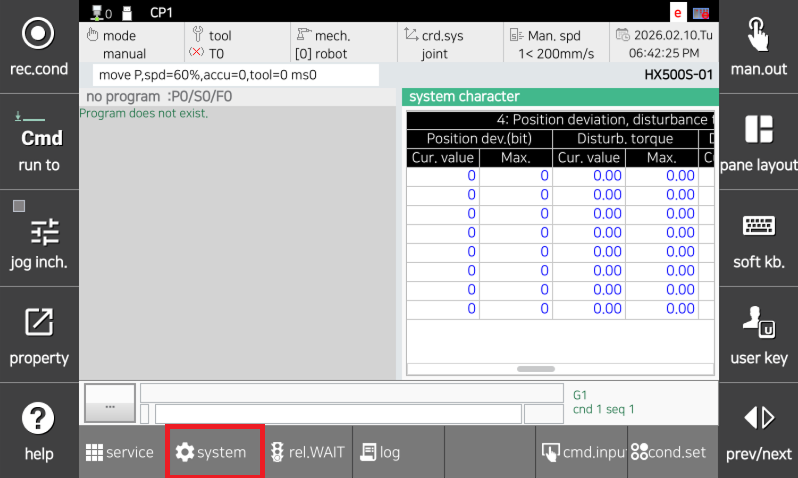
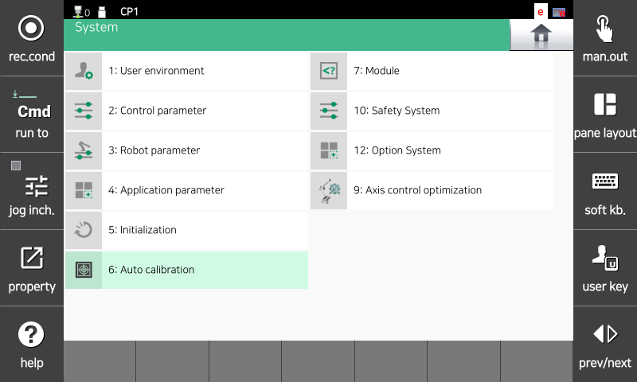
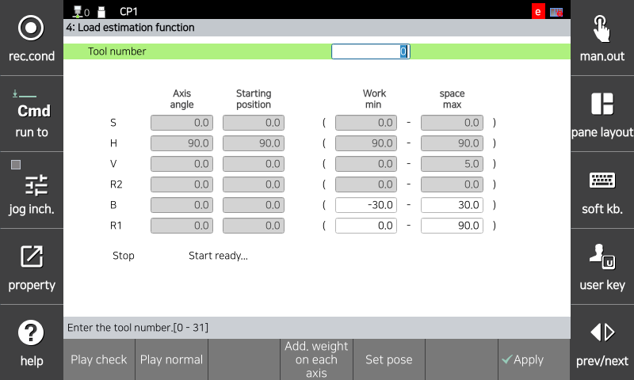

# 4.21. E02652. (O 轴) 电机过载 (未执行负载估算)

### 1. 概述

电机或驱动单元正在过度运行。如果电机或驱动单元的负载超过设定值，伺服板会检测到错误并停止机器人。
当检测到过载状态且未执行负载估算时，会发生此错误。

### 2. 原因和检验



(1) 执行负载估算并检查错误是否再次发生。



(1) 执行负载估算并检查错误是否再次发生。

使用测量仪器是验证负载的最准确方法，但如果不可行，可以使用控制器功能中的负载估算功能。负载估算功能仅能估算安装在机器人末端的工具。

负载估算程序如下：
 * 进入负载估算功能。

        System -> 6. 自动校准 -> 4. 负载估算

                    (图 4.107 负载估算 1)

                    (图 4.108 负载估算 2)

                    (图 4.109 负载估算 3)

 * 使用负载估算功能选择估算后要保存的工具编号。

                    (图 4.110 负载估算 4)

* 点击“正常操作”以执行任务。

    按下电机开关，保持死人开关，然后点击“正常操作”。

                    (图 4.111 负载估算 5)

* 一旦负载估算操作完成，估算结果将在屏幕上显示。

                    (图 4.112 负载估算 6)