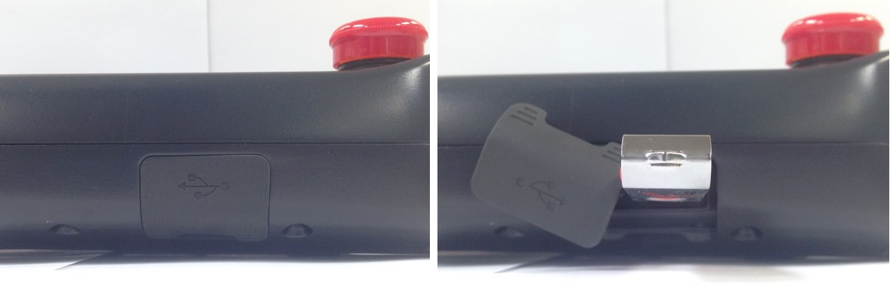
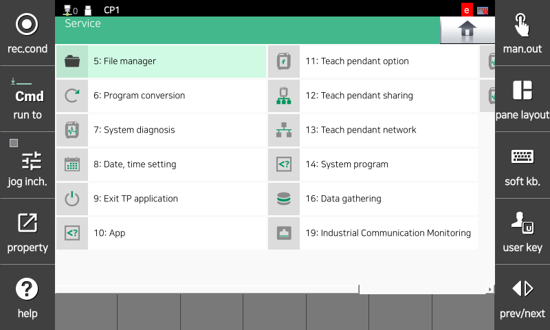
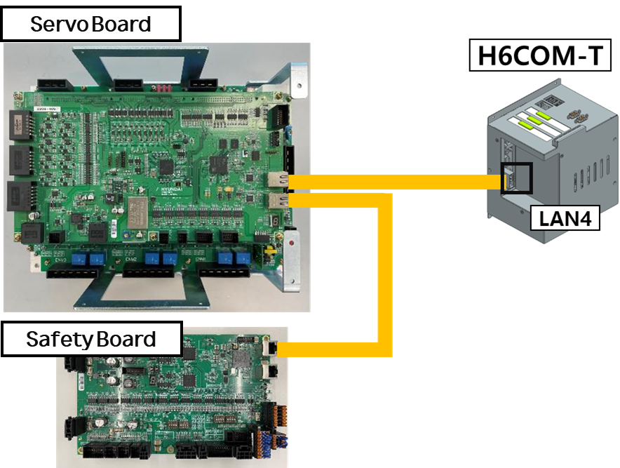
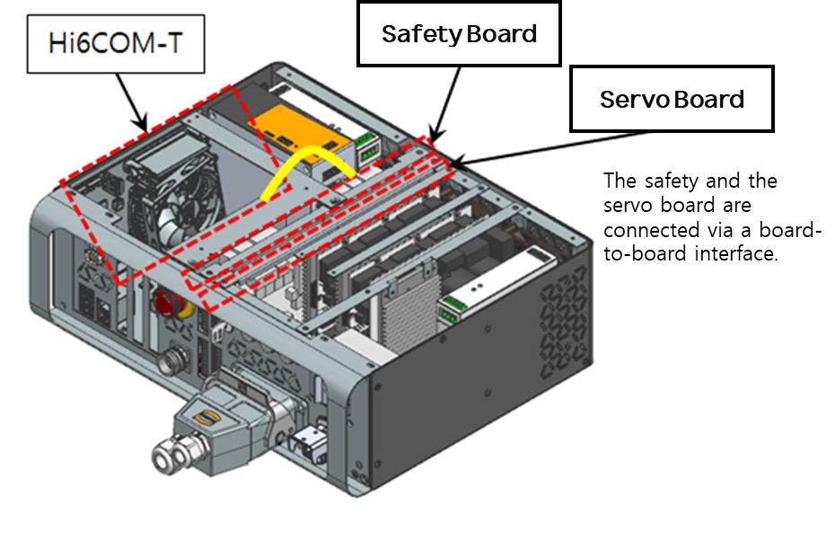

# 4.23. E02670. (O Axis) command value abnormal

### 1. Overview

An error may occur due to a communication abnormality between the mainboard and the servo board or because of rapid motion changes. If a communication problem occurs between the boards, normal commands cannot be transmitted from the mainboard to the servo board. In this case, the robot may exhibit abnormal behavior due to incorrect commands, so the system triggers an error and stops the robot. Additionally, in the case of rapid motion, the drive unit may fail to follow the position commands, which also triggers an error and stops the robot.

### 2. Cause and Inspection



(1)	Check if the mainboard and the servo board are installed correctly.

    * Inspect whether the boards are installed properly.
    * Inspect the boards for any abnormalities or defects.

(2)	Check if there is a work program that causes the robot to move abruptly.



(1)	Check if the mainboard and the servo board are installed correctly.

If the mainboard and servo board are not correctly installed in the rack, or if there is a problem with the boards themselves, communication issues may arise, leading to errors.

---

### ⚠️ Warning

**To protect existing work programs, please ensure all files on the mainboard are backed up to a USB memory device before removing the boards from the rack.**

---

The procedure for backing up mainboard files to a USB memory device is as follows:

                    (Figure 4.114 Connecting USB to TP)
                
When the USB is recognized by the TP, the following icon will appear at the top of the screen.

                    (Figure 4.115 TP USB Recognition)

To back up files, navigate to the following path:

            Service -> 5. File Management

                    (Figure 4.116 Backup Step 1)

                    (Figure 4.117 Backup Step 2)

Copy the "Project" folder to the USB.

    * Inspect whether the boards are installed properly.

        Check the connection status of the EtherCAT cable, which serves as the interface between the boards. Please remove and then reinstall it.

                    (Figure 4.118 Connecting EtherCAT Cable for N Controller)

                    (Figure 4.119 Connecting EtherCAT Cable for T Controller)

    * Inspect the boards for any abnormalities.
        Please replace the board to determine if there is a defect.

        

(2)	Check if there is a work program that causes the robot to move abruptly.
Verify whether the error occurs during segments where the motion changes rapidly.
If the error occurs during abrupt motion, the work program must be modified.

The reasons for errors occurring during abrupt motions are as follows: When executing a work program, there are cases where the robot's posture inevitably changes significantly while moving through a short interval. In such instances, the axial speed of the robot increases suddenly. If the servo board cannot follow this command, an error is triggered. To resolve this, you should modify the teaching points at the location where the posture changes abruptly or adjust the robot's orientation.
