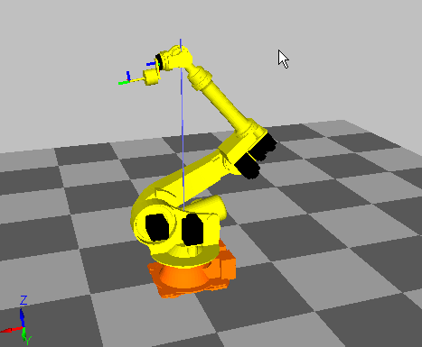
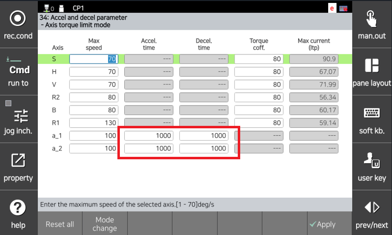

# 4.24. E02680. (O Axis) 最大速度超限

### 1. 概述

机器人的轴速度已超过最大限制。由于机器人处于无法正常控制的状态，系统将其处理为错误并停止机器人。

从主板发送命令到伺服板时，将发送受限命令以避免超过最大速度。但是，如果机器人未能遵循这些命令并发生速度超限，则可能会触发最大速度超限错误。

### 2. 原因和检查



(1) 验证工具数据是否正确输入。

(2) 验证机器人模型是否正确配置。

(3) 检查伺服板 (BD640) 和主 com 的版本。

(4) 检查机器人姿态是否接近奇异点。

(5) 对于额外轴，检查加速/减速参数设置和操作期间的负载因子。

(6) 调整工作程序。



(1) 验证工具数据是否正确输入。

如果工具重量或惯性与控制器中注册的值有显著差异，机器人的控制性能可能会下降，从而导致最大速度超限错误。可以在下面的菜单中为每个工具编号注册工具重量和惯性：

                System -> 3. Robot Parameters -> Tool Data

                    (图 4.120 检查工具数据)

要自动设置工具重量或惯性，可以使用以下菜单中的负载估算功能：

* 输入负载估算功能。

        System -> 6. Auto Calibration -> 4. Load Estimation

                    (图 4.121 负载估算 1)

                    (图 4.122 负载估算 2)

                    (图 4.123 负载估算 3)

* 使用负载估算功能在估算后选择要保存的工具编号。

                    (图 4.124 负载估算 4)

* 单击“正常操作”以执行任务。

    按下电机开关，保持死亡开关，然后单击“正常操作”。

                    (图 4.125 负载估算 5)

* 一旦负载估算操作完成，估算结果将在屏幕上显示。

                    (图 4.126 负载估算 6)

(2) 验证机器人模型是否正确配置。

                    (图 4.127 检查机器人模型)

    验证 TP 屏幕上注册的机器人模型是否与实际安装的机器人相匹配。

(3) 检查伺服板 (BD640) 和主 com 的版本。

如果伺服板 (BD640) 和主 com 版本之间的兼容性受到影响，则可能会发生此错误。尤其是在更换模块的情况下，请执行版本更新，以使每个模块的版本与当前的主 com 版本相匹配。

可以在以下路径检查每个模块的版本：

                Service -> 7. System Diagnosis -> 1. System Version

                    (图 4.128 检查模块版本)

(4) 检查机器人姿态是否接近奇异点。

如果在接近奇异点的姿态下执行 L-插值或 C-插值，而不是 PtP-插值，则可能会发生错误。当 B 轴接近 0 度或手腕中心接近 S 轴的旋转轴时会发生奇异点。如果机器人必须通过奇异点附近，请将相应步骤更改为 PtP-插值。

                    (图 4.129 确定奇异姿态)

(5) 对于额外轴，检查加速/减速参数设置和操作期间的负载因子。

如果额外轴加速/减速参数中的最大速度太高或加速时间太短，电机扭矩可能不足。在监测机器人操作期间的负载因子时，应该降低 I/Ip 的最大速度或增加加速时间。

                System -> 3. Robot Parameters -> 34. Accel/Decel Parameters

                    (图 4.130 检查额外轴加速/减速)

(6) 调整工作程序。

修改工作程序中相应步骤或紧接着的步骤的条件。通过首先尝试更改为“Acc=0”，其次降低步骤速度，最后增加移动路径的额外步骤来更改程序条件。