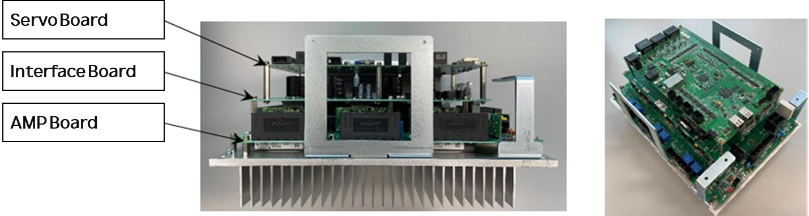
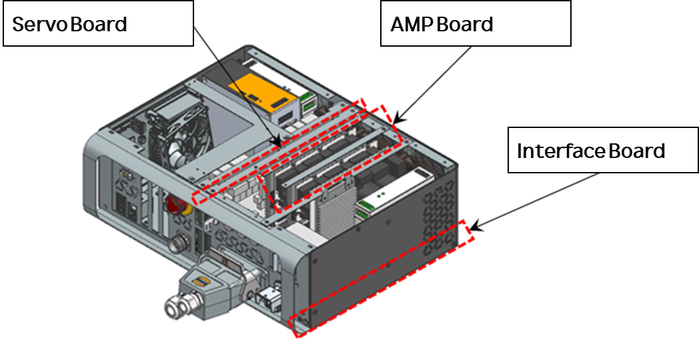

# 4.26. E02781. (O Axis) Servo Lock Cannot Be Maintained – Parameter Error

### 1. Overview

Current for driving the motor or drive unit is not being supplied. The current generated to operate the robot or drive unit is failing to be delivered normally. In such cases, the controller detects the error, prevents the brake from releasing, and cuts off the current supplied to the motor or drive unit. This can be attributed to connection abnormalities between the motor and the controller, wiring defects, or issues in the current generation circuit. Additionally, an error may occur if the parameters required for motor control (Gain and maximum current) do not match the actual motor due to an incorrect robot model registration.

### 2. Cause and Inspection



(1)	Verify that the robot model is configured correctly.

(2)	Inspect the motor power lines and encoder communication lines.

* Check the wiring connecting the robot and the controller.
* Check the internal wiring of the robot.
* Check the internal wiring of the controller.

(3) Inspect the cables between the servo board and the amplifier board inside the controller.

(4) Replace other components.



(1)	Verify that the robot model is configured correctly.

Check whether the robot model registered on the TP screen matches the actually installed robot.

                    (Figure 4.130 Checking Robot Model)

(2)	Inspect the motor power and encoder communication lines.

Turn off the controller power and disconnect the U, V, and W phases of the corresponding axis drive unit to check for any short circuits or open circuits. Perform a 1:1 check of the wiring for each phase using equipment such as a multimeter (tester). Also, verify whether there is any disconnection in the encoder communication lines.

---

### ⚠️ Warning

**Exercise extreme caution when inspecting while the power is on, as there is a risk of electric shock.**

---

* Check the wiring connecting the robot and the controller.
        Remove the wiring connecting the controller to the robot or drive unit. Check if there are any short circuits between the phases (U, V, W) or between a phase and the ground. If a short circuit is found, the corresponding wiring must be replaced.

                    (Figure 4.131 Wiring between N Controller and Robot)

                    (Figure 4.132 Wiring between T Controller and Robot)

* Inspect the internal wiring of the robot.
        It is necessary to inspect the wiring connected to the motor inside the robot for any short circuits or incorrect wiring.

                    (Figure 4.133 Internal Robot Wiring)

* Inspect the internal wiring of the controller.
        It is necessary to inspect the wiring installed with the amplifiers inside the controller.

                    (Figure 4.134 Inspecting Internal Wiring of N Controller)

                    (Figure 4.135 Inspecting Internal Wiring of T Controller)

(2)	Inspect the Board-to-Board connectors between the servo board and the amplifier board inside the controller.

Check whether the connectors (Board-to-Board) that link and secure the servo board to the amplifier board are installed correctly. If the connection is poor, this error may occur.

                    (Figure 4.136 Connection between Servo Board and Amplifier Board in N Controller)

                    (Figure 4.137 Connection between Servo Board and Amplifier Board in T Controller)

(3)	Replace other components.

Check for errors by replacing components in the following order: Servo Board (BD640) → Amplifier Board → Wire Harness → Motor → PSM (Power Supply Module).

[Image of a flowchart showing the component replacement sequence for troubleshooting a robot servo system: Servo Board to Amplifier Board to Wire Harness to Motor to Power Supply Module]

                    (Figure 4.138 Drive Components for N Controller)

                    (Figure 4.139 Drive Components for T Controller)
