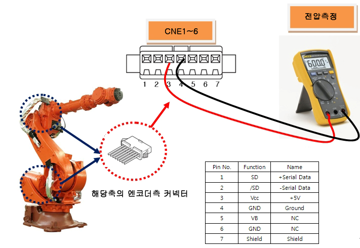

# E02450. (O축)엔코더 응답 없음

## 1. 개요

서보보드에서는 서보 모터의 제어를 수행하기 위해 엔코더와 시리얼통신을 하여 주기적으로 엔코더 데이터를 수신하는데, 엔코더로부터 수신된 데이터가 정해진 통신규정에 어긋나는 경우 발생하는 에러입니다.

엔코더 데이터를 송수신하는 부품들의 고장이거나 배선 또는 엔코더 쉴드 라인의 처리 문제로 상기의 에러가 발생할 수 있습니다.

## 2. 원인 및 점검



(1)	엔코더 공급전압을 확인하십시오 

(2)	엔코더 배선을 점검하십시오

(3)	서보보드를 교체 시험하십시오

(4)	모터(엔코더)를 교체 시험하십시오

(5)	조치 완료후 배선의 통신상태를 점검하십시오



(1)	엔코더 공급전압을 확인하십시오.
엔코더에 공급하는 전원전압은 엔코더측 커넥터 공급 전압이 5V±5% (4.75V ~ 5.25V)범위 내에 있어야 합니다. 엔코더측 커넥터 전압이 4.75V이하로 떨어질 경우, 엔코더가 정상 동작하지 않아, 상기 에러 발생 가능성이 있습니다.

엔코더측 커넥터 pin(3-4)의 전압을 측정해 주십시오.

(그림4.1 엔코더 커넥터 핀 정보)

측정된 전압이 기준전압보다 낮을 경우 서보보드(BD640)의 VR1 볼륨저항을 돌려 엔코더측 커넥터 전압이 기준전압 이내가 되도록 조정하십시오.

(그림4.2 BD640 가변저항)

(2)	엔코더 배선을 점검하십시오.

엔코더의 배선점검 순서는 다음과 같습니다.

1차: 엔코더 배선에 관련된 커넥터들의 접촉 불량여부를 점검하십시오.

2차: 엔코더 배선의 단락 유무를 점검하십시오. 멀티미터(테스터기)와 같은 장비를 이용하여 각 상의 배선을 1:1로 체크하십시오.

3차: 엔코더 배선을 교체시험 하십시오.

엔코더 배선이 단선되지 않고 쉴드선의 접촉불량, 엔코더 신호선과 타 전력선 또는 로봇 본체 금속부위와의 접촉 등의 현상이 있을 경우에는 단락유무 검사로는 검사할 수 없으므로 배선교체 시험을 하여주십시오.

* 제어기 내부 배선을 점검하십시오.
CNEC1,4(BD640)커넥터와 CEC1 간의 배선을 점검하십시오.

(그림4.3 Hi6-N 제어기 엔코더 배선 점검)

(그림4.4 Hi6-T15 제어기 엔코더 배선 점검)

* 제어기와 로봇간의 배선을 점검하십시오.
Hi6-N제어기의 경우, CNEC1와 CER1간의 배선을 Hi6-T15제어기의 경우, CMEC1과 CMER1 간의 배선을 점검하십시오.

(그림4.5 Hi6-N 제어기와 로봇간 기본 설치 구성도)

(그림4.6 Hi6-T15 제어기와 로봇간 기본 설치 구성도)

(그림4.7 Hi6-N 제어기와 로봇간 기본 설치 구성도 상세)

(그림4.8 Hi6-N 제어기와 로봇간 기본 설치 구성도 상세)

* 본체 내부의 배선을 점검하십시오.
CER1과 엔코더측 커넥터간의 배선을 점검하십시오.
배선점검은 로봇 보수설명서의 배선 접속도를 참고하시기 바랍니다.

(그림4.9 로봇기내배선)

(3)	서보보드를 교체 시험하십시오. 
서보 보드를 교체한 후 에러가 발생하지 않으면 서보보드의 엔코더 수신부 불량입니다. 서보 보드를 정상품으로 교체하여 주십시오.

(그림 4.10 N제어기 서보보드 교체)

(그림 4.11 T제어기 서보보드 교체)

(4)	모터(엔코더)를 교체 시험하십시오. 
서보 모터를 교체한 후 에러가 발생하지 않으면 서보모터의 불량입니다. 서보 모터를 정상품으로 교체하여 주십시오. 아래 그림은 HS165 로봇의 각 축 모터의 위치를 나타내고 있으며, 다른 로봇은 해당 기구 보수설명서를 참고하여 교체하시기 바랍니다.

(그림 4.12 HS165 로봇의 각 축 모터 위치)

(5)	조치 완료후 배선의 통신상태를 점검하십시오.
문제부분의 조치가 완료된후 『엔코더 통신실패 횟수 표시 기능 메뉴얼』을 참고하여 통신상태를 점검 하십시오.

(그림 4.13 엔코더 통신실패 모니터링)

