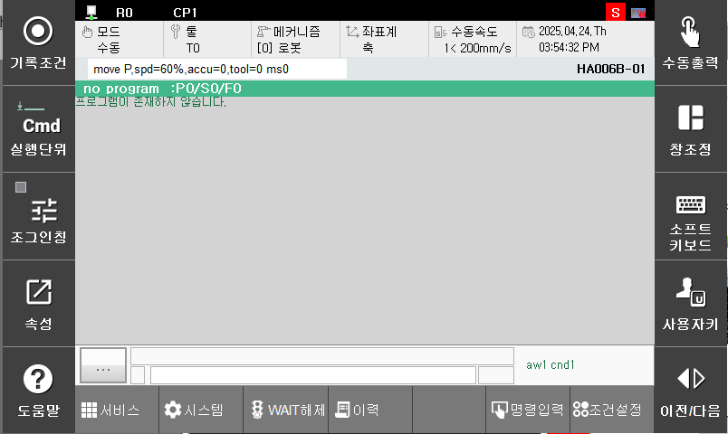
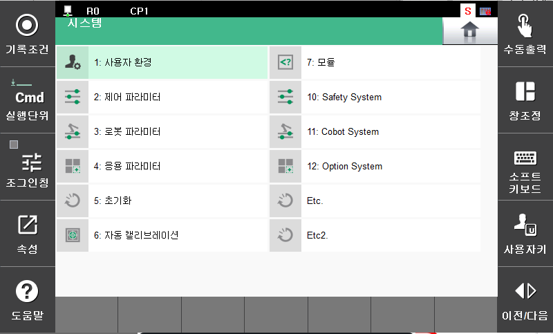
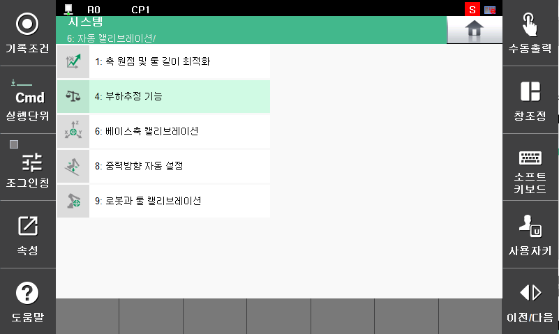
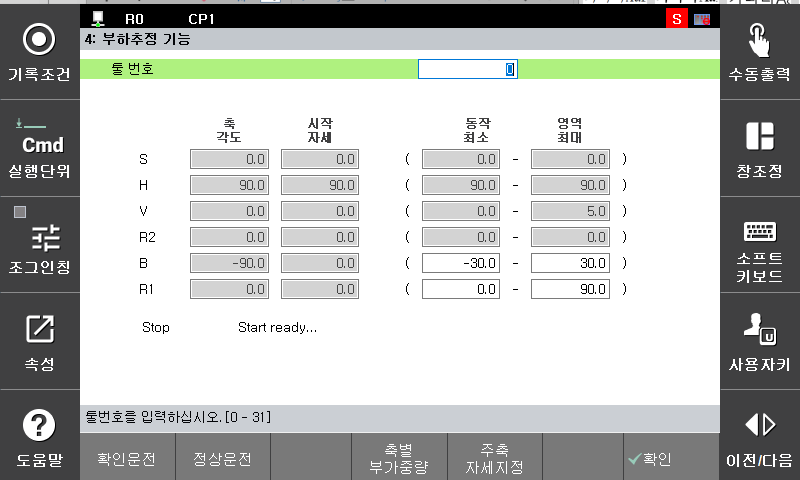
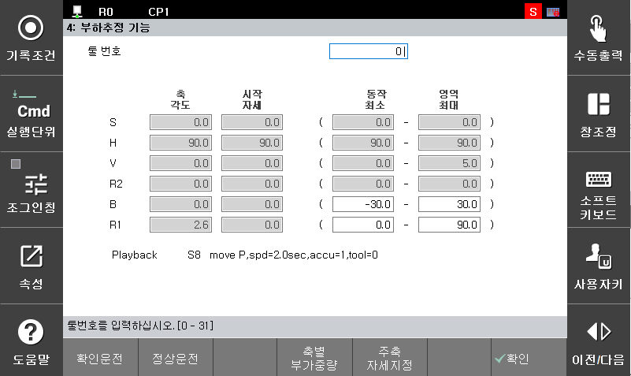
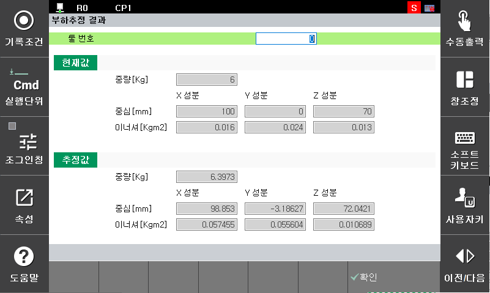
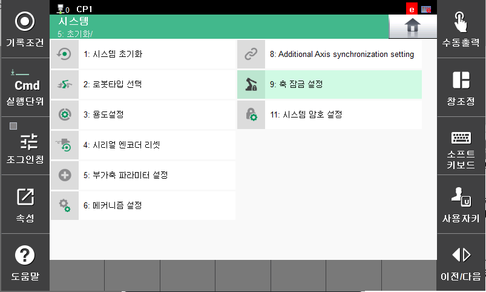
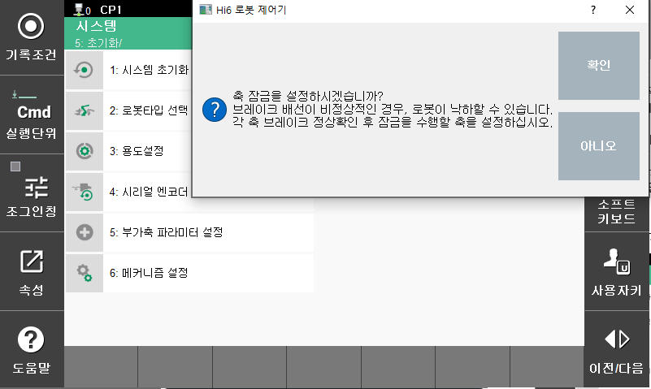
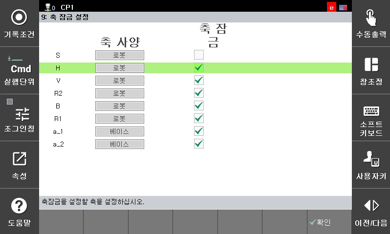
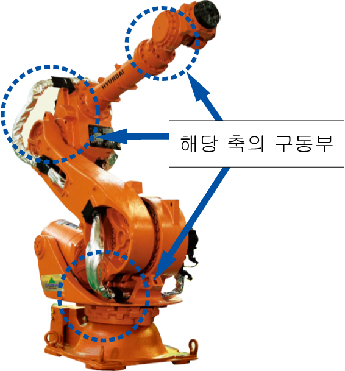

# E02650. (O축) 모터 과부하

## 1. 개요

모터 또는 구동장치가 무리하게 동작되고 있습니다. 모터 또는 구동장치가 설정치 보다 무리하게 동작하게 되면, 서보보드는 에러를 감지하고 로봇을 정지시킵니다.

## 2. 원인 및 점검



(1)	부하가 로봇의 정격 이하로 설치되어 있는지 확인하십시오.

(2)	로봇 동작 중 충돌요소가 있는지 점검하십시오.

(3)	축 브레이크가 정상적으로 작동하는지 확인하십시오.

(4)	모터 케이블 및 커넥터 연결 상태를 점검하십시오.

(5)	서보보드를 교체하여 이상여부를 점검하십시오.

(6)	구동부가 정상적으로 작동하는지 점검하십시오.



(1)	부하가 로봇의 정격 이하로 설치되어 있는지 확인하십시오.

로봇 최대 사양 이하의 부하가 설치되어 있는지 확인하십시오. 사양을 초과할 경우 에러가 발생할 수 있습니다. (여기서 부하란, 로봇 끝단에 설치되는 툴뿐만 아니라 로봇 기구에 부착되는 케이블 및 다른 모든 부분이 포함됩니다.)

부하를 확인하는 방법에는 계측기를 사용하는 방법이 가장 정확하지만 여의치 않을 경우에는 제어기 기능 중 부하추정 기능을 사용하여 확인할 수 있습니다. 부하추정 기능은 로봇 끝단에 설치되어 있는 툴에 대한 부분만 추정 가능합니다.

부하 추정 방법은 다음과 같습니다.

* 부하추정 기능으로 들어갑니다.

        시스템 -> 6. 자동 캘리브레이션 -> 4. 부하추정 기능

                    (그림 4.86 부하 추정 기능1)

                    (그림 4.87 부하 추정 기능2)

                    (그림 4.88 부하 추정 기능3)

 * 부하추정 기능을 사용하여 부하 추정 후 저장할 툴 번호를 선택합니다.

                    (그림 4.89 부하 추정 기능4)

 * 정상 운전을 클릭하여 수행합니다.

    모터 On 스위치를 누르고 데드맨을 잡은 후 정상운전을 클릭합니다.

                    (그림 4.90 부하 추정 기능5)

* 부하 추정 운전이 완료되면 추정 결과가 화면에 보여집니다.

                    (그림 4.91 부하 추정 기능6)

(2)	로봇 동작 중 충돌요소가 있는지 점검하십시오.

로봇 작업 영역에 로봇과 간섭 또는 충돌하는 부분이 있는지 확인하십시오. 로봇이 다른 기구물과 간섭이 발생할 경우 에러가 발생할 수 있습니다. 이 경우, 작업 프로그램을 수정하여 간섭이 발생하지 않도록 합니다.

(3) 브레이크 해제가 정상적으로 작동되는지 확인하십시오.

해당 축 브레이크의 해제기능에 문제가 있거나 브레이크 해제전압의 이상일 수 있습니다.
 * 개별 축 브레이크 해제 이상 점검

    축 잠금 기능을 사용하여 해당 축 브레이크 해제 기능 작동을 확인하십시오.
확인 하려는 축을 제외하고 축 잠금을 한 뒤 모터 온/오프를 반복하여 기구부의 모터에서 브레이크 해제 소리(“딸깍”)가 들리는지 확인하십시오.

    축 잠금 기능을 사용하는 방법은 아래와 같습니다.
        시스템 -> 5. 초기화 -> 9. 축 잠금 설정 -> 확인 -> 개별 축 축잠금

                    (그림 4.92 축 잠금 설정화면1)

                    (그림 4.93 축 잠금 설정화면2)

                    (그림 4.94 축 잠금 설정화면3)

    해당 축의 브레이크가 해제되지 않는다면 서보보드의 브레이크 출력상태를 확인해야 합니다. 브레이크 배선(CNB1, CNB7, CNB8 커넥터)를 제거하고 브레이크 전압을 출력하십시오. CNB1, CNB7 또는 CNB8 커넥터에서 해당 축의 브레이크 전압이 20V 이상으로 출력되는지 측정하십시오. 20V 이하의 전압으로 출력되는 축이 있다면 서보보드(BD640)의 고장이므로 고체하십시오.

                    (그림 4.95 CNB1,CNB7,CNB8 커넥터의 핀배치)

 * 브레이크용 전원이상 점검

    브레이크 전원 배선점검 순서는 다음과 같습니다.

    1차: 브레이크 전원 배선에 관련된 커넥터들의 접촉 불량여부를 점거하십시오.

    2차: 브레이크 전원 배선의 단락 유무를 점검하십시오. 멀티미터(테스터기)와 같은 장비를 이용하여 1:1로 체크하십시오.

    파워전장모듈 내부 배선을 점검하십시오. Hi6-T15 제어기는 파워전장모듈이 없으므로 해당 사항이 없습니다.

                    (그림 4.96 전장모듈 및 전장보드)

 * 서보보드(BD640)를 점검 하십시오.

    파워전장모듈이 정상이라면 서보보드에서 브레이크 전원(DC24V)을 측정하십시오. 아래 그림의 빨간색 구역에 테스트 포인트(PAD24V0BK1)의 측정 값이 DC24V 이상 되어야 정상입니다. 만약 20V 미만이라면 브레이크 전원을 생성하는 전원 장치의 이상입니다. 전장모듈을 교체하십시오.

    

                    (그림 4.97 서보보드 브레이크 전원)

(4)	모터 케이블 및 커넥터 연결 상태를 점검하십시오.
 
 * 제어기 내부 배선을 점검 하십시오.
 * 제어기와 로봇 간의 배선을 점검하십시오.
 * 로봇 기내 배선을 점검하십시오.

(5) 서보보드를 교체하여 이상여부를 확인하십시오.

서보보드에 이상이 있을 경우 에러가 발생할 수 있습니다. 보드를 교체하여 확인하십시오.

                    (그림 4.98 N제어기 서보보드 교체)

                    (그림 4.99 T제어기 서보보드 교체)

(6)	구동부가 정상적으로 작동하는지 확인하십시오.

해당축의 구동부(모터, 감속기)가 정상적으로 작동하는지 확인하십시오.

                    (그림 4.100 구동부 정상동작 확인)