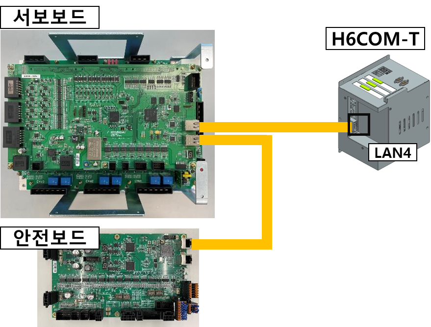
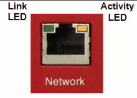
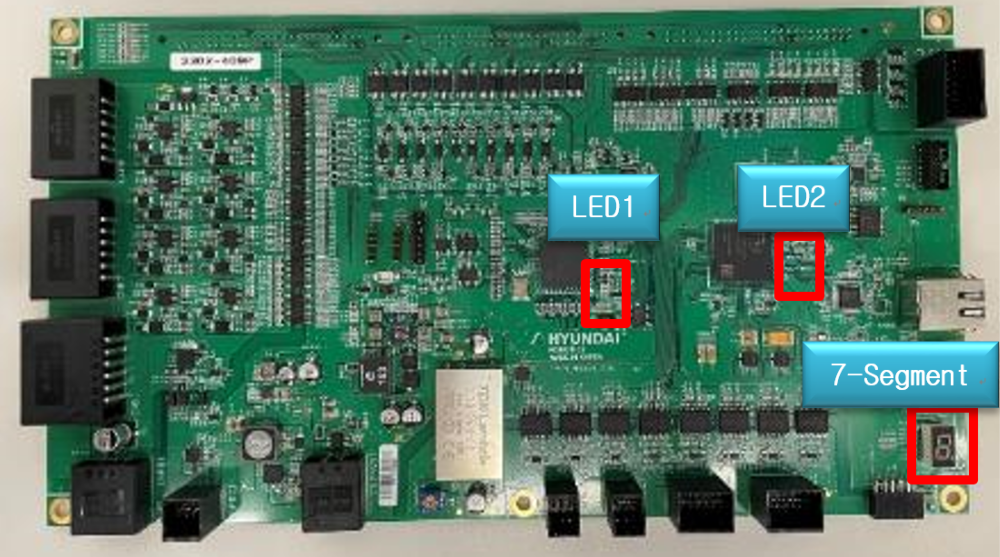

# E29016 전장보드 통신(EtherCAT) 마스터 연결 끊김 발생

## 1. 개요

전장보드 통신(EtherCAT) 마스터와 연결되는 첫번째 장치와의 연결이 끊어 졌습니다.

## 2. 원인



(1)	보드 간 통신 케이블 결선 상태 확인.
(2)	서보보드(BD640)를 점검하십시오.



### (1) 보드 간 통신 케이블 결선 상태 확인.

#### [각 모듈간(메인제어모듈(H6COM-T), 서보보드(BD640)) Ethernet 케이블 결선 상태 확인]
  

1)	점검 대상
A.	메인제어모듈 (H6COM-T) ↔ 서보보드 (BD640) 간 Ethernet 케이블
2)	점검 항목
A.	케이블 양쪽 커넥터가 확실히 체결되어 있는지 확인
B.	케이블에 단선, 압착 손상, 꺾임, 파손이 없는지 육안 점검
C.	커넥터 핀(단자)에 녹, 오염, 휘어짐이 없는지 확인
3)	점검 방법
A.	전원을 OFF한 상태에서 케이블 분리 및 재삽입 수행
B.	삽입 시 '딸깍' 소리가 나도록 완전히 체결
C.	필요한 경우 예비 케이블로 교체 후 재시도
D.	연결 순서 및 올바른 LAN Port와 연결되어 있는지 재확인
4)	추가 확인
A.	서보보드(BD640) 장치 자체에 Link/Act LED 상태 확인
- 정상: 녹색(좌) 점멸, 황색(우) 점등  
- 비정상: 녹색(좌) & 황색(우) 꺼짐 또는 점등 상태 유지 
 
B.	반복적으로 끊김이 발생할 경우, 케이블 내부 단선 가능성 고려 → 케이블 교체 필요 
C.	이더넷 커넥터(PCB 단자부) 손상 가능성도 점검 

 
### (2) 서보보드(BD640)를 점검하십시오.
#### [서보 보드(BD640)를 점검하는 방법]
  

1) 전원 상태 확인 
   LED1과 LED2가 초록색으로 점멸하는지 확인하십시오.  
   7-Segment에 P001 혹은 P002로 표기되는지 확인하십시오. 

2) 정상 부팅 상태 확인 
   메인제어모듈 (H6COM-T)이 완전히 부팅되고 난 후(전원투입후 약 50초 정도 소요)  
   7-Segment에 P002로 표기되어야함. 

1-2) 가 모두 정상임에도 이더캣 통신 연결에 문제가 있는 경우 보드를 교체 하십시오.
